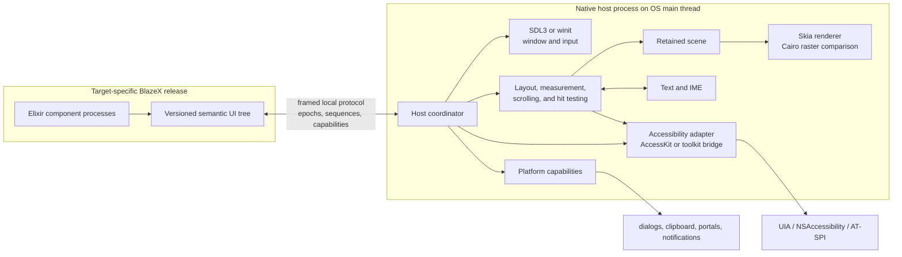

# Cross-platform native host and renderer architecture for BlazeX

**Status:** Research recommendation; no implementation or support claim

**Research date:** 2026-09-03

**Revision date:** 2026-09-04

**Question:** How can BlazeX build a desktop host that works on Windows,
macOS, and Linux, including a portable drawing path, without confusing
custom-drawn pixels with actual native controls or accessible UI?

## Executive decision

BlazeX should not choose one library and call it the native host. A credible
desktop profile needs a small set of independently replaceable subsystems:

1. a target-specific ERTS release that owns portable component state;
2. a separate native process that owns the OS main thread and event loop;
3. a versioned local protocol carrying semantic snapshots, patches, events,
   capabilities, and opaque resource identities;
4. a window/input shell, with **SDL3** the leading C-ABI candidate and
   **winit** the leading Rust-native alternative;
5. a retained scene/display-list renderer, with **Skia** the leading mature
   cross-platform 2D implementation and **Cairo** a distinct software raster
   comparison and fallback;
6. a renderer-local layout, intrinsic-measurement, scrolling, and hit-testing
   subsystem, initially comparing a bounded BlazeX layout vocabulary with
   **Taffy** and **Yoga**, plus platform-control-owned layout in the direct
   native-control adapters;
7. a text subsystem for shaping, fallback, bidi, line breaking, caret
   geometry, selection, and IME composition;
8. an accessibility adapter that maps the BlazeX semantic tree to Windows UI
   Automation, macOS NSAccessibility, and Linux AT-SPI, with **AccessKit** a
   strong accelerator rather than an untested guarantee; and
9. explicit OS capability and packaging adapters.

The leading custom-scene **spike hypothesis** is therefore:

> **ERTS sidecar + versioned protocol + SDL3 + renderer-local layout + Skia +
> HarfBuzz/ICU or SkParagraph + AccessKit/platform accessibility bridges**.

Validation has three deliberately separate roles: the existing headless
renderer remains the semantic/state/event oracle; already-shaped display
lists are compared with pinned fonts and resources through Skia Raster and
Cairo; and text layout is compared independently between
SkParagraph/SkShaper and Pango/HarfBuzz. Pixel equality across operating
systems is not assumed.

This stack is a custom-drawn BlazeX Material renderer. It does **not** satisfy
the accepted actual-native-control gate in
[ADR-0007](architecture-decisions/adr-0007-native-control-portability-gate.md).
That gate should be proven separately with three bounded direct adapters:
**Win32 standard/common controls on Windows, AppKit controls on macOS, and
GTK 4 controls on Linux**. Each adapter receives the same semantic fixtures
and traces while owning its platform event loop, controls, accessibility
objects, dialogs, focus, and disposal locally.

Qt and wxWidgets are excluded from the active implementation, proof,
benchmark, dependency, and fallback set. Their older source notes remain in
the archive solely as historical evidence for the superseded comparison; they
must not re-enter the recommendation transitively through another candidate.

The term “SDLC” in the research request is interpreted as **SDL**, the Simple
DirectMedia Layer. No relevant cross-platform drawing or UI project named
SDLC was identified.

## 1. Scope and evidence standard

This assessment compares four different decisions that are often collapsed
into “choose a GUI library”:

| Decision | Required outcome | Representative candidates |
| --- | --- | --- |
| OS shell | window lifecycle, event loop, input, IME transport, native handles | SDL3, winit, GLFW, toolkit shell |
| Drawing engine | paths, clips, transforms, paint, images, glyph runs, layers | Skia, Cairo, GSK, Vello |
| UI materialization | custom scene or direct platform controls | BlazeX scene, Slint without an excluded backend, Win32, AppKit, GTK 4 |
| Runtime integration | safe state/event exchange with the UI main thread | external process, port, NIF, embedded runtime |

Consequential claims are based primarily on project documentation, platform
documentation, source repositories, and research papers. Engineering blogs
are used to expose integration work that high-level API lists tend to hide.
No candidate was compiled or benchmarked in this pass, so performance,
binary-size, visual, accessibility, and packaging conclusions remain
prototype gates rather than measured facts.

Fast-moving project evidence is pinned in the source notes to a release or
dated snapshot wherever one was available. Those baselines support this
ranking; they are not a substitute for rechecking the selected versions,
licenses, open defects, and platform support immediately before a spike.

## 2. The central finding: there is no complete common drawing primitive

A portable drawing API solves only the last part of a desktop UI frame. It
does not automatically supply:

- a window or application lifecycle;
- pointer, keyboard, dead-key, or IME behavior;
- Unicode segmentation, shaping, font fallback, line breaking, or caret
  geometry;
- focus navigation, shortcuts, drag and drop, clipboard, or native dialogs;
- an accessibility object tree and platform control patterns;
- actual native child controls;
- application identity, entitlements, signing, notarization, or Linux
  portals; or
- safe coordination with BEAM schedulers and the OS main thread.

[SDL3](../30-sources/libsdl-project-2026-sdl3-desktop-host-primitives.md)
is a capable low-level shell, but its built-in renderer is deliberately a
small points/lines/rectangles/textures/triangles API. SDL's newer GPU API is a
modern GPU abstraction; it is not a path, paragraph, widget, or accessibility
engine. Likewise,
[wgpu and Dawn](../30-sources/rust-windowing-gfx-rs-linebender-2026-native-graphics-stack.md)
abstract devices, queues, surfaces, shaders, and pipelines. A complete 2D UI
renderer still has to sit above them.

[Skia](../30-sources/google-2026-skia-2d-graphics-library.md) is the strongest
mature common 2D primitive found. It supplies canvas operations, paths,
images, blending, clipping, transforms, glyph drawing, raster surfaces, and
multiple GPU backends. It intentionally does not create the application
window, input loop, GL context, or Vulkan device. Correct text also needs its
optional shaping/paragraph modules or a separate HarfBuzz/Unicode stack.

The architecture must therefore expose a BlazeX scene contract above the
chosen library, not expose `SDL_Render*`, `SkCanvas`, `wgpu`, or toolkit
objects to portable components.

## 3. “Native” has three materially different meanings

| Meaning | What the user receives | Examples | BlazeX consequence |
| --- | --- | --- | --- |
| Native application shell | OS window, app identity, event loop, menus/services | SDL/winit shell, AppKit/Win32/GTK top level | Necessary but says nothing about child controls |
| Toolkit-drawn native-looking UI | framework owns layout and pixels; styles follow the OS | GTK4, Slint, Flutter | Consistent semantic renderer; accessibility must be supplied by the toolkit/adapter |
| Actual native controls | platform control resources own behavior | direct Win32/AppKit/GTK | Best proof against browser-shaped contracts; behavior and catalog coverage diverge by OS |

This distinction resolves an apparent conflict in the prior research. BlazeX
can ship a high-quality custom-drawn desktop renderer and still retain actual
native controls as a separate portability proof or visual profile. It must
not label the scene renderer “native controls” merely because it is packaged
as a native executable or uses Metal, Direct3D, or Vulkan.

## 4. Recommended process architecture



### 4.1 Why a separate native process

[ERTS interoperability guidance](../30-sources/erlang-elixir-2026-releases-ports-and-native-integration.md)
recommends an external port when its overhead is acceptable because a faulty
NIF or linked-in driver shares the VM's failure domain. GUI libraries also
want one stable foreground thread: AppKit requires application UI work on the
main thread, Win32 window messages are tied to the creating thread, GTK
objects generally belong to its main thread, and SDL renderer/window calls
have main-thread restrictions.

A separate process makes those rules explicit:

- the native executable starts on and keeps the platform main thread;
- all window, renderer, font, input-method, accessibility, and toolkit objects
  remain in that process;
- BEAM processes evaluate components and state transitions independently;
- neither side synchronously calls into the other while holding UI/runtime
  locks;
- the host can reject malformed or stale patches before touching resources;
- a renderer crash cannot corrupt the VM; and
- either side can be terminated, supervised, and diagnosed predictably.

For an early proof, `open_port/2` with an explicit executable, binary mode,
four-byte packet framing, and exit status is sufficient. A production bundle
should invert process ownership: a small native launcher is the application
entry point and starts the renderer/event loop plus the bundled ERTS release.
That makes macOS application identity and lifecycle, Windows packaging, and
single-instance behavior easier to control.

### 4.2 Protocol invariants

The protocol should be independent of Erlang external terms, Rust structs,
SDL events, Skia objects, and OS pointers. It needs at least:

- `hello` with protocol version, build identity, locale, scale, visual
  profile, renderer limits, text features, accessibility availability, and
  granted capabilities;
- monotonically increasing connection epochs and scene sequence numbers;
- full semantic snapshots plus ordered, validated incremental patches;
- opaque `{slot, generation}` handles for images, fonts, windows, surfaces,
  dialogs, and files;
- idempotent create/update/destroy commands and explicit stale-generation
  rejection;
- semantic input events that never synchronously re-enter component
  evaluation;
- bounded queues and visible backpressure;
- coalescing for obsolete visual patches, but never for ordered key, focus,
  composition, selection, lifecycle, or accessibility-action events;
- a fresh snapshot remount after host restart; and
- diagnostics carrying node identity, capability, scene sequence, and
  recoverability without leaking native pointers.

Large image/font payloads can move to shared memory or negotiated blob
channels only after the framed protocol is correct and profiling shows a real
bottleneck.

## 5. Portable scene and drawing contract

The portable component tree and the renderer display list are different IRs.
The semantic tree describes a button, field, list, dialog, or chart. The scene
describes what the custom renderer paints after layout and text shaping.

```text
component state
  → versioned semantic tree
  → renderer reconciliation
  → layout + text shaping
  → retained scene/display list
  → damage/culling/batching
  → Skia or Cairo backend
  → OS surface
```

The first scene protocol should be deliberately bounded:

| Group | Minimum operations |
| --- | --- |
| Coordinates | logical device-independent units, explicit scale, pixel snapping policy |
| Geometry | rectangle, rounded rectangle, path, line, ellipse |
| Paint | solid color, linear/radial gradient, stroke style, blend mode |
| State | save/restore, transform, clip path/rect, opacity, layer |
| Content | image/resource draw, shaped glyph run, selection/caret geometry |
| Effects | shadow first; filters only behind negotiated capability |
| Retention | stable scene node IDs, child ordering, bounds, damage regions |
| Diagnostics | unsupported operation, fallback selected, backend/device loss |

Do not put raw Unicode strings into the final draw list and expect the drawing
library to infer all typography. The shaped primitive should contain glyph
IDs, positions, font-resource identity, direction, cluster mapping, and
bounds, while a higher text object retains the source string, selection, and
accessibility ranges.

Do not make the first renderer depend on GPU success. Raster Skia and Cairo
image surfaces should render the same already-shaped display list with pinned
fonts, resources, engine versions, color space, and tolerances. This is a
backend-independence comparison and fallback path for tests, remote diagnosis,
and low-end devices—not a claim of deterministic pixels across operating
systems. The headless semantic renderer remains the deterministic oracle for
state, event, identity, and normalized semantic-tree behavior.

### 5.1 Renderer-local layout, scrolling, and hit testing

The custom-scene host is incomplete unless one subsystem owns final geometry.
That subsystem belongs in the renderer adapter, not in portable components or
the BEAM state model: text and image intrinsic sizes depend on renderer-local
resources, native controls must be measured on their owning UI thread, and a
display's scale, font catalog, and visual profile can legitimately change the
result.

The portable semantic tree should carry a bounded layout vocabulary—initially
stack, grid, alignment, gap, padding, explicit/minimum/maximum size, flex-like
growth, overflow, and virtualization hints. The renderer lowers that vocabulary
to one of these implementations without exposing its types in the component
ABI:

| Candidate | Useful coverage | Missing work | Spike role |
| --- | --- | --- | --- |
| Bounded BlazeX stack/grid | smallest contract and easiest conformance fixtures | every measurement, flow, and edge case is ours | mandatory semantic baseline, not necessarily the production solver |
| **Taffy 0.14.0** | embeddable Rust Block, Flexbox, and Grid with measurement callbacks | text, scrolling, hit testing, focus, and stable C binding remain external | leading Rust custom-scene layout experiment |
| **Yoga 3.2.1** | mature embeddable C++ Flexbox engine and generated tests | narrower than Taffy; no Grid or host behavior | C++ comparison for a Skia-oriented host |
| Platform-control-owned layout | native intrinsic control measurement, focus, and conventions | geometry and behavior differ by OS | required for the direct Win32/AppKit/GTK proofs |
| Cassowary-style constraints | incremental required/preferred linear relationships | not a general block, grid, text, scroll, or hit-test engine | specialized panes, splitters, overlays, and alignment only |

This comparison is grounded in the pinned
[Taffy/Yoga evidence](../30-sources/dioxuslabs-meta-2026-taffy-and-yoga-layout-engines.md)
and the original
[Cassowary paper](../30-sources/badros-borning-stuckey-2001-cassowary-layout-constraints.md).
The custom-scene renderer and actual-control renderer may therefore produce
different geometry from the same semantic tree. Conformance compares semantic
relationships, constraints, focus/event behavior, and declared visual-profile
rules; it does not require identical pixels or line breaks across profiles.

After intrinsic measurement and layout, the renderer builds a spatial index
over final bounds, clips, transforms, z-order, and scroll offsets. Hit testing,
pointer capture, wheel/gesture routing, accessibility bounds, caret placement,
and focus traversal use that accepted geometry. Native-control bounds are
applied on the UI thread. None of these paths may synchronously call BEAM for a
measurement or accessibility query.

The layout gate must cover min/max and available-size negotiation, baselines,
RTL flow, fractional DPI, font fallback and text reflow, nested clipping and
scrolling, pointer capture, virtualization, stable focus order, and native
control intrinsic-size changes.

## 6. Window and input shell comparison

| Candidate | Strengths | Material gaps | Assessment |
| --- | --- | --- | --- |
| **SDL3** | C ABI; Windows/macOS/Linux; window lifecycle; pointer/keyboard/touch; clipboard/drop; IME preedit/commit; native handles; multiple graphics paths; since 3.2, native file dialogs plus message-box, notification, and tray services; permissive license | no widget tree, accessibility tree, rich paths, paragraph layout, or general application-menu/control framework | **Default shell candidate**; keep its render APIs below the BlazeX backend boundary |
| **winit** | idiomatic Rust; Windows/macOS/X11/Wayland; raw handles; IME events; aligns with AccessKit/wgpu ecosystem | no drawing, controls, menus, accessibility, or stable 1.0 API; one main event loop | **Preferred alternative if the host is intentionally Rust-first** |
| **GLFW** | mature graphics-window harness; GL/Vulkan surfaces; native handles | no drawing or services; current API lacks complete IME preedit/candidate support | good benchmark harness, weak application host |
| Toolkit shell | text, accessibility, menus, dialogs, DPI, and controls may be integrated | larger dependency, framework event model, licensing, harder renderer independence | useful prototype or full-stack alternative |

SDL3 wins the baseline comparison because the BlazeX protocol should work
from C or Rust and real desktop input needs more than a graphics-demo window.
winit may still win after a spike if a Rust shell, AccessKit integration, and
Rust packaging produce lower total ownership cost. The decision should be
made from the same conformance harness, not ecosystem preference.

### 6.1 SDL3–Skia presentation spike matrix

SDL can own application/window lifecycle and input without owning the final
render target. The native renderer integration—not portable BlazeX code—must
create and own the GPU device, queue, surface/swapchain, Skia context, present
synchronization, and device-loss recovery. SDL exposes the native window
handles needed to do that. Until one row below passes its gate, SDL3 + Skia is
a leading spike hypothesis, not a demonstrated implementation.

| Target/path | Surface and presentation ownership | First executable proof |
| --- | --- | --- |
| Portable raster baseline | Skia Raster paints a CPU buffer; host uploads it to an SDL streaming texture or compatible window surface and presents through one SDL-owned path | correct pixels, resize/DPI, dirty-region upload, measured copy cost, and CPU-only fallback |
| Windows | obtain the SDL window's `HWND`; host selects D3D, Vulkan, or GL, creates the corresponding device/swapchain, and wraps its render target for Skia | resize, per-monitor DPI transition, occlusion, present synchronization, device removal, and teardown |
| macOS | obtain the native `NSWindow`/view; host owns the `CAMetalLayer`, Metal device/queue, drawable lifecycle, and Skia Metal target | Retina transition, drawable resize, app background/foreground, autorelease/thread rules, device loss, and teardown |
| Linux/X11 | obtain the X11 display/window; host creates the Vulkan surface or GL drawable/context and corresponding Skia target | window resize, compositor exposure, scale policy, present pacing, GPU fallback, and display disconnect policy |
| Linux/Wayland | obtain `wl_display`/`wl_surface`; host integrates configure events and frame callbacks with a Vulkan surface or EGL/GL target | configure-before-draw, logical/buffer scale, resize, frame pacing, suspend/reconnect policy, and teardown |

Do not combine `SDL_Renderer` or `SDL_GPU` with Skia on the same render target
unless explicit resource-state, queue, synchronization, and ownership interop
has been proven for that backend. The simpler initial choices are either the
raster-upload path or a Skia-owned GPU path behind an SDL-created window. Every
path must preserve the same scene protocol and prove software fallback.

## 7. Drawing and rendering comparison

| Candidate | Coverage | Maturity/cost | BlazeX role |
| --- | --- | --- | --- |
| **Skia** | rich cross-platform 2D, raster and GPU backends, production typography modules | mature; large C++/GN build and binary/dependency surface | **leading production scene renderer** |
| **Cairo; Pango/HarfBuzz evaluated separately** | mature software vector drawing, plus a distinct paragraph shaping/layout stack | stable C APIs; raster and text-layout comparisons require pinned inputs and are not cross-OS pixel oracles | **Cairo raster comparison/fallback; Pango text-layout conformance path** |
| **Platform APIs** | Direct2D/DirectWrite, Core Graphics/Core Text, Cairo/Pango give best local integration | three implementations and divergent metrics | platform escape hatches and validation backends, not first shared renderer |
| **wgpu/Dawn/bgfx** | portable GPU devices, shaders, pipelines, and presentation | no paths, text, layout, input, or accessibility | substrate only, not the common drawing primitive |
| **Vello 0.9 family over wgpu** | Classic GPU, CPU, and early Hybrid renderer directions for modern retained 2D | Hybrid has no API-stability or feature-parity guarantee; production readiness of the family is unproven | measured research branch, not baseline |
| **GTK4/GSK** | Linux-integrated scene graph, text, input, and toolkit accessibility | adopts GTK's toolkit/runtime contract and is not the shared three-OS renderer | Linux validation backend, not a neutral common drawing library |

[Levien's GPU scene research](../30-sources/levien-2022-gpu-tree-scene-rendering.md)
shows why tree-structured clips, blends, culling, and bounding boxes can
benefit from portable compute algorithms. That is evidence for keeping the
scene model GPU-capable, not evidence that an experimental renderer should be the
first production dependency.

[Zed's GPUI engineering reports](../30-sources/zed-industries-2023-2024-custom-gpu-ui-engineering.md)
are a useful reality check. A small set of rectangles, shadows, text, icons,
and images can render very quickly with specialized shaders, but the team
still needed platform text services, renderer-specific synchronization, and
substantial new work for X11, Wayland, system dialogs, and Linux variation.
BlazeX should reuse a mature 2D engine before deciding that its component
shapes justify custom shaders.

## 8. Text and IME are an independent subsystem

[Cairo, Pango, and HarfBuzz documentation](../30-sources/cairo-pango-harfbuzz-2026-rendering-and-text-stack.md)
separates shaping from glyph rasterization and paragraph layout. The same
separation is visible in Skia and production engines such as Flutter.

A credible BlazeX text service needs:

- Unicode script, bidi, grapheme, word, and line segmentation;
- font discovery, fallback, variable-font axes, and emoji/color glyphs;
- shaping into glyph IDs, clusters, advances, and positions;
- line breaking, wrapping, justification, ellipsis, and baseline metrics;
- caret hit testing and logical/visual movement;
- selection rectangles and editable text ranges;
- committed text plus preedit/composition state and candidate-window
  placement; and
- mapping between source-string indices, grapheme clusters, glyphs, visual
  positions, and accessibility text ranges.

SDL and winit can transport IME events; they do not do shaping or editing.
Skia can draw glyphs; core Canvas is not by itself a complete shaper. The
first spike should compare SkParagraph/SkShaper against a direct
HarfBuzz+ICU/platform-font integration. Cairo's “toy” text API must not be
used as the reference for international text; Pango is the corresponding
full text layer.

Acceptance must include dead keys and Japanese, Korean, and Chinese
composition; Arabic and at least one Indic script; mixed-direction text;
emoji sequences; variable fonts; selection/caret movement; and candidate
placement under fractional DPI.

## 9. Accessibility is a parallel output, not a post-processing pass

Pixels contain too little information for a screen reader. Windows custom UI
must expose a UI Automation provider tree and control patterns; macOS custom
elements expose roles, properties, actions, and notifications through
NSAccessibility; Linux assistive technology consumes AT-SPI objects and
events. [AccessKit and the platform APIs](../30-sources/accesskit-platform-vendors-2026-desktop-accessibility-bridges.md)
show that one semantic tree can feed those adapters, but each platform still
has distinct capability and notification semantics.

The BlazeX accessibility contract should include:

- stable node identity and incremental updates;
- role/control type plus supported action patterns;
- name, description, value, range, checked, selected, expanded, disabled,
  busy, and invalid states;
- labelled-by, described-by, controls, ownership, set size/position, and
  logical child order;
- focusability, focused state, traversal groups, and explicit order;
- screen bounds, scrolling, hit testing, live regions, and announcements;
- text selection, caret, attributes, ranges, composition, and edit actions;
  and
- namespaced platform extensions where the common model is insufficient.

The native host should cache the latest accepted semantic/accessibility tree
so synchronous platform accessibility queries never wait for a BEAM
round-trip. Actions flow back as ordered semantic events. Tree updates and
notifications are applied on the UI thread after their corresponding scene
version is accepted.

[Billah et al.](../30-sources/billah-et-al-2016-platform-agnostic-screen-reading.md)
demonstrated that a generic semantic IR can bridge otherwise incompatible OS
screen-reading APIs. [Mascetti et al.](../30-sources/mascetti-et-al-2021-cross-platform-accessibility.md)
found that cross-platform frameworks often expose only a subset of native
accessibility functions and still require platform-specific escapes.
[Pandey et al.](../30-sources/pandey-et-al-2022-ui-framework-accessibility.md)
found real developer and testing barriers across framework/platform
combinations. Together, these works argue for semantic portability plus
platform escape hatches and actual screen-reader testing—not a lowest-common-
denominator role string.

## 10. Direct platform-control adapters

The actual-native-control proof should use the platform APIs directly. This
accepts three materializers in exchange for unambiguous control ownership and
removes a cross-platform widget object's lifecycle, event model, and fallback
behavior from the BlazeX boundary.

| Target | Direct control path | What it proves | Principal concern |
| --- | --- | --- | --- |
| **Windows** | Win32 standard/common controls and platform dialogs | concrete child-window resources, message-loop ownership, standard UI Automation providers, native focus and input behavior | Win32 conventions and custom-provider work must stay behind the adapter |
| **macOS** | AppKit `NSApplication`, `NSWindow`, `NSControl` subclasses, and panels | AppKit-owned controls, target-action events, first-responder behavior, built-in accessibility for standard controls | Objective-C/Swift interoperability and main-thread lifecycle are platform-specific |
| **Linux** | GTK 4 application, widgets, dialogs/services, and accessibility | GTK widget behavior, GLib main-loop ownership, Pango/IME integration, and AT-SPI exposure | Linux desktop, display-server, theme, portal, and distribution variance requires named test environments |

The [direct platform-control source
note](../30-sources/platform-vendors-2026-direct-native-control-apis.md)
records the official evidence. Each host consumes the same versioned semantic
snapshot, patch, event, effect, capability, and opaque-resource protocol.
Platform objects never cross that boundary. Generated protocol bindings,
fixtures, and conformance tests may be shared; widget construction,
measurement, event translation, accessibility, and lifecycle code are
platform-owned.

The bounded fixture remains: label, stack/layout, button, checkbox, text
entry, keyed list and selection, menu, dialog, focus restoration, validation
relationship, and file choice. Success means equivalent semantic state,
event order, identity, focus, accessibility relationships, resource ownership,
stale-event rejection, and disposal. Exact geometry, styling, and pixels are
not required to match across visual profiles.

### 10.1 Relationship to the custom-scene host

The direct-control hosts and the SDL3/Skia custom-scene host are separate
renderer profiles. SDL does not own or embed the proof controls. Both paths
share the semantic protocol and headless oracle, not a window hierarchy or a
widget abstraction. A later hybrid profile would require a new, explicit
surface, focus, accessibility, clipping, and lifecycle proof.

### 10.2 Excluded and historical candidates

Qt and wxWidgets are excluded from active selection, implementation,
prototyping, integration benchmarking, dependencies, and fallbacks. The
[Qt](../30-sources/qt-project-2026-desktop-ui-platform.md) and
[wxWidgets](../30-sources/wxwidgets-project-2026-native-control-toolkit.md)
notes are retained only to preserve the reasoning history; they are not
current candidates.

[Slint](../30-sources/slint-project-2026-desktop-ui-runtime.md) remains only an
optional custom-scene comparison when configured without an excluded backend.
[libui-ng](../30-sources/libui-ng-project-2026-portable-native-gui.md) remains
rejected as a production foundation, and Flutter/Avalonia remain architecture
references rather than BlazeX host candidates.

## 11. Runtime choices

| Runtime path | Current evidence | Decision |
| --- | --- | --- |
| Target-specific ERTS release + external host | mature releases and port transport on all target OSes; best isolation | **first native proof and likely production baseline** |
| Rustler/NIF GUI | fast calls and safe wrappers for many data types; still shares VM faults and does not own the OS main thread | use later only for bounded acceleration proven necessary by profiling |
| Linked-in driver | shares VM fate and UI-thread problems | reject |
| C node/distributed Erlang | workable but brings distribution identity, cookies, EPMD/protocol surface | unnecessary for local first proof |
| Native AtomVM | compact runtime, but documented desktop path lacks a proven Windows target and full OTP compatibility | research-only |
| Current AtomVM Wasm under Wasmtime | Wasmtime is cross-platform; current AtomVM artifact is Emscripten/JavaScript/pthreads-oriented | not drop-in; requires a new WASI/component target or compatibility host |
| Embedded full ERTS library | no supported public `libbeam`-style embedding contract found | do not base the product on it |

The existing [AtomVM](../30-sources/atomvm-project-2026-webassembly-runtime.md)
and [Wasmtime](../30-sources/bytecode-alliance-2026-wasmtime-embedding-and-platform-support.md)
notes remain applicable. Wasmtime and WIT may become a useful sandbox and
host ABI later, but current WASI does not supply a stable desktop window,
input, accessibility, or widget platform.

## 12. Packaging is part of the host design

[Platform distribution requirements](../30-sources/desktop-platform-vendors-2026-packaging-signing-and-sandboxing.md)
rule out a single universal desktop archive. Build and test a target-specific
release for each supported architecture and ABI.

### Windows

- Native `.exe` launcher owns app identity and the foreground message loop.
- Bundle the matching ERTS release and native renderer dependencies.
- Produce and sign an MSIX or another deliberately selected installer.
- Test VC++ runtime requirements, DPI manifest, file associations, protocol
  handlers, single-instance behavior, UIA, and clean uninstall.

### macOS

- `.app` launcher owns `NSApplication`, Info.plist identity, menus, lifecycle,
  and child-process startup.
- Sign nested executables and libraries in the correct order.
- Enable Hardened Runtime, audit JIT/executable-memory entitlements for BEAM,
  notarize, staple, and test Gatekeeper on a clean machine.
- Build and test arm64 and x86_64 artifacts unless a universal bundle is
  deliberately produced from both validated slices.

### Linux

- Treat Wayland and X11 as separate required configurations, not “Linux” as
  one display server.
- Decide the baseline libc/distribution policy; build on an appropriately old
  target or use a controlled runtime image.
- Use Flatpak portals for files, printing, URI opening, notifications, and
  other sandboxed capabilities when shipping Flatpak.
- Test GNOME and KDE, common scaling configurations, theme variants, and both
  AT-SPI/Orca and non-accessibility sessions.

Capability names should align with these distribution systems from the
beginning. A file picker is `ui.files.choose`, not “open any path”; a URL
launch is `ui.uri.open`, not arbitrary process execution. That keeps the same
portable effect meaningful under macOS entitlements, Windows capabilities,
and Linux portals.

## 13. Recommended proof program

### Gate A — protocol, layout, and software scene

1. Preserve the headless renderer as the deterministic semantic/state/event
   oracle and freeze a small versioned semantic fixture plus event trace.
2. Implement the native host as a separate executable with an SDL3 shell.
3. Prove renderer-local intrinsic measurement, bounded layout, scrolling, hit
   testing, pointer capture, focus order, and accessible bounds.
4. Render rectangles, rounded paths, images, clips, transforms, already-shaped
   glyph runs, focus rings, selections, and carets through raster Skia.
5. Render that same already-shaped display list through Cairo using pinned
   fonts, resources, versions, color space, and explicit image tolerances.
6. Prove epochs, sequence validation, stale handles, bounded queues, host
   restart, runtime exit, and full remount.

### Gate B — text, IME, focus, and accessibility

1. Compare SkParagraph/SkShaper with Pango/HarfBuzz on pinned source strings,
   fonts, fallback rules, widths, locale, direction, line breaks, glyph
   clusters, advances, baselines, carets, and selection geometry.
2. Add the selected shaped-text path with source↔cluster↔glyph mapping.
3. Exercise dead keys, composition/preedit, candidate placement, bidi,
   complex scripts, emoji, and selection.
4. Feed the cached semantic tree through AccessKit or explicit platform
   adapters.
5. Inspect the UIA, NSAccessibility, and AT-SPI trees and action patterns.
6. Run Narrator and NVDA on Windows, VoiceOver on macOS, and Orca on Linux.

### Gate C — actual-native-control portability proof

1. Implement the existing ADR-0007 slice independently with Win32 controls,
   AppKit controls, and GTK 4 controls.
2. Compare all three adapters' semantic trees, event ordering, focus,
   validation relations, effect ownership, stale-event rejection, and
   disposal with the headless and DOM renderers.
3. Record the concrete control class and whether each component is a stock
   control, native composite, platform service, framework-drawn extension, or
   unsupported fallback on each target.
4. Inspect UI Automation, NSAccessibility, and AT-SPI output and exercise the
   selected screen readers on named platform versions.
5. Use failures to revise the BlazeX semantic ABI before F0 stability; do not
   hide differences behind a new cross-platform widget abstraction.

### Gate D — adapter convergence and custom-scene alternative

1. Compare the Win32, AppKit, and GTK adapters for protocol reuse, generated
   bindings, platform extensions, duplicate logic, and semantic drift.
2. If a Rust-native custom-scene product remains attractive, repeat the scene
   slice with winit + AccessKit + Skia or Slint configured without an excluded
   backend.
3. Compare integration code, binary size, cold start, idle power, patch cost,
   text fidelity, accessibility completeness, packaging, maintenance surface,
   and license posture.
4. Inspect dependency manifests and produced artifacts to prove that neither
   excluded system entered directly or transitively.

### Gate E — GPU and distribution

1. Add Skia's appropriate GPU backend without changing the scene protocol.
2. Exercise software fallback, device loss, resize, suspend/resume, display
   change, and renderer restart.
3. Build signed/notarized target artifacts and install them on clean systems.
4. Keep Vello/wgpu as a separately measured branch until its maturity and
   total ownership beat the Skia baseline.

## 14. Minimum cross-platform acceptance matrix

| Area | Windows | macOS | Linux |
| --- | --- | --- | --- |
| Architectures | x86_64; arm64 decision recorded | arm64 and x86_64 or validated universal bundle | x86_64 first; arm64 decision recorded |
| Windowing | Win32 lifecycle/message loop, DPI transitions | AppKit lifecycle, menus, spaces/full screen | Wayland and X11; GNOME and KDE |
| Graphics | primary GPU backend + raster fallback | Metal path + raster fallback | Vulkan/OpenGL choice + raster fallback |
| Text/IME | TSF-backed languages, dead keys, emoji | input methods, Command conventions, Core Text parity | IBus/Fcitx paths, X11/Wayland candidate placement |
| Accessibility | UIA tree/patterns; Narrator and NVDA | NSAccessibility; VoiceOver | AT-SPI; Orca |
| Display | fractional scale, multi-monitor, HDR policy | Retina/non-Retina transition, multiple displays | compositor-specific scaling and decorations |
| Capabilities | file/dialog/clipboard/notification/URI | entitlements, dialogs, pasteboard, notifications | portals plus unsandboxed baseline |
| Failure | host/runtime kill, GPU loss, remount | same plus app activation/termination | same plus display-server disconnect policy |
| Distribution | signed install and clean uninstall | codesign, notarize, staple, Gatekeeper | selected packages, portal permissions, distro baseline |

Every result should record OS build, hardware/GPU, display server, desktop
environment, renderer backend, runtime build, locale, input method, screen
reader, package format, and whether the test ran under a sandbox.

## 15. Decision matrix

Scores are research judgments from 1 (weak) to 5 (strong), not benchmark
measurements. “Native controls” means actual platform/toolkit-port controls,
not native-looking paint.

| Strategy | Three-OS shell | Drawing | Text/IME | Accessibility | Actual native controls | Integration/licensing simplicity | Current recommendation |
| --- | ---: | ---: | ---: | ---: | ---: | ---: | --- |
| SDL3 + Skia + AccessKit | 5 | 5 | 3 | 3 | 1 | 4 | leading custom-scene spike hypothesis; prove layout, text, accessibility, and presentation paths |
| winit + Skia + AccessKit | 4 | 5 | 3 | 4 | 1 | 4 | best Rust-first alternative |
| Slint + AccessKit, non-excluded backend only | 4 | 4 | 3 | 4 | 1 | 3 | promising lean second prototype |
| wgpu + Vello 0.9 family | 4 | 3 | 2 | 1 | 1 | 3 | research branch only |
| Direct Win32 control adapter | 1 | 1 | 5 | 5 | 5 | 3 | required Windows actual-control proof |
| Direct AppKit control adapter | 1 | 1 | 5 | 5 | 5 | 3 | required macOS actual-control proof |
| Direct GTK 4 control adapter | 1 | 2 | 5 | 5 | 5 | 3 | required Linux actual-control proof |
| Combined direct-adapter program | 5 | 2 | 5 | 5 | 5 | 1 | required Gate C path; highest fidelity and implementation cost |

## 16. Risks, contradictions, and stop conditions

| Risk or contradiction | Resolution or stop condition |
| --- | --- |
| SDL is described as cross-platform graphics, but its primitives are too low-level for UI | use it only for shell/input/surfaces; Skia owns the scene backend |
| SDL and Skia can both present, but shared surface/queue ownership is unspecified | prove one raster-upload or Skia-owned GPU path per OS; do not mix render APIs without explicit interop |
| A scene graph exists, but no subsystem owns final geometry | keep layout, measurement, scrolling, and hit testing renderer-local; compare Taffy/Yoga/toolkit layout before selection |
| Skia “draws text” but core Skia does not perform all shaping/layout | make shaping/paragraph services explicit and test them independently |
| Three direct adapters may drift into three component models | share only the semantic protocol, generated bindings, fixtures, and conformance suite; revise the ABI if equivalent intent cannot map cleanly |
| Platform controls cover different catalogs and expose different lifecycle rules | classify stock, composite, drawn, service, and unsupported cases per OS; never claim portability from one target's result |
| AccessKit covers all three OS APIs but cannot guarantee every complex pattern | test text ranges, grids/trees, live regions, virtualization, and focus per OS |
| GPU rendering promises speed but adds driver/device-loss risk | pinned software comparison and fallback are mandatory before GPU promotion; the headless renderer remains the semantic oracle |
| A NIF promises low latency but shares VM failure and thread constraints | external process first; reconsider only with measured IPC evidence |
| AtomVM/Wasm promises one guest artifact but current desktop imports are not ready | do not block the ERTS host; require an independent WASI/component feasibility proof |
| Linux is treated as one target | require X11+Wayland and named desktop/package configurations |
| Exact Material visuals conflict with exact OS-native visuals | publish separate BlazeX Material, platform-native, and hybrid profiles |

Stop or redesign the selected production stack if the prototype cannot:

- keep toolkit, drawing, DOM, and OS types out of the portable component API;
- maintain correct IME composition and caret geometry on all target OSes;
- expose required accessibility patterns without synchronous BEAM calls;
- recover from renderer failure from a semantic snapshot;
- pass the native-control portability slice without HTML-shaped contracts;
- keep the excluded widget systems out of source, dependency graphs, linked
  artifacts, and packaged applications;
- produce signed/installable artifacts under realistic sandbox policies; or
- meet measured startup, memory, interaction, idle-power, and binary budgets
  established before product promotion.

## 17. What the literature and engineering reports add

- [Flutter's embedder architecture](../30-sources/flutter-project-2026-desktop-embedder-architecture.md)
  independently validates a portable engine surrounded by platform-specific
  entrypoint, surface, input, accessibility, and event-loop adapters. It also
  shows that a production custom-drawn stack remains platform-aware.
- [Hickson's UI-framework survey](../30-sources/hickson-2025-building-a-ui-framework.md)
  frames performance, adoption, effects, power, focus, keyboard, and
  accessibility as system-level design constraints rather than drawing-API
  choices.
- Zed's engineering accounts show both the performance potential of a narrow
  GPU primitive set and the cost of platform text, synchronization, Linux
  display-server, dialogs, and packaging integration.
- The accessibility papers show that pixels are insufficient, a semantic IR
  can cross platform boundaries, and apparently portable toolkits still need
  platform-specific validation and escape hatches.
- Levien's work supports a retained, tree-structured, GPU-capable scene IR,
  while Vello 0.9's Classic/CPU/early-Hybrid family and explicit Hybrid
  stability limits argue for separating that future from the first production
  dependency.

## 18. Confidence and unresolved questions

**High confidence:** the host needs a main-thread native coordinator; drawing,
layout, text, accessibility, and controls are separate contracts; an external
process is the safest first BEAM boundary; SDL alone is insufficient; Skia is
the strongest mature shared 2D engine; actual native controls require a
different proof; packaging is target-specific.

**Medium confidence:** SDL3 will have lower total cost than winit for BlazeX;
AccessKit will cover the required complex controls without substantial
platform code; SkParagraph will be preferable to direct HarfBuzz/ICU; and the
direct Win32/AppKit/GTK proof can preserve one semantic protocol without
forcing platform types into portable components.

**Unknown until implementation:** binary size, cold start, patch throughput,
idle power, SDL–Skia surface integration, layout-engine fit, GPU driver
coverage, complex text parity, screen-reader behavior, launcher lifecycle,
signing entitlements, and how much of the 83-family catalog belongs in the
custom-scene versus native-control profile.

The next irreversible decision should follow Gates A–D, not precede them.
Until then, the recommendation is a falsifiable architecture and spike order,
not a production-toolkit selection.

## Connections

- [Host-neutral BlazeX architecture and native control backends](host-neutral-blazex-architecture-and-native-control-backends.md) — parent architecture whose renderer and desktop-host choices this report develops.
- [Host-neutral and native-renderer architecture map](../10-maps/host-neutral-and-native-renderer-architecture.md) — curated route through the architecture and evidence.
- [Can one BlazeX component model target DOM and native controls?](../40-inquiries/can-one-blazex-component-model-target-dom-and-native-controls.md) — remains open until the proposed proofs execute.
- [2026-09-04 direct native-control host revision](../50-journal/2026-09-04-direct-native-control-host-revision.md) — supersedes the active toolkit recommendation while preserving the earlier research record.
- [2026-09-03 native-host research journal](../50-journal/2026-09-03-cross-platform-native-host-deep-dive.md) — historical methods, source classes, contradictions, and evidence limits.

## Sources

- [SDL3 desktop host primitives](../30-sources/libsdl-project-2026-sdl3-desktop-host-primitives.md)
- [Skia cross-platform 2D graphics](../30-sources/google-2026-skia-2d-graphics-library.md)
- [Cairo, Pango, and HarfBuzz rendering/text stack](../30-sources/cairo-pango-harfbuzz-2026-rendering-and-text-stack.md)
- [Taffy and Yoga embeddable layout engines](../30-sources/dioxuslabs-meta-2026-taffy-and-yoga-layout-engines.md)
- [Badros, Borning, and Stuckey on Cassowary constraints](../30-sources/badros-borning-stuckey-2001-cassowary-layout-constraints.md)
- [Rust window, GPU, and vector-rendering stack](../30-sources/rust-windowing-gfx-rs-linebender-2026-native-graphics-stack.md)
- [Desktop accessibility APIs and AccessKit](../30-sources/accesskit-platform-vendors-2026-desktop-accessibility-bridges.md)
- [Direct Windows, AppKit, and GTK native-control APIs](../30-sources/platform-vendors-2026-direct-native-control-apis.md)
- [GTK4 desktop UI platform](../30-sources/gtk-project-2026-gtk4-desktop-ui-platform.md)
- [Slint desktop UI runtime](../30-sources/slint-project-2026-desktop-ui-runtime.md)
- [libui-ng portable native GUI](../30-sources/libui-ng-project-2026-portable-native-gui.md)
- [Flutter desktop embedder architecture](../30-sources/flutter-project-2026-desktop-embedder-architecture.md)
- [ERTS releases, ports, and native integration](../30-sources/erlang-elixir-2026-releases-ports-and-native-integration.md)
- [Desktop packaging, signing, and sandboxing](../30-sources/desktop-platform-vendors-2026-packaging-signing-and-sandboxing.md)
- [Zed custom GPU UI engineering](../30-sources/zed-industries-2023-2024-custom-gpu-ui-engineering.md)
- [Hickson on building a UI framework](../30-sources/hickson-2025-building-a-ui-framework.md)
- [Mascetti et al. on cross-platform accessibility](../30-sources/mascetti-et-al-2021-cross-platform-accessibility.md)
- [Billah et al. on platform-agnostic screen reading](../30-sources/billah-et-al-2016-platform-agnostic-screen-reading.md)
- [Pandey et al. on UI-framework accessibility](../30-sources/pandey-et-al-2022-ui-framework-accessibility.md)
- [Levien on GPU tree-scene rendering](../30-sources/levien-2022-gpu-tree-scene-rendering.md)
