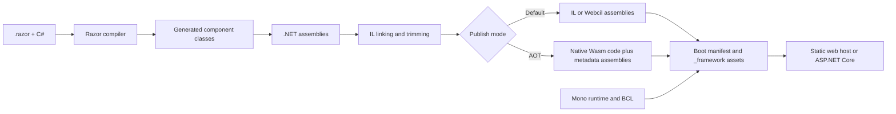
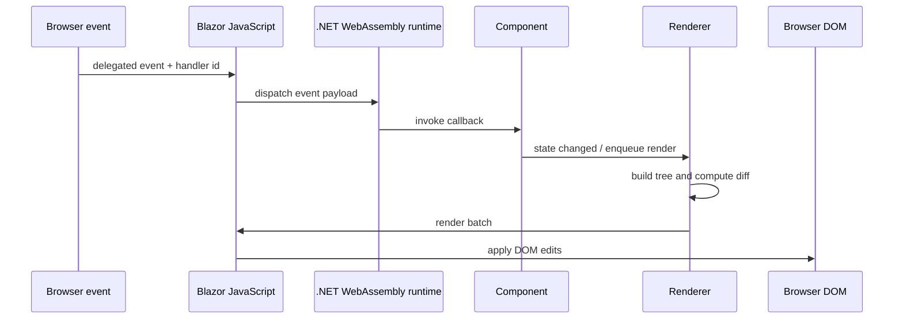
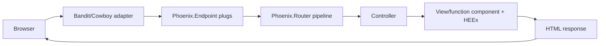
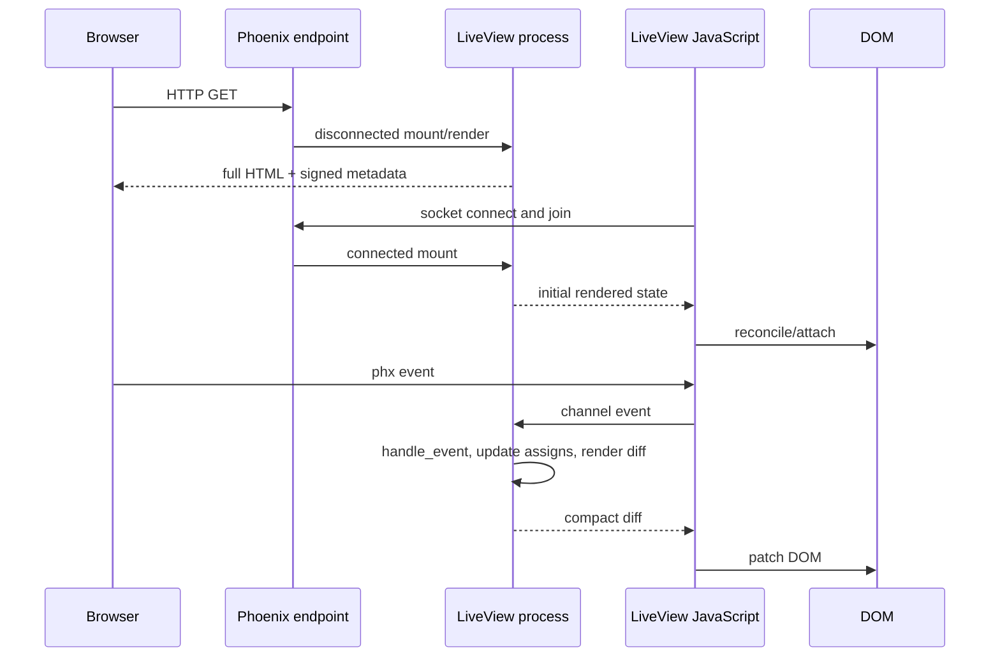
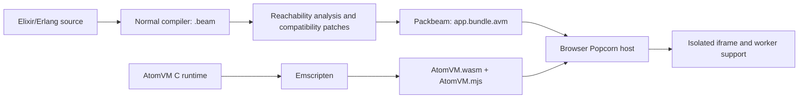
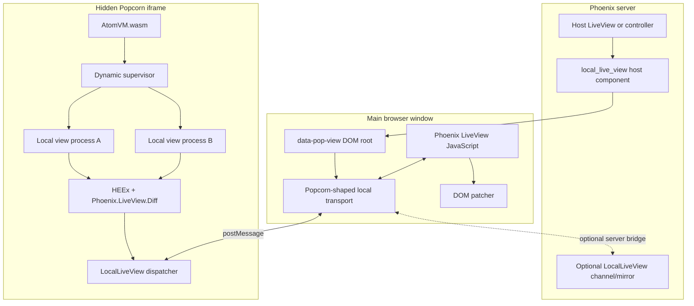
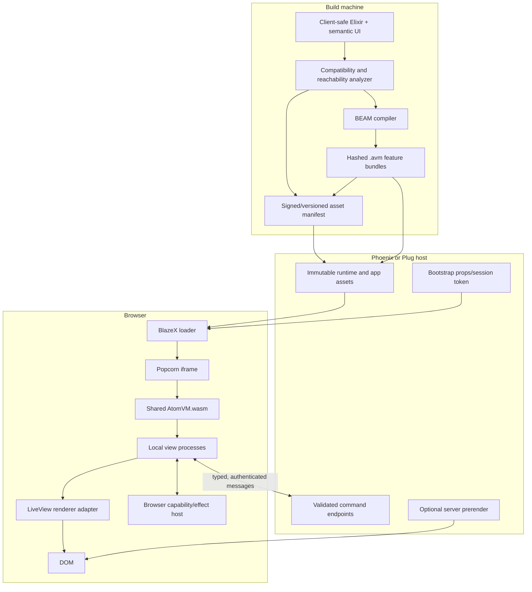
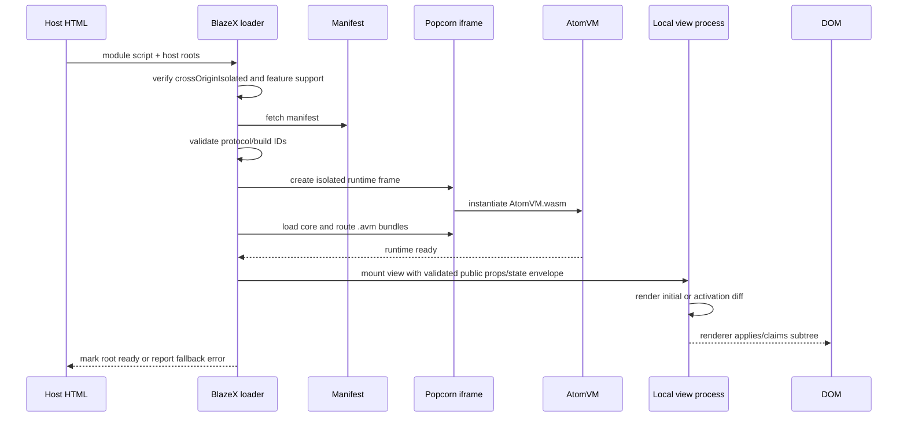
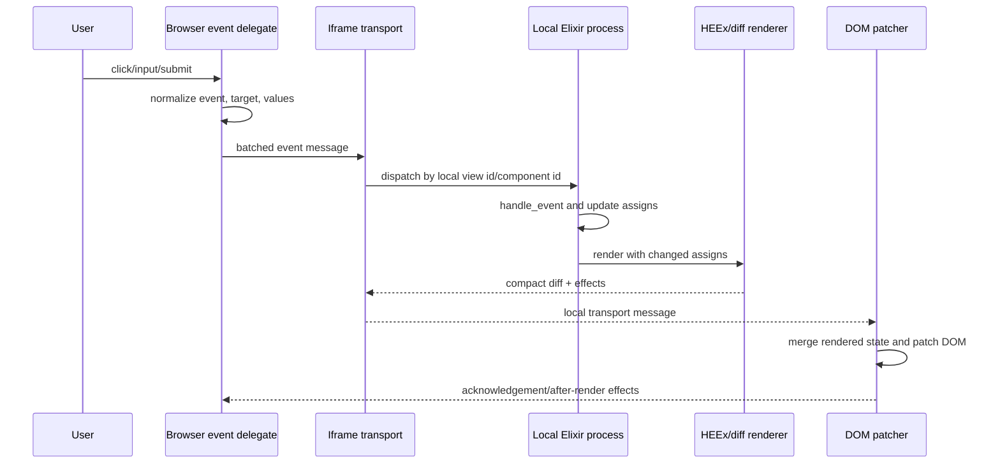

# Elixir WebAssembly component framework for Phoenix and Plug

**Status:** Research and architecture recommendation

**Date:** 2026-09-02

**Working project name:** BlazeX

**Primary question:** How could Elixir-authored UI components run across
browser and non-browser hosts—including WebAssembly deployments—while
integrating naturally with Phoenix and, where practical, plain Plug?

## Executive summary

The proposal is feasible, but the phrase “Elixir components compiled to WebAssembly” hides three materially different products:

1. **A language runtime compiled to WebAssembly, with application bytecode interpreted by it.** This is how ordinary Blazor WebAssembly works by default: the Mono/.NET runtime is WebAssembly, while application assemblies remain .NET IL. It is also how Popcorn works: AtomVM is compiled to WebAssembly, while Elixir/Erlang modules remain BEAM bytecode packaged in an `.avm` archive.
2. **Application code ahead-of-time compiled into native WebAssembly instructions.** Blazor supports this as an optional AOT publish mode. There is no current, production-ready, general Elixir/OTP AOT compiler with equivalent coverage.
3. **Independently composable WebAssembly Component Model binaries.** This is a standards-level component boundary defined with WIT and the Canonical ABI. It is not a browser UI component model, does not provide DOM access, and is not what Blazor means by a Razor component.

The first model is the realistic basis for BlazeX's initial browser profile.
It preserves far more of Elixir's semantics and gives a credible path to
processes, supervision, and LiveView-shaped APIs. It is not the universal
host definition: desktop profiles may use standard BEAM, native AtomVM, or a
non-browser AtomVM-in-Wasm target. The second model is useful for small,
constrained computational kernels. The third may become a useful host/plugin
ABI later, but should not define the initial UI architecture.

Blazor is an architectural reference in this report, not a product
compatibility target. BlazeX is intended to define native Elixir/Phoenix APIs
and semantics. It will not run Razor components, consume Blazor component
packages, mirror .NET types or lifecycle contracts, or claim source, binary,
API, renderer, or behavioral compatibility with .NET.

The target user-facing component catalog is **MudBlazor v9.9.0**, not
Blazor's basic framework components. MudBlazor supplies product and UX
evidence for layouts, actions, navigation, inputs, pickers, overlays, data
controls, charts, theming, and accessibility. BlazeX will implement that
breadth through independently named, native Elixir/Phoenix APIs and assets; it
will not load MudBlazor packages or seek .NET compatibility.

The most important discovery is that much of the proposed system now exists as an early implementation. Software Mansion's [Popcorn](https://github.com/software-mansion/popcorn) runs BEAM bytecode in a browser-hosted AtomVM WebAssembly runtime. Its new [LocalLiveView](https://github.com/software-mansion/popcorn/tree/main/local-live-view) package runs LiveView-style state and rendering in that browser VM, reuses HEEx and LiveView's diff representation, and feeds those diffs into the existing LiveView JavaScript DOM patcher. Version 0.1.0 was published on 2026-08-19, only two weeks before this report.

That changes the rational strategy. BlazeX should not begin by building a
BEAM-compatible VM or general Elixir-to-Wasm compiler from scratch. It should
use Popcorn/AtomVM and LocalLiveView to prove the first browser profile while
building a host-neutral semantic component and renderer boundary above them.
The recommended product shape is:

- a versioned semantic UI tree, event model, effect/capability protocol, and
  accessibility contract that depend on no browser or native toolkit;
- independent runtime, execution-host, renderer, capability-provider, remote,
  and packaging dimensions;
- a headless renderer, a DOM/LiveView adapter, and an early native-control
  vertical slice before public API stabilization;
- one shared AtomVM WebAssembly runtime per browser page/application, with
  hashed `.avm` bundles, as the first local execution profile;
- a small JavaScript host for that browser profile only;
- a public Elixir lifecycle based on `mount`, `update`, semantic events,
  messages, and renderer-neutral output;
- Phoenix as the first trusted remote/server adapter and Plug as a bounded
  alternative;
- a webview desktop shell as an optional middle profile, not the native UI
  destination;
- future fully native widget renderers driven by the same semantic contracts;
  and
- an optional restricted native-Wasm execution backend for tiny pure kernels,
  distinct from the native-control renderer goal.

The conclusion is therefore **“prototype now, productize cautiously.”** The technical path is real and unusually well aligned with Phoenix, but the current foundations are experimental: Popcorn's API is explicitly unstable, currently pins exact OTP and Elixir versions, AtomVM implements only a subset of OTP/BEAM facilities, and LocalLiveView 0.1.0 relies on private LiveView internals. BlazeX should wrap those dependencies behind its own public API, pin and test a toolchain/runtime support matrix, and use explicit release gates before claiming production readiness.

## 1. Scope and terminology

### 1.1 Questions this report answers

This report investigates:

- what Blazor components actually compile into;
- how the Blazor renderer, runtime, event loop, DOM bridge, server modes, packaging, and lazy loading work;
- how Plug, Phoenix, HEEx, Channels, PubSub, LiveView, and LiveComponents divide responsibility;
- which architectural lessons should be adapted to Elixir/Phoenix or deliberately avoided;
- the current state of Elixir/Erlang-to-WebAssembly approaches;
- how Phoenix and Plug could host the resulting artifacts;
- what a practical BlazeX component API, runtime, build pipeline, security model, and roadmap could look like.

This is an architecture study, not a claim that all cited experimental projects are production-ready. Version-sensitive findings are dated 2026-09-02.

### 1.2 Four overloaded meanings of “component”

The word *component* appears in four different domains. They must not be conflated:

| Term | Meaning | Runtime boundary? |
|---|---|---|
| Razor component | A .NET class generated from `.razor` markup and C# | Normally no; it shares the app's renderer and .NET runtime |
| Phoenix function component | An Elixir function accepting assigns and returning HEEx | No; it executes in its caller's process |
| Phoenix LiveComponent | Stateful markup and event callbacks identified by module and ID | State boundary, but no process boundary; it runs in the parent LiveView process |
| WebAssembly Component Model component | A typed binary composition unit with WIT imports/exports | Yes; a language-neutral ABI and capability boundary |

In this report, **UI component** means a reusable state/render/event abstraction. **Wasm component** means a WebAssembly Component Model artifact only when explicitly stated.

### 1.3 What “compiled to WebAssembly” should mean in project language

BlazeX documentation should describe artifacts precisely:

- **Runtime-in-Wasm:** “Elixir components run in a WebAssembly-hosted AtomVM.”
- **Bytecode bundle:** “Elixir source compiles normally to BEAM bytecode, then packages into an `.avm` bundle.”
- **Native Wasm:** Reserve this phrase for functions or modules whose instructions are actually lowered to WebAssembly.
- **Wasm Component Model:** Reserve this phrase for WIT/component binaries.

This is not pedantry. The distinction predicts startup size, performance, reflection/dynamic-code support, debugging, compatibility, and package boundaries.

## 2. Host and WebAssembly constraints

Any architecture has to respect the selected host before considering Elixir
or Phoenix. The browser is the first implementation host, not the only one.
Core WebAssembly defines imports rather than a DOM, filesystem, window system,
or native widget API. Browser JavaScript, WASI, a native embedder, or an
application-specific shell must supply those capabilities.

The [host-neutral architecture
amendment](host-neutral-blazex-architecture-and-native-control-backends.md)
therefore separates runtime substrate, execution host, renderer, capability
provider, remote adapter, and deployment shell. Sections below that discuss
the DOM describe the browser profile, not the universal component ABI.

### 2.1 WebAssembly does not own the DOM

Core WebAssembly defines computation, linear memory, tables, imports, and exports. It deliberately does not define browser APIs. The official [WebAssembly JavaScript Interface](https://webassembly.github.io/spec/js-api/) states that the embedder supplies the connection to the surrounding environment. In a browser, JavaScript (or generated bindings exposed through JavaScript) instantiates the module and provides host functions.

Consequences:

- A Wasm UI framework still needs a JavaScript host layer.
- DOM nodes are browser objects, not values in Wasm linear memory.
- Events must cross a JS/Wasm boundary.
- Strings, maps, and trees require an ABI, serialization, shared-memory view, opaque handles, or generated bindings.
- Fine-grained DOM calls amplify boundary overhead. Batching render operations or sending compact diffs is usually superior.

Blazor and LiveView both follow this rule. Their application logic and render calculation occur outside JavaScript, but JavaScript remains responsible for applying changes to the actual DOM.

### 2.2 A UI component is not a Wasm Component Model component

The [WebAssembly Component Model](https://github.com/WebAssembly/component-model/blob/main/design/mvp/Explainer.md) adds typed imports and exports, WIT interfaces, resources, composition, and a Canonical ABI over Core Wasm modules. It is valuable for cross-language linking and capability control. Browser execution is possible today through tooling such as Bytecode Alliance's [Jco](https://github.com/bytecodealliance/jco), which transpiles components into ES modules plus Core Wasm. Browser WASI support and automatic WebIDL bindings are still described as experimental in the [Jco documentation](https://github.com/bytecodealliance/jco/blob/main/docs/src/transpiling.md).

The Component Model does **not** supply:

- a DOM renderer;
- lifecycle or state management;
- browser event delegation;
- reconciliation;
- CSS or asset loading;
- routing;
- server rendering or hydration;
- an Elixir compiler.

It may eventually be useful as a backend-neutral contract for pure BlazeX services or plugins. It is premature as the foundation of the first UI runtime.

### 2.3 Cross-origin isolation is a deployment concern, not a build detail

Popcorn currently requires `SharedArrayBuffer`, and its setup requires:

```http
Cross-Origin-Opener-Policy: same-origin
Cross-Origin-Embedder-Policy: require-corp
```

Those headers make the page cross-origin isolated. As documented for [COOP](https://developer.mozilla.org/en-US/docs/Web/HTTP/Reference/Headers/Cross-Origin-Opener-Policy), cross-origin resources then need appropriate CORS or CORP treatment. This can affect analytics, third-party fonts, payment widgets, OAuth popups, embedded content, CDN assets, and any page expected to cooperate with another browsing context.

BlazeX must therefore make cross-origin-isolation compatibility a deployment gate. The Phoenix and Plug adapters should set the headers only through an explicit plug and should include a diagnostic that checks `globalThis.crossOriginIsolated` before boot.

### 2.4 The client is always untrusted

WebAssembly's sandbox protects the browser host from the module; it does not make application code or data secret from the user running that module. A user can inspect, modify, replay, or replace client-side state and requests. Therefore:

- authorization remains server-side;
- secrets, private keys, privileged credentials, and trusted business decisions never enter the client bundle;
- server commands validate all component events and mirrored state;
- client validation is a usability feature, not a security boundary;
- client-generated identifiers, prices, roles, and ownership claims are untrusted.

## 3. Blazor architecture deep dive

### 3.1 The corrected Blazor mental model

Blazor does **not** normally produce one standalone WebAssembly module per Razor component. A `.razor` file is compiled by the Razor SDK into a generated .NET component class. Many component classes are compiled together into .NET assemblies. A browser app downloads one shared .NET/Mono WebAssembly runtime, framework assemblies, application assemblies, configuration, JavaScript boot code, and static assets.

In the default execution mode:

- the runtime itself is native WebAssembly;
- application and framework code remain managed .NET IL;
- the runtime interprets IL, augmented by partial JIT support known informally as the Jiterpreter;
- Webcil may wrap managed assemblies in a Wasm container format so restrictive networks serve them more reliably, but that wrapper does not turn each assembly into native Wasm instructions.

With optional AOT publishing, .NET methods are compiled to native WebAssembly. Even then, the application remains a shared runtime/application graph, and managed assemblies still ship for metadata and runtime features. Microsoft reports that AOT applications are generally around twice the size of interpreted IL applications, with the trade favoring CPU-intensive workloads. See the [.NET 10 WebAssembly build and AOT guide](https://learn.microsoft.com/en-us/aspnet/core/blazor/webassembly-build-tools-and-aot?view=aspnetcore-10.0) and the [.NET Webcil design](https://github.com/dotnet/runtime/blob/main/docs/design/mono/webcil.md).

The closest Elixir equivalent is therefore:

```text
Blazor default       = Mono runtime.wasm + .NET IL/Webcil assemblies
Popcorn/BlazeX       = AtomVM runtime.wasm + BEAM modules in .avm bundles
```

This analogy is substantially more accurate than “each component is WebAssembly.”

### 3.2 Blazor's unified component model and render modes

Modern Blazor Web Apps expose a common Razor component model across four modes documented in [.NET 10 render modes](https://learn.microsoft.com/en-us/aspnet/core/blazor/components/render-modes?view=aspnetcore-10.0):

| Mode | Where state and event handlers execute | Connection/runtime |
|---|---|---|
| Static Server | Server, request only | Normal HTTP; no interactive component runtime |
| Interactive Server | Server | Persistent SignalR circuit; browser applies render batches |
| Interactive WebAssembly | Browser | Downloaded .NET Wasm runtime and app bundle |
| Interactive Auto | Server on the first relevant visit; browser on later visits after download | Chooses one mode for a component instance; does not migrate a live instance |

Interactive modes are prerendered by default. WebAssembly and Auto components must be available from a separate client project so the build can place them in the downloaded browser bundle. Render modes propagate down a component hierarchy, and a child cannot arbitrarily switch to a different interactive runtime. Values crossing a static-to-interactive boundary must be serializable.

The design achievement is not merely Wasm. It is a component contract and renderer abstraction that can execute under multiple hosts. BlazeX should copy this principle: keep the component-facing API largely host-neutral, then provide local-Wasm, server-LiveView, static, and perhaps future native-Wasm renderers.

### 3.3 Compilation and publication pipeline

A simplified Blazor WebAssembly pipeline is:



Important stages are:

1. Razor markup generates C# code that builds a logical render tree.
2. C# and generated code compile to normal .NET assemblies.
3. Release publication trims unreachable IL and precompresses framework assets.
4. The build emits boot resources and runtime JavaScript.
5. Optional AOT lowers managed methods to Wasm through the .NET/Emscripten toolchain.
6. The host serves immutable static artifacts. A standalone Blazor WebAssembly app does not require ASP.NET Core; ASP.NET Core is needed for server modes and often used for APIs, auth, and convenient hosting.

The equivalent BlazeX build should preserve the same separation: ordinary language compilation first, browser-runtime packaging second, host integration third.

### 3.4 Browser boot and resource graph

The .NET browser runtime includes a loader, JavaScript runtime glue, Emscripten/native support, the native Wasm runtime, base class libraries, and application assemblies. The exact file layout evolves by .NET release, so the durable concept is more important than filenames: a boot manifest/configuration describes a graph of hashed resources that the loader fetches, instantiates, and caches.

For BlazeX, the corresponding graph should be explicit:

```text
blazex-loader.js
atomvm.<runtime-version>.wasm
atomvm.<runtime-version>.mjs
blazex-dom.<protocol-version>.js
app.<content-hash>.avm
feature-<name>.<content-hash>.avm       # optional lazy bundle
blazex-manifest.<content-hash>.json
```

Runtime assets should be long-lived and cacheable across application deployments. Application bundles should be content-addressed. A manifest should bind exact runtime, renderer protocol, app ABI, and feature bundles, preventing a stale loader from pairing with an incompatible bundle.

### 3.5 Component contract and lifecycle

Razor components implement `IComponent`, normally through [`ComponentBase`](https://github.com/dotnet/aspnetcore/blob/v10.0.0/src/Components/Components/src/ComponentBase.cs). Parameters are applied, initialization and parameter callbacks execute, the renderer invokes the component's render fragment, and state changes enqueue another render. Event callbacks generally trigger rendering automatically. Asynchronous lifecycle methods can cause an initial render and a later completion render. `OnAfterRender` runs only after an interactive DOM update, not during server prerendering.

The broad lifecycle is:

```text
construct/attach
  -> set parameters
  -> initialize (once)
  -> parameters set (each update)
  -> build render tree
  -> renderer computes and applies batch
  -> after-render callback (interactive only)
  -> event/async completion/state notification
  -> repeat render
  -> dispose
```

Lessons for BlazeX:

- lifecycle phases must say whether a real DOM exists;
- server prerender and browser activation may execute initialization twice unless state is transferred;
- side effects need explicit ownership and idempotency rules;
- scheduling a render should be a framework operation, not a user-managed DOM call;
- component disposal must release timers, subscriptions, JS handles, and processes.

### 3.6 Render-tree construction and diffing

Generated Razor code emits `RenderTreeBuilder` operations with frame types such as element, text, attribute, component, region, and markup. Frames include **sequence numbers** derived from source locations. They are not runtime counters: they let the diff algorithm infer which branches and loops correspond across renders. Explicit keys supply identity where list position is insufficient.

The central renderer, [`Renderer`](https://github.com/dotnet/aspnetcore/blob/v10.0.0/src/Components/Components/src/RenderTree/Renderer.cs), maintains component state, event-handler identity, pending render queues, and batch construction. [`RenderTreeDiffBuilder`](https://github.com/dotnet/aspnetcore/blob/v10.0.0/src/Components/Components/src/RenderTree/RenderTreeDiffBuilder.cs) compares old and new frame ranges and emits edits. A render batch includes updated component diffs, reference frames, disposed component IDs, and disposed event-handler IDs.

This architecture avoids serializing full HTML after every event. The browser receives a compact operation stream and applies it with JavaScript. It also makes identity a first-class protocol concern; a framework cannot add reliable local components by treating rendered HTML as an opaque string.

HEEx takes a different but related route: it compiles templates into known static fragments plus dynamic functions, tracks which assigns changed, and sends only changed dynamic data. BlazeX should reuse that representation initially instead of inventing a virtual DOM.

### 3.7 The event-to-DOM pipeline

The client-side Blazor path is approximately:



[`WebAssemblyRenderer`](https://github.com/dotnet/aspnetcore/blob/main/src/Components/WebAssembly/WebAssembly/src/Rendering/WebAssemblyRenderer.cs) is the browser-specific renderer. Its display update crosses into JavaScript to apply a `RenderBatch`; in the normal in-process path, JavaScript can read the batch from managed/Wasm memory synchronously while the heap is held stable. Incoming events are ordered through the renderer's work queue.

The key abstraction is a renderer protocol, not direct component-to-DOM access. BlazeX should preserve the same direction:

```text
DOM event -> JS event delegate -> local Elixir process -> HEEx diff
          -> JS diff decoder -> DOM patch
```

### 3.8 JavaScript interoperability

Blazor supports calls in both directions. General interop APIs are asynchronous so component code remains portable to server hosting, where a call crosses a network. Browser-only code can use synchronous in-process APIs, and newer `[JSImport]`/`[JSExport]` bindings reduce marshalling overhead for compatible signatures. The official [JavaScript interop guidance](https://learn.microsoft.com/en-us/aspnet/core/blazor/javascript-interoperability/call-javascript-from-dotnet?view=aspnetcore-10.0) still treats JavaScript as the bridge to browser-only APIs.

BlazeX should define two interop tiers:

- **Portable effects:** asynchronous, serializable commands such as focus, clipboard, storage, navigation, and measurement. These can be interpreted by either a local or remote renderer.
- **Local browser interop:** explicitly browser-only calls returning JSON-compatible values or opaque handles, with batching and lifecycle-managed disposal.

Direct arbitrary JavaScript evaluation should not be a core API. Named imports and capability-scoped effects are easier to audit, mock, version, and support in server rendering.

### 3.9 Packaging, class libraries, and lazy loading

Razor Class Libraries package component assemblies and static web assets into NuGet packages. Static assets are conventionally exposed under `_content/{package}`. This is a useful model for Hex packaging: a BlazeX package should be able to contribute BEAM modules, component metadata, JavaScript/CSS assets, and build-time manifest entries without copying files manually into the host app.

Blazor's [lazy assembly loading](https://learn.microsoft.com/en-us/aspnet/core/blazor/webassembly-lazy-load-assemblies?view=aspnetcore-10.0) is assembly-level. The browser fetches another managed assembly and loads it into the existing runtime. It does not start a separate Wasm runtime per component. BlazeX should likewise lazy-load **feature bundles**, not individual runtimes:

- keep AtomVM and core HEEx/renderer modules shared;
- group components by route or product feature;
- permit one or more `.avm` bundles to load into the existing VM;
- make package/module identity and version conflicts deterministic;
- prefetch likely bundles during idle time.

### 3.10 Server rendering, hydration, and Auto mode

Blazor's prerendering improves first paint and non-JavaScript output, but introduces an execution boundary. The server first renders HTML. Later the chosen interactive runtime starts, reconstructs component state, attaches event handlers, and becomes authoritative. Without persisted state, initialization can run twice and duplicate data loading or visible work. Blazor provides state transfer mechanisms and explicit render-mode information to manage this.

Interactive Auto is often misunderstood. It does not begin on the server and move a live component's state into Wasm mid-session. It chooses server interactivity initially while browser assets download, then uses client interactivity on subsequent visits when assets are cached. Existing instances retain their chosen mode.

For BlazeX, this suggests three separate deliverables:

1. **Client-only islands:** simplest; a server-rendered placeholder is replaced after AtomVM starts.
2. **Static prerender plus activation:** server renders equivalent HEEx and transfers initial props/state; browser claims or reconciles the DOM.
3. **Auto-like visit selection:** a host may choose server LiveView on a cold cache and local execution on a future navigation, but should not attempt live process migration in the first design.

### 3.11 Blazor lessons to adopt and avoid

Adopt:

- one component contract across multiple render hosts;
- a shared runtime and renderer;
- compact render batches rather than chatty DOM calls;
- explicit identity, keys, lifecycle, and disposal;
- manifest-driven boot and content-hashed resources;
- library packaging that includes code and static assets;
- server prerender as an independent phase with explicit state transfer;
- coarse lazy-loading boundaries.

Avoid or defer:

- presenting per-component Wasm as the architecture;
- AOT as an MVP requirement;
- hidden coupling between public components and renderer internals;
- runtime-mode switching for an already-live instance;
- unrestricted interop that makes host-neutral components impossible;
- making the largest possible runtime the default for tiny isolated controls.

## 4. Plug, Phoenix, and LiveView architecture deep dive

### 4.1 The layers are intentionally separable

Phoenix is not the Elixir web server and Plug is not a UI framework. The relevant stack is:

```text
HTTP server adapter (normally Bandit; Cowboy is also supported)
  -> Plug connection and plug pipeline
    -> Phoenix.Endpoint
      -> Phoenix.Router and route pipelines
        -> controller/view/HEEx, Channel, or LiveView
          -> application contexts, PubSub, persistence, external services
```

That separation is useful for BlazeX:

- A **Plug-only host** can serve Wasm, JavaScript, `.avm`, manifests, headers, and HTTP endpoints.
- A **Phoenix host** adds conventional routing, asset integration, sessions, CSRF, verified routes, Channels, PubSub, HEEx components, and LiveView's renderer.
- A **Phoenix LiveView host** can also prerender local components and bridge server events using existing conventions.

Phoenix should be the primary integration because the desired component semantics already overlap heavily with HEEx and LiveView. Plug remains a valid lower-level host, not the lowest-common-denominator API that constrains the whole framework.

### 4.2 Plug: the minimal host contract

Plug models an HTTP request and response as an immutable `%Plug.Conn{}`. A module plug implements `init/1` and `call/2`; a function plug accepts a connection and options and returns a connection. Plugs compose into pipelines and can send, stream, upgrade, or halt a response. The current [Plug guide](https://plug.hexdocs.pm/readme.html) is the canonical introduction.

A BlazeX Plug integration needs only conventional web responsibilities:

```elixir
plug BlazeX.Plug.CrossOriginIsolation
plug Plug.Static,
  at: "/_blazex",
  from: {:blazex_app, "priv/static/blazex"},
  gzip: true,
  only: ~w(manifest runtime bundles js css)
plug BlazeX.Plug.Bootstrap
plug MyApp.Router
```

The exact API is illustrative, but its responsibilities should be narrow:

- set or validate required response headers;
- serve immutable assets with correct MIME types, including `application/wasm`;
- expose a signed boot manifest and public initial props;
- optionally expose command/event endpoints;
- never assume Phoenix modules exist in the core package.

Plug does not provide a component compiler, browser diff renderer, WebSocket topic protocol, CSRF policy, or state synchronization model. BlazeX must bring those itself or enable optional Phoenix adapters.

### 4.3 Phoenix endpoint and request lifecycle

`Phoenix.Endpoint` is the supervised boundary for web traffic and sockets. It owns the common plug pipeline, static serving, session and socket configuration, code reload hooks, and web-server integration. The router then matches verb and path, runs route-specific pipelines, and dispatches to a controller, LiveView, or other plug. The official [request lifecycle](https://phoenix.hexdocs.pm/request_lifecycle.html), [routing guide](https://phoenix.hexdocs.pm/routing.html), and [`Phoenix.Endpoint`](https://phoenix.hexdocs.pm/Phoenix.Endpoint.html) reference document the layers.

For ordinary HTML:



Phoenix's value to BlazeX is not that it can serve a `.wasm` file—any static server can do that. Its value is that the rest of an Elixir web application already has a supervised lifecycle, request security, session establishment, asset conventions, route metadata, component templates, realtime transport, and cluster messaging.

### 4.4 HEEx and function components

Phoenix function components are ordinary functions that take an `assigns` map and return a HEEx template. HEEx provides HTML-aware parsing, safe escaping, declarative attributes and slots, component calls, and compile-time validation. See [Components and HEEx](https://phoenix.hexdocs.pm/components.html).

Conceptually:

```elixir
attr :label, :string, required: true
attr :count, :integer, default: 0

def badge(assigns) do
  ~H"""
  <span class="badge">{@label}: {@count}</span>
  """
end
```

A function component is a strong basis for stateless BlazeX UI because:

- it is already idiomatic Phoenix;
- its inputs can be declared and validated;
- its output has a structured static/dynamic representation;
- it runs on ordinary BEAM for server rendering and can run on AtomVM if its transitive code is supported;
- it has no implicit process or network requirement.

Not every Phoenix component should become a local component. A reusable HTML primitive often belongs as a function component rendered by its parent. A local runtime boundary is justified when a subtree owns state, events, timers, offline behavior, or latency-sensitive interaction.

### 4.5 HEEx's compiled render representation

HEEx is not merely string interpolation. LiveView's engine compiles a template into a `Phoenix.LiveView.Rendered` value containing:

- `static`: literal fragments shared across renders;
- `dynamic`: a function that yields dynamic entries or `nil` for unchanged entries;
- `fingerprint`: identity for template shape;
- nested rendered structures, comprehensions, and components.

The source-level explanation is in [`Phoenix.LiveView.Engine`](https://github.com/phoenixframework/phoenix_live_view/blob/main/lib/phoenix_live_view/engine.ex). Assign change tracking allows the engine to skip computation and transmission of unchanged dynamic expressions. The initial render carries static and dynamic parts; later diffs can refer to known statics and include only changes.

This gives BlazeX a mature intermediate representation with many properties that Blazor's render tree also supplies:

| Need | Blazor | HEEx/LiveView |
|---|---|---|
| Stable template shape | Source sequence numbers and frames | Template fingerprints and static fragments |
| Dynamic values | Render-tree frames | Dynamic function entries |
| Change pruning | Component render queue and tree diff | Changed assigns and `nil` dynamic entries |
| List identity/updates | Keys and subtree edits | Comprehension metadata, streams, component IDs |
| Browser application | Render batch JavaScript | LiveView `Rendered` merge and DOM patch JavaScript |

Reusing HEEx therefore avoids creating a new JSX-like language, parser, escaping model, slot system, and diff protocol.

### 4.6 Channels and PubSub

Phoenix Channels multiplex many logical topics over one WebSocket or long-poll connection. Each joined channel normally has a lightweight server process; messages are routed by topic and event. [Phoenix Channels](https://phoenix.hexdocs.pm/channels.html) supply transport, joins, replies, pushes, intercepts, and presence integration. [Phoenix PubSub](https://hexdocs.pm/phoenix_pubsub/Phoenix.PubSub.html) distributes topic messages locally and across a cluster.

For BlazeX, Channels are an optional server bridge, not the local component runtime:

- local events should not require a network round trip;
- trusted commands can be pushed to a server channel;
- server broadcasts can update local processes;
- mirrored state should name selected fields and conflict policy;
- connection loss should not terminate purely local state;
- reconnect should have an explicit resynchronization protocol.

A Plug-only host can implement an equivalent HTTP/WebSocket transport, but it should conform to a small BlazeX protocol rather than recreate every Phoenix Channel feature.

### 4.7 LiveView lifecycle and process model

A LiveView begins with an HTTP render so the browser receives usable HTML. JavaScript then connects over a Phoenix Socket, joins the LiveView topic, and the server starts or attaches the stateful LiveView process. The process receives events and messages, updates immutable socket assigns, renders a diff, and pushes it to the browser. The current [`Phoenix.LiveView`](https://phoenix-live-view.hexdocs.pm/Phoenix.LiveView.html) documentation summarizes it directly: a LiveView is a process that receives events, updates state, and renders page updates as diffs.



The principal callbacks are:

- `mount/3`: initialize from route params and session;
- `handle_params/3`: react to live URL changes;
- `handle_event/3`: process browser events;
- `handle_info/2`: process ordinary BEAM messages;
- `render/1`: produce HEEx;
- termination and async callbacks for cleanup/background work.

The architecture maps exceptionally well to a browser AtomVM:

```text
LiveView server process       -> local Elixir process in AtomVM
Phoenix channel event         -> iframe/JS dispatch into local process
socket assigns                -> local process state/socket assigns
HEEx render and Diff          -> same code running locally
wire diff                     -> local postMessage/JS boundary diff
LiveView DOM patcher          -> same browser JavaScript renderer
```

The largest semantic change is trust and capability: a server LiveView can access databases and secrets; a local component cannot and must issue a validated server command.

### 4.8 LiveView, LiveComponent, and function-component boundaries

The distinction matters for a browser runtime:

- A **LiveView is a process** and can receive ordinary messages.
- A **LiveComponent has its own state and lifecycle but runs inside the parent LiveView process**. It is identified by module plus ID and does not have an independent mailbox.
- A **function component is stateless** and runs as part of rendering its caller.

The current [`Phoenix.LiveComponent`](https://phoenix-live-view.hexdocs.pm/Phoenix.LiveComponent.html) docs explicitly recommend function components unless encapsulated state and event handling are needed.

BlazeX should preserve these economics:

- each local view/island may be one lightweight AtomVM process;
- nested stateful components can initially share the local view process and LiveView diff state;
- stateless function components remain calls, not processes;
- an explicit `isolated: true` or child-local-view primitive can create a separate process when fault isolation, a mailbox, or independent lifecycle is required.

“One process per visual node” would squander memory and complicate ownership. “One process per interactive island” aligns with both LiveView and the browser runtime.

### 4.9 LiveView browser client

The JavaScript client has more responsibility than a thin WebSocket wrapper. It:

- captures `phx-*` events through delegated listeners;
- serializes event values and targeting information;
- tracks views and component IDs;
- merges compact rendered diffs into a client-side rendered representation;
- applies DOM patches while preserving focus, form state, hooks, uploads, transitions, and ignored subtrees;
- handles navigation, reconnects, pending events, loading classes, and server-pushed events.

The server-side [`Phoenix.LiveView.Diff`](https://github.com/phoenixframework/phoenix_live_view/blob/main/lib/phoenix_live_view/diff.ex) and browser-side [`Rendered`](https://github.com/phoenixframework/phoenix_live_view/blob/main/assets/js/phoenix_live_view/rendered.js) / [`DOMPatch`](https://github.com/phoenixframework/phoenix_live_view/blob/main/assets/js/phoenix_live_view/dom_patch.js) form a protocol pair.

This is a major reason to build on LiveView instead of writing a minimal `innerHTML` loop. Correct DOM reconciliation around forms, focus, nested components, uploads, and hooks contains years of edge-case work. The cost is coupling: BlazeX must either obtain a supported public renderer API from LiveView or own a versioned fork/adapter with exhaustive compatibility tests.

### 4.10 Phoenix lessons to adopt and avoid

Adopt:

- HEEx as the initial template and render IR;
- immutable assigns and explicit state transitions;
- one process per interactive island, not per leaf component;
- server command boundaries for privileged work;
- Channels/PubSub as optional integration capabilities;
- initial HTTP output and progressive enhancement as the long-term UX target;
- function components for cheap stateless composition;
- familiar lifecycle and event callback names.

Avoid or constrain:

- calling browser-local state a secure source of truth;
- depending indefinitely on private LiveView internals;
- assuming an always-connected socket for local interactions;
- serializing arbitrary Elixir terms across a trust boundary;
- running unsupported OTP/NIF-dependent libraries in AtomVM without build-time diagnostics;
- forcing Phoenix on the runtime core when a Plug/static host is enough.

## 5. Blazor and Phoenix/LiveView compared

The systems converge at the rendering boundary but place computation on opposite sides of the network.

| Concern | Blazor WebAssembly | Phoenix LiveView | Proposed BlazeX local runtime |
|---|---|---|---|
| Authoring language | Razor + C# | HEEx + Elixir | HEEx + Elixir |
| Stateful logic | Browser .NET runtime | Server BEAM process | Browser AtomVM process |
| Initial output | Optional/default server prerender in Blazor Web App; CSR in standalone | HTTP server render | Client-only first, then server prerender/hydration |
| Render representation | RenderTree frames | Static/dynamic HEEx + fingerprints | Reused HEEx/LiveView diff initially |
| Diff calculation | Browser for Wasm mode | Server | Browser AtomVM |
| Diff transport | In-memory JS interop | Phoenix Channel | iframe `postMessage`/JS interop |
| DOM updates | Blazor JavaScript renderer | LiveView JavaScript renderer | LiveView renderer adapter initially |
| Component isolation | Logical component state; shared runtime | LiveView process; LiveComponents share it | Local-view process; nested components share it |
| Offline local events | Yes | No, unless custom JS | Yes for bundled/local work |
| Trusted state | No | Yes, subject to server validation model | No; server validates commands |
| Realtime server bridge | HTTP/SignalR as app needs | Built in | Optional Channels/HTTP bridge |
| Fixed browser payload | .NET runtime, BCL, assemblies | Small JS client | AtomVM, patched libs, HEEx/LiveView code, app bundle |
| AOT application code | Supported | Not applicable | Not generally available |
| Package unit | Assembly/Razor Class Library | Hex package/BEAM modules/assets | Hex package plus bundle/asset manifest |
| Lazy unit | Managed assembly | Not usually client code | `.avm` feature bundle |

The transferable Blazor idea is a **host-neutral component and renderer architecture**. The transferable LiveView idea is a **compiled template diff protocol and process-shaped state model**. BlazeX can combine them: LiveView's Elixir-facing semantics with Blazor's local execution and multi-host framing.

## 6. Current Elixir and WebAssembly landscape

### 6.1 Popcorn and AtomVM: a practical managed-runtime route

[AtomVM](https://github.com/atomvm/AtomVM) is a compact, from-scratch virtual machine that executes BEAM bytecode and implements a useful subset of Erlang/OTP and Elixir. Its Emscripten target can run in browsers. [Popcorn](https://github.com/software-mansion/popcorn) turns that capability into an Elixir browser toolchain.

The build/runtime model is:



Popcorn's architecture places AtomVM and application bundles in a hidden iframe. The main page and iframe exchange messages through `postMessage`. The isolation prevents a VM hang or crash from directly taking down main-page JavaScript and gives the host a place to detect and restart failure. It also creates an unavoidable serialization/scheduling boundary.

Popcorn patches known Erlang/Elixir standard-library modules when AtomVM lacks a native function, then includes the compatible variants in the `.avm` bundle. Experimental tree shaking constructs a call graph to omit unreachable functions/modules. The output is still ordinary BEAM bytecode executed by AtomVM.

As of Popcorn 0.3.3, the important limitations are:

- its public API is explicitly unstable;
- the package requires OTP 26.0.2 and Elixir 1.17.3 exactly;
- AtomVM does not implement all BEAM instructions, OTP applications, BIFs, or NIFs;
- large integers, unusual bitstrings, distribution, ETS, logger, timers, random facilities, and native-dependent libraries have varying or partial support;
- JavaScript interop accepts JSON-compatible values, with opaque references for complex host objects;
- every JS/Elixir call crosses iframe `postMessage`, so batching matters;
- ordinary BEAM debugging/profiling tools are not available in full;
- current browser setup requires cross-origin isolation.

These constraints do not invalidate the architecture. They define a browser-runtime support profile that BlazeX must make explicit and testable.

### 6.2 LocalLiveView: the reference implementation discovered during research

[LocalLiveView](https://github.com/software-mansion/popcorn/tree/main/local-live-view) is not merely adjacent prior art. It implements the central idea of this project:

- LiveView-shaped Elixir state runs inside browser AtomVM;
- HEEx renders locally;
- LiveView's diff machinery computes a compact update locally;
- the stock LiveView JavaScript client applies the update to the DOM;
- selected events/state can still cross to Phoenix.

The 0.1.0 package architecture, reconstructed from its source, is:



Key implementation details are:

1. A `<.local_live_view>` server function component emits a root element carrying the local module name, instance ID, serialized initial assigns, a hook, and `phx-update="ignore"` so the host LiveView does not overwrite the locally managed subtree.
2. Popcorn starts one shared AtomVM runtime. Local view instances are individual Elixir processes under a dynamic supervisor rather than separate Wasm instances.
3. A dispatcher process maps JavaScript calls to local view IDs/processes.
4. The local server process invokes the view lifecycle and private `Phoenix.LiveView.Diff`, `Renderer`, `Lifecycle`, and utility modules to produce the same shape of data expected by LiveView JavaScript.
5. JavaScript presents a transport compatible with the Socket/Channel/View objects expected by the LiveView client. The normal rendered-state merge and DOM patch code can therefore operate without a second DOM framework.
6. Event routing beneath a local root is redirected into this local transport.
7. `push_server_event` uses a host bridge for optimistic-local-then-server interactions. Mirror sync uses a Phoenix Channel, signed token, a server mirror process, and selected JSON-compatible state.

This implementation validates the core event loop but exposes several product risks:

- **Version coupling:** it imports LiveView implementation modules that are not public compatibility contracts and adapts JavaScript internals.
- **Toolchain coupling:** it inherits Popcorn and AtomVM version restrictions.
- **No completed SSR:** initial local content waits for runtime activation unless the host independently emits a placeholder; SSR is listed as future work.
- **Payload floor:** the inspected 0.1.0 package contains a 4,234,209-byte raw `AtomVM.wasm`; gzip at level 9 produced 1,416,258 bytes for that file alone. The four principal raw runtime/LLV assets total 4,594,577 bytes before the application `.avm`, CSS, and host code. The authors separately report an experimentally tree-shaken Kanban demo at about 1.8 MB for all compressed assets.
- **Serialization:** iframe/JS messages use JSON-compatible data and add latency; host-to-local initial-assign handling and server mirror paths do not form one general transparent Elixir-term channel.
- **Shared fate within the VM:** views are process-isolated in the Elixir sense, but a VM-level failure affects all local views sharing that runtime.
- **Trust:** every local assign and module is visible and modifiable by the user.

The correct strategic response is to wrap and harden LocalLiveView, not duplicate it invisibly. BlazeX should seek upstream public renderer hooks and contribute compatibility/testing improvements where possible.

### 6.3 Orb: native Wasm through a constrained Elixir DSL

[Orb](https://github.com/RoyalIcing/Orb) lets Elixir execute at compile time to construct Core Wasm modules. It can produce very small modules because it carries no BEAM runtime. The trade is explicit: Orb does not aim to run arbitrary Elixir at Wasm runtime, does not provide OTP processes, and treats DOM access as a poor fit.

Orb is appropriate for:

- pure reducers and state machines;
- parsers, codecs, validators, and formatters;
- CPU-heavy algorithms;
- deterministic HTML/SVG/string builders;
- tiny interactive controls with a deliberately narrow ABI.

It is not an implementation of “write a normal LiveView and run it locally.” BlazeX can support an Orb-like backend later under a distinct API such as `use BlazeX.NativeComponent`, with compile-time types and effects, but should not claim transparent source compatibility between that backend and full local Elixir.

### 6.4 Hologram: useful compiler/framework comparison, JavaScript target

[Hologram](https://github.com/bartblast/hologram) compiles client-reachable Elixir to JavaScript and provides its own pages, components, `~HOLO` templates, local actions, server commands, runtime, and JavaScript interop. It is relevant because it has to solve dependency reachability, client/server code separation, standard-library emulation, state ownership, browser interop, bundle budgets, errors, and developer tooling.

It does not target Wasm and is not HEEx/LiveView-compatible. Adopting it would answer “Elixir-authored client framework” but not the stated WebAssembly goal. Its design reinforces two BlazeX principles:

- make client reachability and forbidden server code visible at build time;
- model trusted server work as commands rather than allowing ambient server access from client code.

### 6.5 Wasmex: useful in the opposite direction

[Wasmex](https://github.com/tessi/wasmex) embeds Wasmtime in a BEAM server using a Rust NIF. It runs Wasm modules from Elixir for sandboxing, plugins, WASI, and shared cross-language logic. That is the reverse of Popcorn: Wasm-in-Elixir rather than Elixir-in-Wasm.

Wasmex is not a browser runtime. It could nevertheless support BlazeX's restricted native-Wasm track by executing the same pure component kernel on the Phoenix server for SSR, conformance testing, or edge/server reuse.

### 6.6 Firefly: evidence about the cost of general AOT

[Firefly](https://github.com/GetFirefly/firefly), formerly Lumen, attempted an alternative BEAM compiler/runtime with LLVM and WebAssembly targets. Its pipeline and runtime ambitions show what general Elixir AOT entails: Erlang frontend semantics, multiple intermediate representations, process scheduling, garbage collection, exceptions, BIF/NIF surfaces, OTP compatibility, and host services.

The project was experimental and archived in June 2024. It is not a viable dependency. Its history is a warning against making a new general compiler/runtime the first BlazeX milestone.

### 6.7 Component Model: possible future ABI, not the first UI runtime

WIT could eventually define boundaries such as:

```wit
package blazex:component@1.0.0;

interface reducer {
  reduce: func(state: list<u8>, event: list<u8>) -> result<list<u8>, string>;
}
```

That would help language-neutral pure kernels and capability-scoped plugins. It does not encode an Elixir process, HEEx render tree, callback lifecycle, DOM ownership, or Phoenix session. Browser tooling currently lowers/transpiles components through JavaScript bindings and shims. The Component Model belongs on the long-term interoperability roadmap, not in the MVP critical path.

### 6.8 Landscape summary

| Approach | Ordinary Elixir semantics | Native app Wasm | Typical fixed cost | HEEx/LiveView reuse | Maturity for this goal | Recommended role |
|---|---:|---:|---:|---:|---|---|
| Popcorn + AtomVM | Partial but substantial | No; VM is Wasm, app is BEAM | Runtime in megabyte class before compression/tree shaking | Yes through LocalLiveView | Experimental but working | Primary prototype runtime |
| LocalLiveView | LiveView-shaped subset | No | Adds LiveView/HEEx/runtime code | Directly | 0.1.0, private API coupling | Reference implementation and upstream base |
| Orb | Restricted DSL only | Yes | Kilobyte-class possible | No, unless a new adapter is built | Alpha | Optional pure/native backend |
| Hologram | Implemented client subset | No, JavaScript | Runtime/bundle dependent | No | Active independent framework | Design comparison, not Wasm base |
| Wasmex | Server Elixir calls Wasm | Runs native Wasm on server | Server-only | No | Established server library | Server execution of native kernels |
| Firefly | Intended broad support | Intended | Unknown | No | Archived | Historical reference only |
| New compiler/VM | Potentially controllable | Potentially | Unknown and expensive | Must be built | Nonexistent | Reject for initial phases |

## 7. Architecture options

### Option A — build a new general Elixir-to-Wasm compiler and runtime

This would offer maximum theoretical control and perhaps native AOT. It also requires years of work across compiler semantics, runtime, GC, processes, scheduling, exceptions, OTP libraries, browser host services, debugging, source maps, incremental builds, linking, and conformance.

**Decision:** reject as the first foundation. Reconsider only if the project develops a compiler team, an independently valuable runtime goal, and evidence that AtomVM cannot meet a bounded browser-runtime profile.

### Option B — build BlazeX over Popcorn and LocalLiveView

This path begins from a working local LiveView loop. BlazeX supplies a stable public facade, package/build conventions, compatibility diagnostics, host adapters, SSR/activation, testing, observability, security defaults, and release engineering. Private LiveView integration should be reduced through upstream collaboration.

**Decision:** recommended primary path.

### Option C — build a restricted native-Wasm UI DSL over Orb concepts

This gives small payloads and high compute performance but changes the language contract. Components become typed pure state machines/renderers with explicitly imported browser capabilities. It is compelling for embedded widgets and compute-heavy controls.

**Decision:** preserve as a separate second backend after the component protocol is stable. Do not make it masquerade as general Elixir.

### Option D — compile Elixir to JavaScript

Hologram demonstrates feasibility, but this abandons the explicit Wasm goal and competes with an existing framework. It may still inform tooling or serve as a fallback renderer if cross-origin isolation proves unacceptable.

**Decision:** do not adopt as BlazeX's core; monitor and learn from it.

### Option E — use JavaScript framework islands hosted by Phoenix

LiveVue, LiveSvelte, hooks, and custom elements already solve local state with mature browser ecosystems. This is the lowest technical risk when “Elixir in the browser” is not a hard requirement.

**Decision:** retain as the control case for every benchmark and product decision. BlazeX should prove value over ordinary JS islands rather than compare only with server LiveView.

### 7.1 Weighted decision matrix

Scores are 1 (poor) to 5 (strong). Weights reflect the stated goal, not universal framework quality.

| Criterion | Weight | Popcorn + LocalLiveView | New compiler/runtime | Orb-like native DSL | Elixir-to-JS | JS islands |
|---|---:|---:|---:|---:|---:|---:|
| Familiar Elixir/LiveView authoring | 25% | 5 | 4 | 2 | 3 | 1 |
| Time to credible prototype | 20% | 5 | 1 | 3 | 3 | 5 |
| Runtime/bundle efficiency | 15% | 2 | 2 | 5 | 3 | 4 |
| Phoenix integration | 15% | 5 | 2 | 3 | 3 | 5 |
| Technical/maturity risk | 10% | 2 | 1 | 2 | 3 | 5 |
| Offline/local semantics | 10% | 5 | 4 | 4 | 5 | 5 |
| Long-term backend flexibility | 5% | 4 | 5 | 4 | 3 | 3 |
| **Weighted score** | **100%** | **4.30** | **2.20** | **3.10** | **3.30** | **3.70** |

The score does not imply immediate production readiness. It says Popcorn/LocalLiveView most directly serves the project's distinctive objective at prototype stage.

## 8. Recommendation and product boundary

Build BlazeX as a **host-neutral semantic component system with a
Phoenix-first trusted adapter, Popcorn/AtomVM browser runtime adapter, and
versioned renderer protocol**. Treat LocalLiveView as the first DOM reference
implementation and likely upstream dependency. Do not let its HEEx/DOM
representation become the portable component ABI. Preserve fully native
controls as an explicit renderer target and use a webview only as an optional
middle profile.

### 8.1 Goals

- Author portable semantic components in Elixir, with an ergonomic HEEx
  adapter for web applications.
- Preserve familiar LiveView-style state, lifecycle, messages, function
  components, and nested state where compatible, while using semantic events
  and renderer-neutral output.
- Execute local events without a server round trip and continue bounded behavior offline.
- Integrate trusted commands and shared data with Phoenix Channels/PubSub or a portable Plug transport.
- Support ordinary server BEAM rendering for tests and future prerender/activation.
- Package component libraries through Hex with code, metadata, and static assets.
- Make runtime compatibility, bundle contents, secrets risk, and unsupported APIs visible at build time.
- Keep runtimes, hosts, renderers, capability providers, and remote adapters
  behind independent public protocols.
- Support a future native-widget renderer without translating arbitrary HTML.
- Require a headless renderer and native-control vertical slice before the F0
  component API is considered stable.

### 8.2 Non-goals for the first product

- Full ERTS/OTP compatibility in the browser.
- Arbitrary Phoenix server code, Ecto, filesystem access, or NIFs on the client.
- One Wasm binary or runtime instance per UI component.
- Transparent migration of a live component process between server and client.
- General Elixir AOT compilation to native Wasm.
- Direct DOM access from arbitrary component code.
- A replacement for Phoenix, Plug, LiveView, or JavaScript.
- Security through Wasm obfuscation or client-side authorization.

## 9. Proposed BlazeX architecture

### 9.1 Architectural principles

1. **One public semantic component model, multiple combinations.** Application
   code targets BlazeX callbacks, semantic nodes, events, effects, and data
   contracts—not Popcorn, HTML, DOM events, native toolkit classes, or private
   LiveView modules.
2. **Runtime, host, renderer, capability provider, and remote adapter are
   independent axes.** One AtomVM per browser page is a browser-profile
   default, not a universal process model.
3. **Server and client capability sets are explicit.** A component cannot accidentally call Ecto, a secret-bearing module, or an unsupported NIF because it happened to compile.
4. **Materialization belongs to the renderer.** The DOM renderer uses
   JavaScript and LiveView patching; a native renderer owns toolkit controls
   and the native UI event loop. Portable components observe neither.
5. **Trust boundaries align with serialization boundaries.** Anything sent by the client is validated and authorized at the server.
6. **Compatibility is a product feature.** Runtime, renderer protocol, OTP/Elixir profile, and app bundle versions are declared and checked.
7. **Progressive enhancement is staged.** Client-only islands are acceptable for the MVP; server prerender/activation is required before a broad “Blazor-like” claim.
8. **Upstream before fork.** Public extension points in Popcorn and LiveView are preferable to a permanent private protocol copy.
9. **Native proof before API freeze.** A cross-renderer vertical slice must
   prove identity, events, focus, accessibility, resources, and disposal
   before expanding the component catalog around browser assumptions.

### 9.2 Package boundaries

The package names are proposals, not implemented modules.

| Package | Responsibility | Must depend on Phoenix? |
|---|---|---:|
| `blazex_core` | Component behaviours, lifecycle, identity, state, semantic events, manifest schema | No |
| `blazex_ui_tree` | Versioned semantic nodes, layout/tokens, accessibility, resources, and renderer-neutral diffs | No |
| `blazex_renderer` | Renderer behavior, capability negotiation, generations, errors, and disposal | No |
| `blazex_renderer_headless` | Deterministic semantic-tree and event-trace conformance oracle | No |
| `blazex_build` | Mix compiler/task, reachability, client-safe dependency checks, `.avm` bundles, hashes, manifests, diagnostics | No |
| `blazex_runtime_popcorn` | AtomVM/Popcorn boot, process registry, iframe transport, bundle loading, restart policy | No |
| `blazex_renderer_live_view` | Version-pinned adapter from semantic nodes to HEEx/LiveView diff and browser patching | Yes, at adapter boundary |
| `blazex_renderer_native` | Toolkit-neutral native control/resource/event protocol and helpers | No |
| `blazex_host_browser` | Browser loader and Web API capability implementation | No |
| `blazex_host_desktop` | Native window/event-loop and OS capability contract | No |
| `blazex_phoenix` | Endpoint/static integration, HEEx host component, sessions/tokens, Channels/PubSub command bridge, SSR | Yes |
| `blazex_plug` | Static assets, headers, signed bootstrap endpoint, HTTP/WebSocket command adapter | Plug only |
| `@blazex/runtime` | Browser-profile loader, event routing, effects, diagnostics, fallback UI | JavaScript package |
| `blazex_test` | Cross-runtime and cross-renderer conformance, golden semantic trees, browser/native harnesses | Optional test dependency |

Initially, some of these can live in one repository/application. Dependency
direction must be enforced so the public component API imports no Phoenix
endpoint, Popcorn implementation, HTML/DOM type, JavaScript handle, or native
toolkit class.

### 9.3 Reference browser deployment

This diagram is the first browser profile, not the universal BlazeX
architecture. The [host-neutral decomposition](host-neutral-blazex-architecture-and-native-control-backends.md)
also permits desktop webview, native-widget, server, standalone-runtime, and
headless combinations.



### 9.4 Component model

BlazeX should distinguish three authoring units:

- **Semantic function component:** pure renderer-neutral composition, no
  independent local state. A web adapter may expose it through HEEx.
- **Nested stateful component:** state and event lifecycle nested within a
  root process; a LiveComponent is one web adapter implementation.
- **Local view:** process boundary, mailbox, independent lifecycle, renderer root, and unit of failure/restart.

An illustrative local view:

```elixir
defmodule ShopWeb.CartLocal do
  use BlazeX.LocalView

  prop :cart_id, :string, required: true
  prop :initial_items, {:list, :map}, default: []

  server_command :save_cart,
    request: %{cart_id: :string, items: {:list, :map}},
    reply: %{version: :integer}

  @impl true
  def mount(_params, props, socket) do
    {:ok,
     assign(socket,
       cart_id: props.cart_id,
       items: props.initial_items,
       saved_version: nil,
       status: :ready
     )}
  end

  @impl true
  def handle_event("add", %{"sku" => sku}, socket) do
    item = CatalogSnapshot.lookup!(sku)
    {:noreply, update(socket, :items, &[item | &1])}
  end

  @impl true
  def handle_event("save", _params, socket) do
    request = %{cart_id: socket.assigns.cart_id, items: socket.assigns.items}

    {:noreply,
     socket
     |> assign(:status, :saving)
     |> command(:save_cart, request, on_reply: :cart_saved)}
  end

  @impl true
  def handle_command_reply(:cart_saved, {:ok, %{version: version}}, socket) do
    {:noreply, assign(socket, status: :saved, saved_version: version)}
  end

  @impl true
  def render(assigns) do
    ~H"""
    <section id={@id}>
      <ul>
        <li :for={item <- @items} id={"item-#{item.sku}"}>{item.name}</li>
      </ul>
      <button phx-click="save" disabled={@status == :saving}>Save</button>
      <span :if={@status == :saved}>Saved as v{@saved_version}</span>
    </section>
    """
  end
end
```

And a Phoenix host:

```elixir
def render(assigns) do
  ~H"""
  <.blazex_view
    module={ShopWeb.CartLocal}
    id={"cart-#{@cart.id}"}
    props={%{cart_id: @cart.id, initial_items: public_cart_items(@cart)}}
    loading={:prerender}
    server_bridge={:phoenix}
  />
  """
end
```

The API intentionally distinguishes `command/4` from a local event. A command is serialized, authenticated, validated, authorized, deduplicated where necessary, and may fail because of connectivity. Local events remain process messages and state transitions.

### 9.5 Component and bundle manifest

Each build should emit a machine-readable manifest similar to:

```json
{
  "format": 1,
  "app": "shop_web",
  "build_id": "sha256-...",
  "runtime": {
    "backend": "popcorn",
    "atomvm": "pinned-build-id",
    "popcorn": "0.3.3",
    "otp": "26.0.2",
    "elixir": "1.17.3"
  },
  "renderer": {
    "name": "live_view",
    "protocol": 1,
    "live_view": "1.2.x-adapter-1"
  },
  "entrypoints": {
    "ShopWeb.CartLocal": {
      "bundle": "cart.3f6c....avm",
      "props_schema": "sha256-...",
      "commands": ["save_cart"]
    }
  },
  "assets": {
    "runtime_wasm": "AtomVM.a82d....wasm",
    "runtime_js": "blazex-runtime.0d4c....js"
  }
}
```

The host and browser must reject incompatible protocol/runtime combinations rather than fail later with malformed diffs. The build ID should appear in diagnostics and server messages so stale tabs are identifiable.

### 9.6 Build pipeline

`mix blazex.build` should perform these stages:

1. **Discover entry points.** Read explicit local-view declarations from configuration or annotations. Never infer that every project module is client-safe.
2. **Trace reachability.** Build a transitive module/function graph, including HEEx components, protocol implementations, structs, and compile-time generated calls.
3. **Enforce client boundaries.** Reject or require explicit adapters for Ecto repositories, endpoint modules, secret configuration, filesystem/network APIs, server-only Mix dependencies, NIFs, ports, unsupported BIFs, and dynamic calls that defeat analysis.
4. **Compile normally.** Use the pinned Elixir/Erlang compiler to generate BEAM files.
5. **Apply compatibility transforms.** Delegate Popcorn's known patches and verify their exact version/profile.
6. **Tree-shake conservatively.** Remove only proven-unreachable code. Provide a report and escape hatch for dynamic protocol/module use.
7. **Package bundles.** Group entry points by configured feature/route and produce deterministic `.avm` files.
8. **Assemble runtime assets.** Copy pinned AtomVM/Popcorn and renderer JavaScript assets without mutable filenames.
9. **Generate manifest and type metadata.** Include hashes, compatibility versions, prop/event/command schemas, and source maps where available.
10. **Audit output.** Fail on secrets/patterns, unexpected modules, excessive bundle budgets, missing licenses, or unsigned/unhashed production assets.

Build diagnostics should answer:

- Why is this module in the bundle?
- Which entrypoint reaches it?
- Which function or NIF is unsupported?
- Which package contributed an asset?
- What are raw, gzip, and Brotli sizes by runtime and feature bundle?
- Which dynamic calls prevent tree shaking?
- Which server-only configuration keys or literals appear suspicious?

### 9.7 Browser boot sequence



The loader should boot once even if several roots appear. Roots discovered later through LiveView navigation or DOM insertion should reuse the ready runtime. Route bundles may load lazily before process mount.

### 9.8 Local event and render protocol



Protocol messages require:

- protocol and build version;
- local view instance ID and generation number;
- monotonically increasing event/render sequence;
- target component ID where relevant;
- event name and schema-validated payload;
- render diff or structured error;
- effect list and acknowledgement semantics;
- optional trace ID and timing fields in development.

Generation numbers prevent a late response from an old, restarted process patching a replacement root.

### 9.9 State and serialization rules

State has three classes:

1. **Local internal state:** ordinary AtomVM-supported terms inside the local process. It never crosses a trust boundary and need not be JSON-compatible unless persisted or mirrored.
2. **Host props/activation state:** a declared, versioned, public schema. It must contain only data safe to expose to the browser. For SSR activation, it is authenticated against accidental/cross-request tampering but still visible to the user.
3. **Server command/mirror data:** a strict, size-bounded schema decoded as untrusted input. The server reconstructs trusted domain objects and reauthorizes every operation.

Do not make arbitrary Erlang external-term decoding from an untrusted browser payload a default server operation. If ETF is used for server-to-client efficiency, use a safe, restricted decoder and a schema/version envelope. JSON is slower for some terms but easier to audit and integrate. A compact binary protocol can be introduced only after measurement.

State persistence options should be explicit:

- `:memory` — lost on page reload;
- `:session` — serialized to `sessionStorage` under schema and size limits;
- `:local` — serialized to IndexedDB/local storage with application-defined migration;
- `{:server, command}` — stored through an authorized server command;
- `:none` — state intentionally ephemeral.

### 9.10 Phoenix integration

The Phoenix adapter should provide:

- an endpoint plug for runtime headers and static assets;
- `<.blazex_view>` and perhaps `<.blazex_component>` host helpers;
- session/CSRF-aware bootstrap tokens scoped to view, user/session, command set, and expiry;
- a Socket/Channel for commands, replies, server pushes, mirror sync, and reconnect;
- PubSub helpers for server-originated updates;
- route/LiveView navigation hooks that mount and dispose local roots;
- optional SSR using the same component module on server BEAM;
- Telemetry events and LiveDashboard/dev diagnostics;
- deployment/build-ID mismatch handling.

Illustrative endpoint configuration:

```elixir
defmodule ShopWeb.Endpoint do
  use Phoenix.Endpoint, otp_app: :shop

  plug BlazeX.Phoenix.CrossOriginIsolation,
    enabled: Application.compile_env(:shop, :blazex_isolation, true)

  plug Plug.Static,
    at: "/_blazex",
    from: {:shop, "priv/static/blazex"},
    gzip: true,
    brotli: true

  socket "/blazex", BlazeX.Phoenix.Socket,
    websocket: [connect_info: [:peer_data, :user_agent, session: @session_options]]

  # ordinary Phoenix endpoint plugs follow
end
```

The generated integration must not silently enable cross-origin isolation. It should print an asset compatibility report and require an explicit production setting.

### 9.11 Plug-only integration

Plain Plug can host the client runtime with four layers:

1. `BlazeX.Plug.Static` or configured `Plug.Static` for hashed artifacts and correct content types.
2. `BlazeX.Plug.CrossOriginIsolation` for explicit COOP/COEP policy.
3. `BlazeX.Plug.Bootstrap` for a signed manifest/initial-props envelope.
4. `BlazeX.Plug.Commands` for typed POST requests and, optionally, a behaviour implemented by a WebSocket adapter.

The Plug contract might be:

```elixir
defmodule MyCommands do
  @behaviour BlazeX.CommandHandler

  @impl true
  def authorize(conn, "save_cart", payload) do
    with user when not is_nil(user) <- conn.assigns.current_user,
         true <- Carts.can_edit?(user, payload["cart_id"]) do
      {:ok, %{user: user}}
    else
      _ -> {:error, :forbidden}
    end
  end

  @impl true
  def handle("save_cart", payload, %{user: user}) do
    Carts.save_from_client(user, payload)
  end
end
```

Tradeoffs relative to Phoenix:

- The framework must supply or configure signing/session/auth integration.
- PubSub and multiplexed topics are not implied.
- If the LiveView JavaScript renderer remains the DOM engine, the adapter still carries a LiveView package dependency even without a server LiveView.
- An independent smaller DOM renderer could remove that dependency later, but would assume responsibility for form/focus/hook/patch correctness.

For the MVP, “Plug support” should mean static hosting plus HTTP commands. Realtime and SSR parity can follow after the Phoenix path is stable.

### 9.12 Server rendering and activation

There are three implementation levels:

#### Level 0 — placeholder

The server emits a stable root and loading/fallback content. The local runtime replaces its interior after boot. This is easiest but has weaker first paint, SEO, accessibility-before-boot, and no-JavaScript behavior.

#### Level 1 — static equivalent prerender

The server invokes the same module's render path under ordinary BEAM with declared props and emits HTML. The local process starts independently and reconciles/replaces that HTML. This improves first paint but can still lose DOM state if reconciliation is not exact.

#### Level 2 — true activation/hydration

The server emits:

- deterministic HTML and renderer fingerprint;
- a versioned component-state envelope or sufficient initial props;
- component IDs/keys matching the local renderer;
- a build and renderer protocol ID.

The browser local process reconstructs the state, renders, verifies the fingerprint/shape, attaches event ownership, and claims the existing DOM. On mismatch it records a diagnostic and falls back to a safe subtree replacement.

Rules for dual execution:

- `mount` must distinguish `:prerender` and `:interactive` contexts.
- Effects do not run during prerender.
- Data acquisition must be passed in or persisted to avoid double loading.
- Random IDs, current time, locale, and nondeterministic ordering need injected values.
- State envelopes have schema versions and migrations.
- A server-rendered component must not imply that its browser copy is trusted.

### 9.13 Lazy loading and package distribution

Do not compile each component into its own AtomVM runtime. Instead:

- ship one core runtime/renderer bundle;
- create route/feature `.avm` bundles;
- permit components to declare a `bundle_group`;
- emit a module ownership table and fail duplicate incompatible definitions;
- prefetch likely next bundles after the primary view becomes idle;
- cache bundles by content hash and runtime compatibility tuple;
- dispose process state independently of retaining code in the VM;
- consider full-page reload after incompatible deployment rather than hot code replacement in the MVP.

A Hex component library should include:

```text
lib/                         server and/or shared Elixir source
priv/blazex/components.json  entrypoints, prop/event/command schemas
priv/static/                 optional JS/CSS/images
LICENSES/                    third-party notices where required
mix.exs                      BlazeX compatibility and optional targets
```

The consuming app remains responsible for selecting client entrypoints. Installing a package must not automatically ship all of its server code to the browser.

### 9.14 Browser effects and JavaScript interop

Prefer a capability/effect vocabulary:

```elixir
socket
|> effect(:focus, selector: "#name")
|> effect(:clipboard_write, text: value)
|> effect(:storage_put, area: :session, key: "draft", value: draft)
|> effect(:measure, selector: "#panel", reply_to: :panel_measured)
```

Each effect has:

- a serializable schema;
- an allowed runtime context;
- synchronous/asynchronous semantics;
- a failure result;
- a security/privacy category;
- test and SSR behavior;
- lifecycle/disposal rules.

Custom JavaScript modules can register named capabilities. Arbitrary code evaluation should be a development-only escape hatch, not a portable component feature. Opaque JavaScript handles must be owned by a local view generation and released on disposal or VM restart.

### 9.15 Navigation and ownership

A host element is the ownership boundary. Its instance ID is unique on the page, while module plus logical ID identifies component continuity inside the local renderer. On LiveView patch/navigation:

- inserted roots enqueue mount after their required bundle is available;
- moved roots retain process state only if identity and owner remain valid;
- removed roots receive a bounded dispose message, then are forcibly terminated after a deadline;
- browser history/navigation effects remain coordinated with the host router;
- full navigation cancels pending command UI updates or restores them from durable state;
- nested server LiveViews and local roots may not both own the same DOM subtree.

### 9.16 Failure and recovery model

Failure classes need distinct handling:

| Failure | Scope | Default response |
|---|---|---|
| Component callback exception | Local view process | Supervisor restart with root fallback; preserve state only if explicitly durable |
| Infinite/long callback | Shared VM scheduler | Watchdog budget; terminate process if possible, restart VM if unresponsive |
| Malformed render diff | Renderer instance/protocol | Quarantine root, log build IDs, safe replace or reload |
| Iframe/AtomVM crash | All local views in page runtime | Recreate iframe, reload bundles, remount durable roots |
| Server command rejection | One command | Deliver typed error; component resolves optimistic state |
| Network loss | Server bridge | Keep local events running; queue only commands explicitly marked retryable |
| Deployment version mismatch | Page runtime | Prompt or force controlled reload; never mix renderer protocols |
| Cross-origin isolation absent | Runtime boot | Render diagnostic/fallback; optionally use server LiveView mode |

Supervision is useful only if restart intensity, state recovery, and VM-level failure are visible. A browser-side supervisor does not recover server authorization or unsaved data automatically.

### 9.17 Observability and developer experience

Development tooling should expose:

- runtime/renderer/app build IDs;
- local process tree, mailbox length, reductions if available, heap size, and restart history;
- event-to-render-to-paint timings;
- current assigns with automatic redaction controls;
- bundle/module reachability explanations;
- command request/reply traces and connectivity state;
- render diffs and DOM patch failures;
- unsupported AtomVM call reports linked to source location;
- a toggle to run the same component as server LiveView versus local view for comparison.

Production telemetry should aggregate without leaking user state:

```text
[:blazex, :runtime, :boot]
[:blazex, :view, :mount]
[:blazex, :event, :stop]
[:blazex, :render, :stop]
[:blazex, :command, :stop]
[:blazex, :runtime, :restart]
[:blazex, :protocol, :mismatch]
```

The loader should integrate with browser Performance entries, while the Phoenix adapter emits corresponding Telemetry events with a shared trace ID for server commands.

## 10. Security architecture

### 10.1 Trust model

The trusted system consists of the server's authorization/domain logic, build/release pipeline, signed host configuration, and correctly configured browser origin. Browser JavaScript, Wasm memory, `.avm` code, local state, persisted drafts, event payloads, command retries, and mirror updates are attacker-controlled from the server's perspective.

| Asset or boundary | Threat | Required control |
|---|---|---|
| Client bundle | Secrets or server-only code accidentally shipped | Explicit entrypoints, reachability report, forbidden dependency list, secret scanning, bundle review |
| Runtime/application assets | Tampering or version mix | HTTPS, content hashes, immutable cache paths, manifest signature/MAC where needed, CSP/SRI for script entrypoints |
| Initial props/state | Cross-user leakage or tampering | Public-data projection, per-request generation, scoped signed envelope, no secrets, schema and size limits |
| Local event | Forged target/value or DOM injection | Treat payload as local only; HEEx escaping; constrain raw markup; component identity/generation checks |
| Server command | Privilege escalation, replay, CSRF, confused deputy | Authenticated connection, CSRF/origin policy, command allowlist, schema validation, resource authorization, nonce/idempotency |
| Mirror sync | Client overwrites authoritative records | Mirror only declared non-authoritative fields or run domain validation/conflict policy before persistence |
| Local persistence | Sensitive data exposure or stale schema | Explicit classification, browser-storage threat notice, encryption only when it meaningfully changes threat model, expiry/migrations |
| Wasm/iframe | DoS through CPU/memory/mailbox growth | Event/rate/size limits, process budgets, VM watchdog, bounded restart intensity |
| JS capability | Ambient browser authority | Named capabilities, least privilege, module registration, lifecycle-bound handles, CSP |
| Supply chain | Compromised Hex/npm/runtime artifact | Lockfiles, checksums, SBOM, licenses, pinned runtime builds, reproducible output, security advisories |

### 10.2 Wasm and iframe isolation do not isolate application authority

Wasm linear memory protects the browser process from arbitrary native memory access. The hidden iframe narrows crash/failure effects and mediates browser access. Neither mechanism makes local component decisions trustworthy or prevents a user from modifying messages in their own browser.

AtomVM processes share one native/Wasm runtime and memory implementation. Their language-level isolation is valuable for fault structure, but it is not equivalent to separate Wasm instances or operating-system processes. A runtime exploit or host bridge bug can affect all local views in that VM.

### 10.3 HTML and JavaScript safety

HEEx escaping should remain the default. APIs that accept pre-marked safe HTML, JavaScript snippets, URLs, CSS, or event names need explicit review. Browser effects should avoid string-to-code evaluation. If custom component packages provide JavaScript, the manifest should list the module, hash, capability names, and CSP requirements.

The renderer must preserve LiveView's protections around attributes and avoid interpreting untrusted diff data as code. Protocol fuzzing should include malformed statics, component IDs, nested diffs, huge lists, invalid UTF-8, and lifecycle races.

### 10.4 Command design

Commands should be declared by name and schema at compile time. A server handler performs this order:

1. authenticate connection/request;
2. verify origin/CSRF/session binding;
3. verify bootstrap token scope, expiry, view ID, and build compatibility;
4. decode under byte/depth/list limits;
5. validate command schema;
6. load trusted server-side identity/domain records;
7. authorize the specific resource and action;
8. execute through ordinary application context functions;
9. return a public reply schema;
10. record audit/telemetry without storing sensitive payloads by default.

Never invoke an arbitrary module/function supplied by the client. The server maps a manifest-declared command name to an application handler.

### 10.5 Cross-origin-isolation decision

Before enabling BlazeX for an application, inventory:

- every script, stylesheet, font, image, media, iframe, worker, and Wasm asset origin;
- popup/opener flows, especially OAuth and payment providers;
- embedding requirements in other sites;
- development tooling and reverse proxies;
- CDN headers and cache behavior;
- error reporting, analytics, and customer-support widgets.

The host adapter should offer a report/test endpoint and browser self-check. If isolation cannot be enabled, the application needs an explicit fallback: server LiveView, JavaScript island, or a future single-thread/non-`SharedArrayBuffer` runtime—not a silent partial boot.

## 11. Performance model and benchmark plan

### 11.1 Cost model

BlazeX's cold interaction time is approximately:

```text
network(runtime + core libraries + app bundle + JS)
+ decompression
+ Wasm compilation/instantiation
+ AtomVM and patched-library initialization
+ .avm load/link
+ local process mount and initial HEEx render
+ postMessage serialization/scheduling
+ DOM patch and browser paint
```

Warm navigation may eliminate most network and Wasm compilation cost but still pays bundle load, process mount, render, and paint. Local events remove network round trips but add the iframe bridge twice (event in, diff out). Whether that wins depends on network latency, event frequency, render size, and device CPU.

### 11.2 Required comparisons

Every benchmark should include:

1. Phoenix LiveView server execution;
2. LocalLiveView/BlazeX execution;
3. a small idiomatic JavaScript component island;
4. where relevant, a restricted native-Wasm kernel;
5. cold cache, warm runtime cache, and warm route-bundle cache;
6. desktop and representative low-end/mid-range mobile hardware;
7. local network, realistic broadband, high-latency mobile, and offline modes.

Without the JavaScript control, the research cannot establish whether BlazeX's developer-experience benefit justifies its payload and runtime cost.

### 11.3 Metrics

| Category | Metrics |
|---|---|
| Build | clean/incremental duration, peak memory, module count, tree-shake ratio, output determinism |
| Payload | raw/gzip/Brotli bytes for runtime, core libs, renderer JS, app and route bundles |
| Startup | fetch, Wasm compile, instantiate, VM ready, bundles loaded, first mount, first interactive, first paint |
| Runtime | JS heap, Wasm memory, per-view/process memory, mailbox size, GC time if observable |
| Interaction | event-to-handler, handler duration, render duration, bridge duration, patch duration, event-to-next-paint p50/p95/p99 |
| Server bridge | command latency, reconnect time, retry/deduplication, server CPU/memory |
| Resilience | crash detection, VM restart, remount time, state recovery, offline queue size |

### 11.4 Initial experimental gates

These are proposed decision thresholds, not measured claims:

- compressed shared runtime plus renderer target at or below 2 MB for the first useful app, with a documented path downward;
- a trivial feature bundle below 100 KB compressed after shared assets;
- warm local event-to-paint p95 below 50 ms on representative mid-range mobile hardware;
- cold first-interactive below 3 seconds on that device under a defined fast-4G profile, or a server-rendered usable UI before local activation;
- no unbounded mailbox, event, command, diff, or persisted-state path;
- VM restart and deterministic remount within 2 seconds for a small app;
- identical or explicitly explained initial render output under BEAM and AtomVM.

These gates should be revised from product requirements and measured distributions. A payload failure may still be acceptable for offline-first applications; it is likely unacceptable for one small button.

### 11.5 Optimization order

Optimize in this order:

1. remove unnecessary modules/functions and duplicate assets;
2. split app bundles by route/feature;
3. cache immutable runtime assets across deployments where ABI-compatible;
4. Brotli/gzip precompress and serve correct cache headers;
5. batch events, effects, and render messages across `postMessage`;
6. reduce serialization and render-diff allocations based on profiles;
7. move proven CPU hotspots to a restricted native-Wasm kernel;
8. consider broader AOT/runtime changes only after evidence.

Starting with a new compiler because a counter bundle is large would optimize the most expensive organizational path before validating ordinary build pruning.

## 12. Verification strategy

### 12.1 BlazeX cross-runtime contract suite

Run the same component scenarios under ordinary BEAM and browser AtomVM:

- props/defaults/validation;
- mount/update/dispose ordering;
- event targeting and replies;
- `handle_info` and timers;
- nested function and live components;
- list identity, keys, streams, insert/delete/reorder;
- exceptions, exits, links/monitors where supported;
- Unicode, binaries, maps, tuples, structs, protocols, comprehensions;
- async command completion and stale-generation rejection;
- deterministic prerender and activation.

Each test records callback traces, normalized render output, diffs, effects, and final DOM.

### 12.2 Renderer protocol tests

- Golden fixtures for initial renders and incremental diffs.
- Cross-version compatibility table for BlazeX adapter and LiveView client.
- Property/fuzz tests for malformed, truncated, oversized, out-of-order, duplicated, and stale messages.
- Browser tests for focus, selection, forms, uploads, hooks, transitions, ignored DOM, nested roots, and accessibility attributes.
- Mutation tests that ensure version/generation checks actually reject bad input.

### 12.3 Build tests

- Deterministic bundle/manifest hashes from identical source/toolchains.
- Reachability explanations and dynamic-dispatch fixtures.
- Rejection of server-only dependencies, NIFs, unsupported calls, and secret fixtures.
- Package conflict, duplicate module, license, and static-asset collision tests.
- Budget enforcement for runtime and each entrypoint bundle.
- Upgrade matrix across supported OTP, Elixir, AtomVM, Popcorn, Phoenix, LiveView, and browser versions.

### 12.4 Integration tests

Phoenix:

- controller and LiveView hosts;
- session/CSRF/bootstrap scope;
- Channel commands, replies, PubSub pushes, mirror sync, reconnect;
- deploy/build mismatch and node failover;
- static digest/compression/caching;
- SSR/activation and server fallback.

Plug:

- static assets and MIME types;
- COOP/COEP enabled/disabled behavior;
- signed bootstrap and HTTP commands;
- adapter-neutral authentication hooks;
- optional WebSocket implementation if in scope.

Browser:

- Chromium, Firefox, and WebKit stable baselines;
- desktop and Android mobile; iOS/WebKit through an appropriate device farm;
- offline/reconnect, multiple tabs, back/forward cache, memory pressure, backgrounding, and tab discard;
- CSP and cross-origin-resource matrices.

### 12.5 Security tests

- forged/expired/wrong-user bootstrap tokens;
- command replay and idempotency;
- cross-origin requests and websocket joins;
- oversized/deep payloads and diff bombs;
- XSS attempts through props, events, raw markup, URLs, and custom assets;
- unauthorized mirror fields and resource IDs;
- malicious component package fixtures;
- CPU loops, mailbox floods, memory allocation pressure, and runtime restart loops.

## 13. Staged delivery plan

### Stage 0A — host-neutral semantic and renderer gate

Deliverables:

- versioned semantic node, event, effect, resource, token/layout, and
  accessibility contracts;
- deterministic headless renderer;
- minimal DOM/LiveView lowering behind an adapter;
- native-control renderer spike creating actual toolkit controls and covering
  text/stack, button, field, selection, keyed list, surface/dialog, focus,
  file choice, and disposal;
- manifest dimensions for runtime, host, renderer, capability provider,
  remote adapter, and fallback; and
- dependency checks rejecting browser, Phoenix, and native-toolkit types from
  portable packages.

Exit gate: the same component state/event traces pass headless, DOM, and
native-spike tests without HTML or DOM concepts in the public component API.

### Stage 0B — reproduce and bound the browser dependency stack

Deliverables:

- a pinned Phoenix application using released Popcorn and LocalLiveView;
- a counter, form, nested component, timer/message example, and one secure server command;
- exact lockfiles and emitted artifacts;
- bundle/startup/memory/event benchmark baseline;
- dependency/private API inventory;
- initial BEAM-versus-AtomVM compatibility suite.

Exit gate: reproducible on a clean machine and supported browsers; no unexplained module/runtime behavior. If the exact OTP/Elixir pin cannot be provisioned reliably, stop and solve toolchain packaging before framework design.

### Stage 1 — stable BlazeX facade and Phoenix MVP

Deliverables:

- `BlazeX.LocalView` public behaviour/macros;
- explicit prop, event, effect, and server-command schemas;
- one shared runtime loader and multiple view instances;
- manifest/build task with compatibility and secret diagnostics;
- Phoenix host component, static integration, and one Channel command bridge;
- versioned renderer adapter with golden tests;
- crash fallback and runtime diagnostics.

Exit gate: application component code imports no private LiveView or Popcorn module; the adapter is the only version-coupled package.

### Stage 2 — resilience, offline, and Plug baseline

Deliverables:

- explicit retry/idempotency/connectivity semantics;
- durable local state opt-ins and schema migration;
- VM watchdog/restart/remount behavior;
- Plug static/bootstrap/HTTP-command adapter;
- cross-origin-isolation audit tooling;
- mobile and poor-network benchmarks.

Exit gate: all failure modes have deterministic UI and telemetry; client data cannot bypass server authorization in the reference app.

### Stage 3 — server prerender and activation

Deliverables:

- deterministic server render context;
- state/fingerprint envelope and activation protocol;
- mismatch fallback;
- duplicate-effect prevention;
- tests for forms, focus, hooks, navigation, and accessibility before/after activation.

Exit gate: no visible replacement or state loss in the supported component profile, and no duplicate server-side side effects.

### Stage 4 — packages, lazy bundles, and developer tooling

Deliverables:

- Hex component package metadata convention;
- route/feature `.avm` bundles, prefetch, and cache policy;
- devtools process/render/command view;
- source-linked unsupported-call diagnostics;
- upgrade assistant and version-support matrix;
- SBOM/license reports.

Exit gate: a third-party package can contribute a client component without manual asset copying or hidden server-code inclusion.

### Stage 4B — desktop profiles and native controls

Deliverables:

- an optional Tauri-like webview shell using the DOM renderer and desktop
  capability adapter;
- one selected native toolkit renderer implementing the semantic vertical
  slice with actual controls and platform accessibility;
- main-thread scheduling, batching, backpressure, resource ownership, and
  crash/remount behavior;
- per-component native-preferred, native-composite, framework-drawn, or
  unsupported disposition; and
- named platform-native, BlazeX Material, or hybrid visual profile.

Exit gate: native controls pass shared state, event, focus, accessibility,
effect, disposal, and security contracts. Webview coverage is reported
separately and cannot satisfy this gate.

### Stage 5 — optional restricted native-Wasm execution backend

Deliverables:

- a typed, pure component-kernel ABI;
- Orb-inspired compiler backend or adapter;
- JavaScript/Component Model bindings where useful;
- server execution through Wasmex for conformance/SSR;
- benchmarks showing a concrete payload or CPU win.

Exit gate: the backend solves measured cases and remains explicitly distinct
from general local Elixir semantics and from the native-control renderer.

## 14. Risk register

| Risk | Likelihood | Impact | Mitigation / decision trigger |
|---|---|---|---|
| LocalLiveView private API breaks on LiveView upgrades | High | High | Isolate adapter, pin versions, golden protocol tests, seek upstream public API; fork only by explicit decision |
| Exact OTP/Elixir pin blocks adoption | High now | High | Reproducible toolchain container/Nix/asdf setup; contribute compatibility lift; do not promise broad matrix early |
| AtomVM lacks required library/runtime behavior | High | Medium–High | Publish client profile, static analyzer, adapters; narrow component scope; stop if core HEEx/lifecycle conformance cannot hold |
| Fixed payload/startup is too large | Medium–High | High for small widgets | Tree shaking, shared caching, feature bundles, SSR; compare JS control; target offline/rich apps first |
| Cross-origin isolation conflicts with integrations | Medium | High | Audit tool, explicit opt-in, CORP/CORS remediation, server/JS fallback; reconsider runtime threading requirement |
| Iframe bridge latency erases local advantage | Medium | Medium | Batch, profile, compact protocol; compare against server RTT and direct JS; reject event classes that miss budget |
| SSR and local render diverge | Medium | High | Shared conformance fixtures, deterministic context, fingerprint mismatch fallback |
| Client code leaks secrets or trusted logic | Medium | Critical | Explicit entrypoints, reachability/secret reports, code review, server-only dependency denylist |
| Framework duplicates/fights upstream LocalLiveView | Medium | Medium–High | Collaborate upstream, keep BlazeX as facade/productization layer, document ownership boundary |
| Debugging is materially worse than LiveView/JS | High now | Medium | Source maps, process/event inspector, structured errors, server-mode comparison, narrow supported profile |
| One VM failure takes all local views down | Medium | Medium | Runtime-level supervisor/watchdog, remount protocol, optional multiple runtime pools for high-isolation cases |
| Ecosystem labels bytecode execution “native Wasm” | High | Medium | Precise terminology in docs, manifests, benchmarks, and marketing |
| HEEx/DOM becomes the portable component ABI | High without an early gate | Critical for native controls | Semantic UI tree, adapter-only HEEx lowering, native vertical slice before API freeze |
| WASI assumed to provide a GUI/widget standard | Medium | High | Own the renderer/capability protocols; treat graphics/windowing proposals as optional future inputs |
| Native UI main-thread and toolkit differences | High | High | Renderer-owned scheduling, explicit visual profiles, per-backend coverage, batching and disposal tests |
| Desktop host capabilities become ambient authority | Medium | Critical | Capability grants, opaque resources, least-authority manifests, host-side validation |

## 15. Decisions to record as ADRs

Before implementation, create explicit architecture decision records for:

1. **Host-neutral decomposition:** runtime, execution host, renderer,
   capability provider, remote adapter, and shell are independent dimensions.
2. **Semantic render contract:** versioned renderer-neutral tree, events,
   effects, resources, layout/tokens, and accessibility.
3. **Runtime backend:** Popcorn/AtomVM as the initial browser backend,
   including pin and replacement boundary.
4. **Renderers:** headless oracle, LiveView DOM adapter, native-control
   protocol, and conditions for owning or forking implementation code.
5. **Component process model:** process per local root; nested stateful
   components share it unless a profile specifies another boundary.
6. **Client/server API:** declared commands and effects rather than ambient RPC.
7. **Serialization:** JSON/schema baseline, ETF/binary optimization criteria, limits, and versioning.
8. **SSR:** client-only MVP followed by deterministic prerender/activation; no live process migration.
9. **Hosting:** Phoenix feature-complete first; Plug static/HTTP baseline second; desktop native and webview profiles explicit.
10. **Native controls:** ultimate renderer goal, webview intermediate, native spike required before F0 stability.
11. **Cross-origin isolation:** explicit browser-profile opt-in and fallback policy.
12. **Packaging:** profile-specific runtime/assets, feature bundles, content-addressed manifest.
13. **Native Wasm:** separate restricted execution backend, never implied by a native-control renderer or normal `BlazeX.LocalView`.

## 16. Final assessment

An Elixir component framework with WebAssembly deployment profiles is
technically credible today. Blazor proves the managed-runtime pattern.
Phoenix LiveView provides an excellent first web adapter through HEEx,
process-oriented state, compact diffs, and a mature browser patcher. Neither
defines the renderer-neutral component ABI required for native controls.

Popcorn and LocalLiveView connect those halves. They demonstrate local Elixir processes and LiveView-style rendering in a browser. They also make the current limits impossible to ignore: this is runtime-in-Wasm rather than general Elixir AOT, the toolchain and OTP surface are narrow, the payload is material, cross-origin isolation affects deployment, and LocalLiveView currently reaches into private LiveView implementation details.

The recommended course is therefore:

1. define and prove the semantic tree, events, effects, resources,
   accessibility, and renderer protocol before freezing F0;
2. reproduce and benchmark LocalLiveView under exact pins as the first browser
   runtime/renderer profile;
3. build a headless renderer, DOM adapter, and small native-control spike from
   the beginning;
4. make Phoenix the primary trusted remote boundary while keeping it outside
   the portable component kernel;
5. support Plug for bounded web hosting and a webview shell as an optional
   desktop middle profile;
6. pursue a fully native widget backend as a separate renderer, not an
   HTML-to-native translator;
7. collaborate upstream on public browser renderer APIs, supported runtime
   behavior, and SSR;
8. gate production and portability claims on cross-runtime/cross-renderer
   contracts, performance, deployment compatibility, accessibility, and
   security; and
9. reserve native Wasm for a separately named restricted execution backend.

The key product choice is not “Elixir or WebAssembly,” nor “browser or
desktop.” BlazeX should optimize the portable layer for familiar Elixir
semantics and semantic UI contracts, then select runtime and renderer profiles
independently. Popcorn/AtomVM is the right first browser execution answer.
Native widgets require an owned renderer protocol. Orb-like kernels may later
answer the minimal native-Wasm execution question. Keeping those concerns
separate prevents both browser lock-in and misleading portability claims.

## Connections

- [Elixir WebAssembly components map](../10-maps/elixir-webassembly-components.md) — curated navigation through the evidence behind this synthesis.
- [Host-neutral BlazeX architecture and native control backends](host-neutral-blazex-architecture-and-native-control-backends.md) — authoritative amendment separating runtimes, hosts, renderers, capabilities, and native-control goals.
- [MudBlazor-inspired component system for BlazeX](mudblazor-inspired-component-system-for-blazex.md) — target visual catalog, exhaustive family study, native package architecture, and F0–F4 roadmap.
- [Blazor framework semantics beneath BlazeX](blazor-framework-semantics-beneath-blazex.md) — lower-level study using built-in Razor framework APIs as design evidence for native renderer, lifecycle, form, and host facilities.
- [Can Elixir WebAssembly components integrate with Phoenix and Plug?](../40-inquiries/can-elixir-webassembly-components-integrate-with-phoenix-and-plug.md) — operational criteria and experiments still required.
- [2026-09-02 deep-dive journal](../50-journal/2026-09-02-elixir-webassembly-components-deep-dive.md) — versions, package inspection, measurements, and evidence limits.

## Sources

### Blazor and .NET

- [Blazor render modes and components](../30-sources/microsoft-2026-blazor-render-modes-and-components.md)
- [Blazor WebAssembly runtime, build, deployment, and packaging](../30-sources/microsoft-2026-blazor-webassembly-runtime-build-and-deployment.md)
- [ASP.NET Core renderer source](../30-sources/dotnet-project-2025-aspnetcore-component-renderer-source.md)
- [.NET browser runtime and Webcil](../30-sources/dotnet-project-2026-browser-wasm-runtime-and-webcil.md)

### Phoenix and Plug

- [Phoenix 1.8 architecture](../30-sources/phoenix-framework-2026-phoenix-1-8-documentation.md)
- [LiveView 1.2 lifecycle and renderer](../30-sources/phoenix-framework-2026-liveview-1-2-documentation-and-source.md)
- [Plug 1.20 model](../30-sources/elixir-plug-team-2026-plug-1-20-documentation.md)

### Elixir and WebAssembly runtimes and alternatives

- [Popcorn architecture and limitations](../30-sources/software-mansion-2026-popcorn-documentation-and-source.md)
- [LocalLiveView first release and source](../30-sources/software-mansion-2026-local-live-view-first-release.md)
- [AtomVM WebAssembly runtime](../30-sources/atomvm-project-2026-webassembly-runtime.md)
- [Orb](../30-sources/royal-icing-2026-orb-project.md)
- [Hologram](../30-sources/bartblast-2026-hologram-project.md)
- [Wasmex](../30-sources/tessi-2026-wasmex-project.md)
- [Firefly](../30-sources/getfirefly-2024-firefly-project.md)

### Non-web hosts and desktop profiles

- [WebAssembly non-web embeddings and WASI](../30-sources/webassembly-community-group-2026-non-web-embeddings-and-wasi.md)
- [Wasmtime embedding and platform support](../30-sources/bytecode-alliance-2026-wasmtime-embedding-and-platform-support.md)
- [Tauri desktop webview architecture](../30-sources/tauri-2026-desktop-webview-architecture.md)
- [WASI WebGPU and windowing status](../30-sources/webassembly-wasi-2026-webgpu-and-windowing-status.md)

### Browser and WebAssembly standards

- [WebAssembly JavaScript and Web APIs](../30-sources/webassembly-community-group-2026-javascript-and-web-api.md)
- [WebAssembly Component Model and Jco](../30-sources/bytecode-alliance-2026-webassembly-component-model-and-jco.md)
- [Cross-origin isolation](../30-sources/mozilla-2026-cross-origin-isolation-documentation.md)

## Appendix A: glossary

**Activation / hydration**

Starting an interactive client component over server-rendered HTML while preserving identity and state.

**AOT**

Ahead-of-time compilation. In this report, native application instructions are emitted as WebAssembly before deployment.

**`.avm`**

AtomVM's packbeam archive containing BEAM modules and potentially other data.

**BEAM**

The bytecode format and commonly used name for the Erlang virtual machine ecosystem. AtomVM executes a supported subset of compiled BEAM modules.

**Component Model**

The WebAssembly proposal/standard layer for typed imports, exports, WIT interfaces, resources, and composition. It is not a browser UI framework.

**Effect**

A declared request from component logic to a host capability such as focus,
storage, clipboard, measurement, file choice, or window operations.

**HEEx**

Phoenix's HTML-aware EEx template format used by function components and LiveView.

**Interactive island / local view**

A semantic UI subtree whose state and event loop are owned by one local Elixir
process and renderer root. A DOM subtree is one materialization.

**Jiterpreter**

.NET browser runtime's informal name for its partial JIT support augmenting IL interpretation.

**LocalLiveView**

Software Mansion's package that runs LiveView-style state/rendering in browser AtomVM through Popcorn.

**Popcorn**

Software Mansion's browser toolchain and JavaScript bridge for running Elixir/Erlang BEAM bytecode under AtomVM compiled to Wasm.

**Prerender**

Generating initial component HTML on the server before the interactive runtime is active.

**Renderer adapter**

The versioned BlazeX layer translating semantic nodes and events into a DOM,
native widget tree, custom scene, or headless representation.

**Execution host**

The environment that instantiates a runtime and supplies capabilities, such as
a browser, native desktop process, webview shell, standalone Wasm runtime, or
test process.

**Render backend**

The implementation that materializes BlazeX semantic nodes as DOM elements,
native controls, a custom scene, or normalized test output.

**Runtime substrate**

The engine that executes application logic, such as ERTS, native AtomVM,
AtomVM compiled to Wasm, or a restricted native-Wasm runtime.

**Runtime-in-Wasm**

A language VM is compiled to WebAssembly and interprets/manages application bytecode. Popcorn and default Blazor WebAssembly use this broad pattern.

**Server command**

A declared, typed, authenticated request from untrusted local component code to trusted server application logic.

**Webcil**

A .NET managed-assembly container using a Wasm-compatible wrapper; it does not by itself make managed IL native Wasm.

**WIT**

WebAssembly Interface Type language used to describe Component Model imports and exports.
