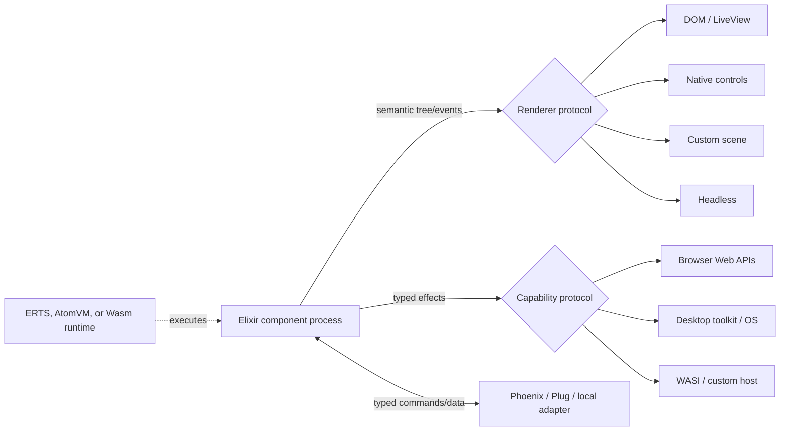

# Host-neutral BlazeX architecture and native control backends

**Status:** Architecture correction and from-the-start design constraint

**Date:** 2026-09-02

**Primary question:** How can BlazeX use Popcorn/AtomVM and a DOM renderer as
its first implementation without making the browser, HEEx, HTML, CSS, or a
webview permanent constraints on a future fully native control backend?

## Executive decision

BlazeX should be designed as a **host-neutral semantic component system**.
The browser-local Popcorn/AtomVM path is the first executable profile because
it offers the shortest route to Elixir processes and Phoenix-compatible
rendering. It is not the canonical definition of a component, effect, event,
or renderer.

The long-term target includes desktop hosts that instantiate actual native
controls. A Tauri- or Electron-style webview is a supported middle profile,
useful for packaging and native capability integration, but it does not
satisfy the native-control goal. A future native backend should be able to map
a BlazeX button to an OS/toolkit button, a field to a native text editor, a
menu to a native or toolkit menu, and accessibility metadata to the platform
accessibility tree without reverse-engineering HTML or DOM behavior.

This requires five immediate decisions:

1. The portable component contract emits a BlazeX semantic render tree, not
   arbitrary HEEx or HTML.
2. Runtime substrate, execution host, render backend, capability provider,
   and server transport are separate choices.
3. Events and effects use semantic names such as `:activate`, `:change`,
   `:focus`, `:choose_file`, and `:open_surface`, never DOM event names or
   JavaScript object contracts in the portable layer.
4. HEEx/LiveView, the DOM, CSS, Popcorn, and browser JavaScript are adapters.
5. A small native-control renderer must be prototyped before the public
   component API, styling model, or F0 foundation is declared stable.

MudBlazor remains the catalog and interaction reference. The portable target
is the semantic purpose of its components—selection, validation, disclosure,
navigation, feedback, data presentation, and accessibility—not its Razor
types, DOM structure, CSS classes, JavaScript services, or .NET lifecycle.

## 1. Correct decomposition

The earlier browser-first design overloaded the word *host*. BlazeX needs the
following independent axes.

| Axis | Examples | Contract owner |
| --- | --- | --- |
| Runtime substrate | ERTS/BEAM, native AtomVM, AtomVM compiled to Wasm, restricted native-Wasm kernel | runtime adapter |
| Execution host | browser, desktop native process, desktop webview, standalone Wasm runtime, server, edge worker, test process | host bootstrap |
| Render backend | LiveView DOM, standalone DOM, native widgets, custom scene/GPU, headless semantic tree | renderer adapter |
| Capability provider | Web APIs, Tauri commands, native toolkit/OS services, WASI, test doubles | effect host |
| Server/remote adapter | Phoenix, Plug, application transport, local-only | command/data adapter |
| Packaging shell | web assets, desktop application, CLI, embedded firmware, server release | release tooling |

No axis should imply another. For example:

- AtomVM-in-Wasm can run in a browser today, but a different AtomVM Wasm
  target might run under Wasmtime in a native desktop process.
- A desktop application can use a webview and the DOM renderer, or it can use
  a native-widget renderer without any DOM.
- Standard BEAM can drive a native renderer without involving Wasm.
- A browser can use server LiveView rendering, browser-local AtomVM, or both.
- Phoenix may remain the trusted remote authority even when the local UI is a
  native desktop application.



### 1.1 Terminology rule

Use these terms precisely:

- **runtime** executes Elixir/BEAM or native Wasm instructions;
- **host** instantiates the runtime and grants external capabilities;
- **renderer** materializes the semantic UI as DOM nodes, native controls, a
  scene, or test output;
- **adapter** maps a BlazeX protocol onto a concrete runtime, renderer,
  capability system, or remote service; and
- **shell** packages the selected combination for deployment.

Popcorn is a browser-oriented runtime/tooling path. AtomVM is a runtime, not a
desktop UI host. Wasmtime is an example non-browser Wasm host, but it does not
provide native widgets. Wasmex embeds Wasmtime inside BEAM; it is useful for
Wasm plugins or pure kernels, not by itself a BlazeX renderer.

## 2. Why HEEx cannot be the portable rendering contract

HEEx is valuable and should remain a first-class web authoring and rendering
adapter. It is nevertheless an HTML template language with web-specific
attributes, slots, escaping, event bindings, and renderer output.

A native backend cannot reliably recover the following intent from arbitrary
HTML:

- whether a styled element is a momentary button, toggle, menu trigger, link,
  tab, or custom interactive region;
- which state is controlled versus locally owned;
- whether a group uses radio, listbox, toolbar, menu, or application
  navigation semantics;
- which visual values are semantic tokens versus arbitrary CSS;
- which event means activation rather than `click`, keydown, pointer release,
  or touch gesture;
- how labels, descriptions, validation messages, and accessibility relations
  should map to a platform accessibility API;
- which detached surface owns focus, stacking, dismissal, and restoration;
- how a native layout engine should interpret CSS selectors, pseudo-elements,
  cascade, media queries, and browser layout behavior; or
- whether a DOM-specific escape hatch has a meaningful native equivalent.

Treating HEEx as canonical would make a native renderer an HTML emulator or a
lossy HTML-to-widget translator. That contradicts the fully native goal.

### 2.1 Two authoring surfaces

BlazeX should support two explicit authoring classes:

1. **Portable semantic components.** They produce BlazeX semantic nodes and
   may target every renderer that implements their required capabilities.
2. **Renderer-specific components.** HEEx/HTML, raw CSS, DOM hooks, native
   toolkit handles, or custom GPU scenes are allowed, but the manifest names
   the required renderer and fallback.

The exact syntax remains open. It could be Elixir builders, macros, a
HEEx-like semantic DSL, or generated functions. The stable contract is the
semantic tree, not the surface syntax. Phoenix adapters may expose portable
components naturally inside HEEx while compiling or translating their
semantic nodes to HTML.

## 3. Portable semantic render tree

The minimum renderer-neutral output is conceptually:

```elixir
%BlazeX.UI.Node{
  kind: :button,
  id: "save",
  key: {:action, :save},
  props: %{
    variant: :filled,
    tone: :primary,
    enabled?: true,
    loading?: false
  },
  semantics: %{
    role: :button,
    label: "Save changes",
    description: nil
  },
  events: %{activate: {:event, :save}},
  children: [%BlazeX.UI.Text{value: "Save"}]
}
```

This is illustrative, not a frozen struct. The protocol needs at least:

- semantic node kind and version;
- stable identity and optional list key;
- typed, renderer-neutral properties;
- child nodes and named semantic regions;
- accessibility role, name, description, value, state, and relationships;
- semantic event bindings;
- required and optional capabilities;
- theme/layout tokens;
- resource references such as icon IDs and images;
- renderer-specific extension data under a namespaced escape hatch; and
- deterministic serialization or diff representation where a process
  boundary requires it.

### 3.1 Node categories

The portable tree should remain bounded rather than mirror every MudBlazor
class or every native toolkit widget:

| Category | Representative nodes |
| --- | --- |
| Content | text, icon, image, rich text region |
| Layout | stack, grid, container, spacer, divider, scroll region |
| Actions | button, toggle button, command item |
| Input | text field, numeric field, checkbox, radio group, switch, slider, select |
| Navigation | link/action destination, tab set, breadcrumbs, navigation collection |
| Disclosure | collapse, expansion group, menu trigger/surface |
| Surfaces | dialog, popover, tooltip, notification, overlay |
| Structured data | list, table, tree, virtualized collection, data grid |
| Visualization | progress, rating, timeline, chart/scene extension |
| Host service | file choice, color choice, date/time choice, notification, clipboard |

Compound components can lower to several nodes. The public component catalog
does not need a one-to-one relationship with renderer protocol opcodes.

### 3.2 Semantic events

Portable events describe user intent:

- `:activate`, `:change`, `:submit`, `:select`, `:expand`, `:dismiss`;
- `:move`, `:reorder`, `:increment`, `:decrement`;
- `:request_open`, `:request_close`, `:request_page`; and
- typed component-specific events where a generic intent is insufficient.

The DOM renderer maps `:activate` to the correct keyboard, click, pointer, or
native activation behavior. A native renderer maps it to the toolkit's action
signal. Component logic must not branch on `onclick`, `keydown`, an
`HTMLElement`, or a platform widget callback.

## 4. Renderer protocol

A renderer consumes a semantic tree and owns materialized UI resources. Its
minimum contract should cover:

- mount a root and return a renderer/root generation;
- reconcile or apply an ordered semantic change set;
- create, update, move, and remove materialized controls;
- route semantic user events to the owning component identity;
- perform renderer-owned focus and accessibility updates;
- attach and dispose resources deterministically;
- report capabilities and limits before mount;
- reject unsupported nodes or properties with a structured diagnostic;
- expose measurement only through capability effects; and
- recover or remount after renderer failure.

The first implementation may lower the semantic tree into HEEx/LiveView
render data. That lowering is inside `blazex_renderer_dom_liveview`; no
portable component may observe LiveView diff structs or DOM handles.

### 4.1 Renderer classes

| Renderer | Materialization | Intended role |
| --- | --- | --- |
| Headless | normalized semantic tree and event trace | first conformance oracle and tests |
| DOM/LiveView | HTML nodes, ARIA, CSS, LiveView patching | first browser/Phoenix implementation |
| DOM standalone | HTML nodes without a server LiveView dependency | later Plug/browser and webview profile |
| Native widget | platform/toolkit controls and native accessibility objects | ultimate desktop control target |
| Custom scene | retained layout/drawing tree, possibly GPU-backed | optional highly styled or data-visualization backend |

### 4.2 Native control policy

“Fully native” must be defined per component. BlazeX should assign one of
three strategies:

- **native-preferred:** map to a platform/toolkit control when it can preserve
  the documented behavior and accessibility;
- **native-composite:** compose native primitives and BlazeX-owned state when
  no single control is sufficient; or
- **framework-drawn:** render a BlazeX scene when exact Material behavior or a
  complex visualization has no native equivalent.

| BlazeX family | Likely native strategy | Notes |
| --- | --- | --- |
| Button, checkbox, radio, switch | native-preferred | Map activation, enabled, selected, label, and focus semantics. |
| Text and numeric fields | native-preferred | Native text editing, IME, selection, clipboard, and accessibility are valuable. |
| Select, menu, tabs | native-preferred or composite | Native menus may differ visually and in nesting behavior. |
| File picker, color picker | host service | Prefer secure OS dialog where available. |
| Date/time picker | host service or composite | Platform capability and desired cross-platform consistency determine choice. |
| Dialog/message box | native or composite | App-content dialogs may need a framework-owned surface; simple confirmation may use OS UI. |
| Snackbar, tooltip, popover | native-composite | Usually implemented as toolkit windows/surfaces rather than stock OS controls. |
| Drawer, carousel, expansion panel | native-composite | Layout and transitions are framework concerns. |
| Table, tree, DataGrid | native-composite | Toolkit controls vary greatly; provider, selection, edit, and virtualization contracts remain BlazeX-owned. |
| Charts and Material-specific visuals | framework-drawn | Native accessibility fallback remains mandatory. |

MudBlazor visual fidelity and OS-native appearance can conflict. BlazeX must
not promise both simultaneously. Each native renderer should publish a named
visual profile: platform-native, BlazeX Material, or hybrid.

## 5. Host capability protocol

Effects should name capabilities, not implementation technology. Proposed
capability groups include:

| Capability | Browser mapping | Native desktop mapping |
| --- | --- | --- |
| `ui.focus` | DOM focus and focus scopes | toolkit focus manager |
| `ui.measure` | layout boxes/observers | widget/layout measurements |
| `ui.pointer` | pointer events/capture | toolkit pointer/mouse/touch stream |
| `ui.keyboard` | DOM keyboard events | window/toolkit key commands |
| `ui.clipboard` | Clipboard API | OS clipboard |
| `ui.files.choose` | file input/File System Access where supported | native open/save dialog |
| `ui.window` | browser viewport/history subset | native windows, state, close request |
| `ui.surface` | portal/overlay root | popup/transient/native child window |
| `ui.notifications` | web notification or in-app surface | OS or in-app notification |
| `ui.storage` | browser storage | capability-scoped application storage |
| `ui.theme.system` | media queries | OS appearance/accessibility settings |
| `ui.accessibility` | ARIA/DOM accessibility tree | platform accessibility API |
| `time` | browser timers | host/runtime timers |
| `network` | `fetch`, Channel, WebSocket | WASI/native HTTP or app transport |

A component requests an effect such as:

```elixir
{:effect, :choose_file,
 %{mode: :open, accept: ["image/png"], multiple?: false, request_id: ref}}
```

The browser adapter returns an opaque browser file handle. A desktop adapter
returns an opaque capability-scoped file resource. Neither leaks its native
object into portable component state.

### 5.1 Negotiation and fallback

Before mounting a component root, BlazeX intersects:

1. component-required capabilities;
2. renderer capabilities;
3. execution-host capabilities;
4. application-granted capabilities; and
5. server/remote capabilities.

A missing required capability causes an explicit mount failure or declared
fallback. Optional capabilities can select another interaction, such as an
in-app date picker when no native date dialog exists. Silent partial behavior
is forbidden.

## 6. Runtime profiles

The component API must not expose runtime implementation details.

| Profile | Elixir execution | Renderer possibilities | Status |
| --- | --- | --- | --- |
| Server BEAM | ERTS | server HTML, LiveView DOM, headless, potential native bridge | mature substrate |
| Browser local | AtomVM-in-Wasm through Popcorn | DOM/LiveView adapter | experimental but demonstrated |
| Desktop webview | browser AtomVM build inside system webview | DOM renderer | plausible middle profile; untested |
| Native desktop BEAM | ERTS process/application | native widget or custom scene adapter | architectural option |
| Native AtomVM | embedded native AtomVM | native widget or custom scene adapter | requires host integration research |
| Desktop Wasm | AtomVM-in-Wasm or restricted native Wasm under Wasmtime-like host | native widget protocol implemented by host | requires a non-browser import target |
| Headless | ERTS, AtomVM, or Wasm runtime | normalized semantic tree | required early test profile |

Popcorn's current artifact must not be assumed portable to Wasmtime or WASI.
Its JavaScript, Emscripten, iframe, worker, and shared-memory imports need to
be inventoried. A desktop Wasm profile may require a new AtomVM build target
and host shim. This is a runtime-adapter issue, not a reason to contaminate
the component API with browser concepts.

## 7. Deployment profiles

### 7.1 Browser-local profile

- Runtime: Popcorn/AtomVM-in-Wasm.
- Renderer: LiveView DOM adapter initially.
- Capabilities: JavaScript/Web APIs.
- Trusted remote: Phoenix first, Plug where practical.
- Role: fastest executable proof and production path if dependencies mature.

### 7.2 Desktop webview profile

- Shell: Tauri-like native application and system webview.
- Runtime/renderer: browser-local profile largely reused.
- Capabilities: browser effects plus explicit desktop commands.
- Role: packaging and desktop capability bridge; not the final native UI.

### 7.3 Fully native desktop profile

- Shell: native application owning the main thread and event loop.
- Runtime: ERTS, native AtomVM, or AtomVM/native guest under an embedded Wasm
  runtime.
- Renderer: platform or cross-platform native widget adapter.
- Capabilities: toolkit and OS services.
- Role: ultimate desktop control target.

The renderer must account for main-thread UI restrictions. Elixir processes
can compute state and render trees off the UI thread, but control creation and
mutation are scheduled through the renderer's event loop. Backpressure and
coalescing prevent a fast process from flooding the native UI queue.

### 7.4 Headless and non-UI profile

- Runtime: any supported runtime.
- Renderer: normalized tree/event trace or no renderer.
- Capabilities: deterministic test doubles or WASI services.
- Role: conformance, server prerender planning, package validation, bots,
  automation, and non-visual component logic.

## 8. Revised package boundaries

| Package | Responsibility | Forbidden dependencies |
| --- | --- | --- |
| `blazex_core` | lifecycle, state, identity, semantic events, commands | Phoenix, HTML, DOM, native toolkit |
| `blazex_ui_tree` | versioned semantic nodes, properties, accessibility, diffs | renderer implementations |
| `blazex_ui_tokens` | semantic color, typography, spacing, shape, motion, density | CSS-only values as canonical state |
| `blazex_ui_effects` | capability requests, resources, ownership, cancellation | JavaScript or OS object types |
| `blazex_renderer` | renderer behavior, capability negotiation, diagnostics | concrete renderer code |
| `blazex_renderer_headless` | normalized tree and event oracle | Phoenix/browser/native toolkit |
| `blazex_renderer_dom_liveview` | semantic-tree lowering to HEEx/LiveView/DOM | native toolkit |
| `blazex_renderer_dom` | future standalone DOM implementation | Phoenix server internals |
| `blazex_renderer_native` | native renderer protocol helpers and toolkit-neutral resources | one platform toolkit in core |
| `blazex_runtime_popcorn` | browser AtomVM boot and transport | component catalog policy |
| `blazex_runtime_atomvm_host` | future native/non-browser AtomVM adapter | renderer selection |
| `blazex_host_browser` | Web API effects and loader | portable component logic |
| `blazex_host_desktop` | desktop windows/services and native event loop contract | application domain logic |
| `blazex_phoenix` | trusted commands, auth, uploads, routes, SSR/web integration | renderer-neutral core ownership |
| `blazex_plug` | static/bootstrap/HTTP transport baseline | Phoenix-only facilities |
| `blazex_ui_*` | MudBlazor-inspired semantic component families | direct host/runtime APIs |
| `blazex_test` | cross-runtime and cross-renderer contract suites | production-only assumptions |

A toolkit-specific backend belongs in its own package, for example a future
`blazex_renderer_gtk`, `blazex_renderer_winui`, or another selected
cross-platform toolkit adapter. Those names are illustrative, not decisions.

## 9. Component manifest amendment

Host support cannot remain one ambiguous list such as `[live_server, local]`.
A component manifest should declare independent requirements:

```yaml
id: forms.text_field
component_protocol: 1
runtimes: [beam, atomvm]
renderers:
  required_semantics: [text_input, label, validation_message]
  tested: [headless, dom_liveview]
  planned: [native_widget]
capabilities:
  required: [ui.focus, ui.keyboard, ui.accessibility]
  optional: [ui.clipboard]
remote:
  required: false
fallback:
  native_widget: native_composite
extensions:
  dom: []
  native: []
```

Build tooling should reject portable packages that directly reference DOM
event names, JavaScript handles, CSS selectors, Phoenix sockets, native
widget classes, or platform file paths outside namespaced adapter modules.

## 10. Styling and layout portability

CSS cannot be the canonical style model. BlazeX should define semantic tokens
and bounded layout properties:

- role-based colors and contrast pairs;
- typography roles rather than CSS font declarations;
- spacing, density, shape, elevation, and motion tokens;
- stack, grid, alignment, wrapping, sizing, and scroll intent;
- direction, locale, reduced-motion, high-contrast, and system-theme state;
- named component variants and parts; and
- renderer-specific extensions for needs outside the portable vocabulary.

The DOM renderer lowers tokens to CSS variables/classes and semantic layout
to HTML/CSS. The native renderer maps them to toolkit properties, layout
constraints, system metrics, or custom drawing. A component using arbitrary
CSS becomes DOM-specific unless it supplies an explicit native alternative.

## 11. Accessibility portability

Accessibility is part of the semantic tree, not an HTML-only test layer.
Portable nodes must describe:

- role and control type;
- accessible name and description;
- value, range, checked/selected/expanded/busy/invalid state;
- labels, errors, controls, ownership, and set-position relationships;
- focusability and logical traversal order;
- live announcement intent; and
- keyboard or alternative interaction contract.

The DOM renderer emits correct HTML and ARIA. Native backends create platform
accessibility objects and actions. The headless renderer exposes a normalized
accessibility tree for contract tests.

## 12. Security and trust

Host neutrality broadens the local capability surface. A native desktop host
may have filesystem, process, window, clipboard, notification, credential,
and network access that a browser would mediate.

Rules:

- components begin with no ambient host authority;
- capabilities are granted per application/root/package policy;
- opaque resources cannot be forged from integers or paths;
- file and network access use bounded grants;
- host callbacks validate generation and ownership;
- remote Phoenix commands remain authenticated and authorized regardless of
  local renderer;
- native UI does not make client-side decisions trustworthy; and
- Wasm sandboxing protects the host only to the extent that imports and the
  embedding runtime preserve the boundary.

## 13. From-the-start validation gates

### N0 — semantic kernel gate

Before freezing F0 APIs:

- specify versioned semantic node, event, effect, resource, and accessibility
  contracts;
- build a headless renderer and deterministic golden format;
- build a DOM lowering for a minimal vertical slice;
- build a native-renderer spike that creates actual toolkit controls; this
  proof toolkit need not be the eventual supported production backend;
- run the same component state/event traces through both; and
- prove mount, update, reorder, focus, validation, surface, and disposal
  behavior without DOM types in component code.

The minimum vertical slice should include:

1. text and stack layout;
2. button activation;
3. controlled text field with raw/parsed state;
4. checkbox or switch;
5. list identity and reorder;
6. menu or popover surface;
7. dialog focus restoration; and
8. file-choice capability with opaque result.

If these require HTML-specific component APIs, F0 is not portable and must be
redesigned before catalog expansion.

### N1 — browser reference backend

Proceed with Popcorn/AtomVM, LocalLiveView, Phoenix commands, DOM rendering,
and browser effects, but only behind the N0 protocols. This remains the first
feature-complete implementation and performance baseline.

### N2 — desktop webview middle profile

Package the DOM backend in a Tauri-like shell. Validate native window close,
menus, files, clipboard, notifications, application updates, and security
grants through the same capability protocol. Do not count DOM controls as
native-control coverage.

### N3 — native control backend

Select the production toolkit only after the N0 proof has validated the
semantic vertical slice and main-thread model. Implement the F1 controls, then
forms and surfaces. Publish an explicit component coverage and visual-profile
matrix rather than claiming automatic parity.

### N4 — optional standalone Wasm host

Inventory AtomVM/Popcorn imports and test whether a Wasmtime/WASI or custom
embedding is useful. This is not required for native desktop controls if
standard BEAM or native AtomVM is the better runtime there.

## 14. Cross-renderer testing contract

| Dimension | Shared assertion | Backend-specific assertion |
| --- | --- | --- |
| State | same controlled/local transitions and revisions | toolkit state synchronization |
| Identity | same keys, move/remove semantics, stale-event rejection | native object reuse policy |
| Events | same semantic event payloads and ordering | DOM/toolkit raw-event mapping |
| Focus | same requested target and restoration outcome | ARIA/DOM versus native focus manager |
| Accessibility | same normalized role/name/state tree | platform inspection and screen-reader behavior |
| Layout | same semantic constraints and token intent | pixel/platform differences within profile |
| Effects | same request, ownership, cancellation, fallback | host API/resource implementation |
| Failure | same unsupported-capability and remount contract | renderer crash diagnostics |
| Performance | bounded render work and queue growth | event-to-paint and native main-thread cost |

A component is “portable” only after at least two materially different
renderer implementations pass its shared contract. A headless renderer plus
DOM is useful but insufficient to claim native-widget support; the N0 native
spike prevents obvious leakage before API freeze.

## 15. Risks and tradeoffs

| Risk | Consequence | Decision |
| --- | --- | --- |
| Lowest-common-denominator abstraction | Weak controls that ignore platform strengths | Keep a strong semantic core plus namespaced renderer extensions. |
| HEEx ecosystem divergence | Phoenix developers lose familiar composition | Provide an excellent HEEx adapter, but keep it outside the portable IR. |
| Native toolkits disagree | Inconsistent behavior and missing component analogues | Specify observable semantics and publish per-backend coverage/fallbacks. |
| Material versus OS-native appearance | Cannot satisfy both exact visual profiles | Name renderer visual profiles and let applications choose. |
| Too-early universal IR | Abstract design without implementation pressure | Require DOM and native vertical slices before stabilization. |
| Main-thread/native callback complexity | deadlocks, queue floods, stale updates | Renderer-owned scheduling, generations, batching, backpressure, disposal. |
| Popcorn APIs leak into core | non-browser runtime becomes impractical | Static dependency checks and runtime adapter isolation. |
| WASI assumed to provide GUI | architecture waits on a nonexistent widget standard | Own renderer/capability protocols; treat future WASI graphics as optional. |
| Custom-drawn backend scope | layout, text, IME, accessibility become enormous | Prefer native widgets first; isolate custom scenes to justified families. |
| Native host has broad authority | local component compromise reaches OS resources | capability grants, opaque resources, least authority, audit manifest. |

## 16. Decisions to record as ADRs

1. BlazeX is host-neutral; browser-local is the first profile only.
2. The portable render contract is a versioned semantic tree.
3. HEEx/LiveView is a DOM renderer adapter, not the kernel representation.
4. Native widgets are an ultimate renderer goal; webview is intermediate.
5. Runtime, host, renderer, capability provider, and remote adapter are
   independent manifest dimensions.
6. Semantic events and effects cannot expose DOM or toolkit object types.
7. Tokens/layout/accessibility are renderer-neutral contracts.
8. Renderer-specific escape hatches are explicit and reduce portability.
9. A native vertical slice is an F0 API-stability gate.
10. WASI/WIT may encode host interfaces later but do not supply native UI.

## 17. Open questions

- Which portable authoring syntax offers HEEx-quality ergonomics without
  making `Phoenix.LiveView.Rendered` the component ABI?
- Should the semantic tree be an Elixir struct graph, generated opcode stream,
  protocol, or compiler IR with a stable serialized form?
- Where should reconciliation occur for each profile: component runtime,
  renderer host, or a split model?
- Which native toolkit offers the best initial cross-platform proof while
  preserving actual native text, accessibility, and input behavior?
- Is one cross-platform toolkit preferable to WinUI/AppKit/GTK adapters, or
  should BlazeX define only the protocol and allow several implementations?
- Can current Phoenix component macros be adapted to emit both HEEx and a
  semantic tree from one source, or is a dedicated semantic DSL necessary?
- Which MudBlazor families should use native-preferred, native-composite, or
  framework-drawn strategies?
- How much visual consistency should a platform-native profile trade for OS
  conventions?
- Can AtomVM be embedded natively or built for a standalone Wasm host with the
  process, timer, networking, and resource support BlazeX needs?
- How should WIT resources represent controls, surfaces, subscriptions, and
  opaque file handles if the Component Model later becomes a host ABI?

## 18. Final assessment

The browser-first prototype remains the right implementation starting point,
but it is no longer the right architectural center. BlazeX should center on a
semantic component tree, semantic events, capability-scoped effects,
renderer-owned resources, and explicit runtime/host/renderer manifests.

That approach preserves three valuable paths simultaneously:

- rapid progress through Phoenix, HEEx lowering, LiveView DOM patching, and
  Popcorn/AtomVM;
- a practical desktop middle profile through a webview shell; and
- a credible fully native desktop renderer without treating HTML as the
  universal UI bytecode.

The cost is that BlazeX must own a real renderer protocol earlier than the
original design expected. That cost is necessary. Deferring it until after a
large HEEx component catalog exists would make native controls a rewrite,
not an adapter.

## Connections

- [Elixir WebAssembly component framework for Phoenix and Plug](elixir-webassembly-component-framework-for-phoenix-and-plug.md) — parent runtime, Phoenix, Plug, security, and delivery study amended by this host-neutral boundary.
- [MudBlazor-inspired component system for BlazeX](mudblazor-inspired-component-system-for-blazex.md) — target catalog whose semantics must lower to DOM and native backends.
- [Host-neutral and native-renderer map](../10-maps/host-neutral-and-native-renderer-architecture.md) — curated route through evidence and decisions.
- [Can one BlazeX component model target DOM and native controls?](../40-inquiries/can-one-blazex-component-model-target-dom-and-native-controls.md) — executable portability and native-control gates.
- [2026-09-02 host-neutral design revision](../50-journal/2026-09-02-host-neutral-native-renderer-design-revision.md) — rationale and evidence boundaries for the correction.

## Sources

- [WebAssembly non-web embeddings and WASI host capabilities](../30-sources/webassembly-community-group-2026-non-web-embeddings-and-wasi.md)
- [Wasmtime embedding APIs and desktop platform support](../30-sources/bytecode-alliance-2026-wasmtime-embedding-and-platform-support.md)
- [Tauri desktop webview architecture](../30-sources/tauri-2026-desktop-webview-architecture.md)
- [WASI WebGPU and windowing status](../30-sources/webassembly-wasi-2026-webgpu-and-windowing-status.md)
- [WebAssembly Component Model and Jco](../30-sources/bytecode-alliance-2026-webassembly-component-model-and-jco.md)
- [Wasmex: embedding Wasmtime in Elixir](../30-sources/tessi-2026-wasmex-project.md)
- [Popcorn architecture and limitations](../30-sources/software-mansion-2026-popcorn-documentation-and-source.md)
- [AtomVM WebAssembly runtime](../30-sources/atomvm-project-2026-webassembly-runtime.md)
