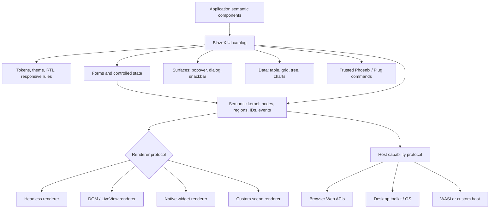

# MudBlazor-inspired component system for BlazeX

**Status:** Architecture, catalog, and implementation recommendation

**Date:** 2026-09-02

**Reference baseline:** MudBlazor `v9.9.0`, commit
`3d85eed63a2c886d0a2e37f9f0cad78be655ad1c`; Phoenix 1.8; Phoenix LiveView
1.2.11; LocalLiveView 0.1.0; Popcorn 0.3.3

**Primary question:** How should BlazeX build a host-neutral Elixir component
framework whose target catalog and interaction quality are based on
MudBlazor, with Phoenix/browser delivery first and fully native controls as a
future renderer?

## Executive summary

MudBlazor is the correct reference for the intended BlazeX component set.
Blazor's built-in library supplies renderer, routing, form, authorization, and
lifecycle infrastructure, but it is not a broad visual-control library.
MudBlazor adds the actual product surface under discussion: Material-style
layout, buttons, navigation, fields, pickers, dialogs, snackbars, menus,
tables, DataGrid, trees, charts, drag/drop, theming, responsive behavior, and
hundreds of documented examples.

This correction does **not** introduce a .NET compatibility objective.
BlazeX should use MudBlazor as:

- a target catalog of user-visible component families;
- a reference for interaction, state, accessibility, responsive, and
  composition semantics;
- a reference architecture for themes, providers, overlays, forms, data
  controls, browser services, packaging, documentation, and tests; and
- a benchmark for the breadth and polish expected of a serious framework.

BlazeX should not use MudBlazor as:

- a C#/Razor source or binary contract;
- a public namespace or API naming contract;
- a promise that MudBlazor packages can run under BlazeX;
- a requirement to reproduce .NET generics, dependency injection, reflection,
  component inheritance, or renderer internals; or
- an automatic pixel-for-pixel claim across every browser and release.

The native target should be idiomatic Elixir with Phoenix as the first trusted
remote adapter. Portable components emit semantic UI nodes, events, effects,
tokens, and accessibility data. An HEEx/LiveView adapter lowers those semantics
to HTML/DOM for the first browser profile; a future native renderer maps them
to actual toolkit controls. Local views/processes retain state and failure
domains, while trusted operations remain Phoenix-authoritative where a server
is present.

The source audit shows the scale. MudBlazor v9.9.0 has 83 first-level
component directories, 166 Razor files, about 70,843 lines of component
source, 1,808 declared component parameters, 111 SCSS files, 26 JavaScript
modules, 211 component test files, and 646 documentation examples. A credible
BlazeX equivalent in breadth is a multi-release framework program, not a
single package sprint.

The recommended sequence is:

1. **F0 — foundation:** semantic render tree, renderer and host-capability
   protocols, headless/DOM/native vertical slices, tokens, theme scopes,
   backend assets, common props, controlled state, IDs, RTL, responsive
   service, icon reachability, effects, surfaces, focus, keyboard, and tests;
2. **F1 — presentational core:** typography, paper, layout, grid/stack,
   buttons, icons, cards, alerts, badges, avatars, progress, skeletons, chips,
   toolbars, and simple navigation;
3. **F2 — forms and controlled interaction:** form/field state, text/numeric
   inputs, checkbox, switch, radio, select, autocomplete, slider, toggles,
   validation, and conversion;
4. **F3 — coordinated host surfaces:** popover, menu, tooltip, dialog,
   snackbar, drawer, tabs, pickers, file selection/upload, focus trap,
   responsive observers, hotkeys, swipe, split panel, and drag/drop; and
5. **F4 — complex data systems:** table, DataGrid, tree, virtualization,
   timelines, carousel, charts, remote providers, editing, grouping, and
   aggregation.

The first release should not advertise “the MudBlazor catalog” until the F0
contracts are stable and a native-control vertical slice proves that HTML,
CSS, DOM events, and JavaScript objects have not entered the portable API.
Otherwise each component will invent its own colors, breakpoints, surface
positioning, field state, keyboard logic, disposal, and host assumptions.

## 1. Scope correction and interpretation

### 1.1 Correct source

The URL supplied in the clarification duplicated the repository address. The
canonical source is:

<https://github.com/MudBlazor/MudBlazor>

This study is pinned to the latest stable release observed on the research
date, `v9.9.0`, released 2026-08-24. The moving `dev` branch and nightly
packages are not treated as the product baseline.

### 1.2 What “based on MudBlazor” means

The recommended product interpretation has four layers:

| Layer | BlazeX target |
| --- | --- |
| Catalog | Cover the same major categories and compound use cases, with explicit omissions and sequencing. |
| User semantics | Preserve useful expectations for variants, colors, density, disabled/read-only states, templates, selection, validation, keyboard use, responsive behavior, and async data. |
| Visual language | Offer a coherent Material-inspired token system, elevations, typography, shape, spacing, motion, light/dark palettes, and RTL. |
| Native programming model | Express all of the above through Elixir modules, semantic nodes/regions, messages, processes, events, effects, and capability protocols; expose HEEx and native-widget adapters separately. |

“Based on” does not require reusing MudBlazor's public names. For example,
`MudButton Variant="Filled" Color="Primary"` may inspire a native API such as
`BlazeX.UI.button(variant: :filled, color: :primary)`. The observable purpose
is familiar; ownership, state, and implementation are BlazeX-specific.

### 1.3 Visual fidelity is a separate claim

The target should initially promise a coherent Material-style system and the
documented BlazeX behavior for each control. Exact pixel matching to one
MudBlazor release should not be implied because fonts, browser rendering,
theme overrides, responsive widths, and future upstream releases change the
result.

If exact screenshot fidelity later becomes a requirement, it needs a named
visual profile, pinned fonts/assets, viewport matrix, screenshot tolerances,
and its own release/version policy. It should not be confused with .NET
interoperability.

### 1.4 Basic Blazor research remains subordinate

The prior Blazor study remains useful for renderer lifecycle, render trees,
events, forms, routing, and host architecture. It is no longer the target
component catalog. MudBlazor is layered on framework primitives in .NET;
BlazeX must layer its visual system on a renderer-neutral semantic kernel.
Phoenix/HEEx, LocalLiveView, and browser effects form the first adapter set,
not the permanent foundation for every host.

## 2. MudBlazor is a system, not a flat control list

### 2.1 Architectural layers found in v9.9.0

| MudBlazor layer | Representative implementation | Why BlazeX needs an analogue |
| --- | --- | --- |
| Common component base | `MudComponentBase`, class/style/tag/unmatched attrs, IDs | Every component needs predictable semantic props/identity; HTML attributes belong to the DOM adapter. |
| Parameter state | `ComponentBaseWithState`, `ParameterState<T>` | Controlled values, parent updates, local pending state, change handlers, and loops need consistent rules. |
| Composition context | Cascading parameters and parent/child registration | Compound controls need registration, shared disabled/read-only state, selection, and disposal. |
| Theme and CSS | `MudTheme`, `MudThemeProvider`, SCSS, utility classes | Visual components depend on renderer-neutral tokens; CSS is one lowering. |
| Root services/providers | theme, popover, dialog, snackbar providers | Detached surfaces and global queues need scoped ownership and render outlets. |
| Host services | viewport/window, resize, key, scroll, pointer, focus, file/clipboard APIs | Polished interactions require capability-scoped host services and lifecycle ownership. |
| Form system | `MudFormComponent`, `MudBaseInput`, converters, validation | Input styling alone does not provide raw/typed values, errors, touched state, or accessibility. |
| Data systems | table, DataGrid, tree, virtualization, charts | These are small frameworks with provider, template, identity, async, and accessibility contracts. |
| Assets/build | SCSS/JS build, static assets, analyzers, generated icons | Every renderer profile needs deterministic asset/resource discovery, pruning, versioning, and diagnostics. |
| Quality system | API docs, hundreds of examples, bUnit tests, visual viewer | The component contract lives as much in examples and edge-case tests as in type signatures. |

### 2.2 The four root providers reveal the real dependency graph

MudBlazor's installation documentation calls out `MudThemeProvider`,
`MudPopoverProvider`, `MudDialogProvider`, and `MudSnackbarProvider`. These
providers must be in an interactive render scope with their consumers.

The BlazeX-native shape should be:

- **theme scope:** resolves tokens, mode, direction, density, and
  renderer-specific materialization such as CSS variables or toolkit values;
- **surface/portal scope:** owns detached popovers, menus, tooltips, overlays,
  and z-index stacking;
- **dialog supervisor/outlet:** owns dialog identities, content, results,
  focus restoration, and close policy;
- **notification supervisor/outlet:** owns snackbar queueing, deduplication,
  duration, actions, and navigation policy.

These can be processes or state owned by one supervised local root. In server
LiveView they may be LiveView state plus shared components/hooks; in a native
renderer they own toolkit surfaces and resources. They expose one semantic
BlazeX API while keeping renderer and host mechanics behind adapters.

### 2.3 Host interop is shared infrastructure

MudBlazor minimizes JavaScript but still has 26 JavaScript source modules.
They handle drag/drop, element references, exit prompts, file input, input
sizing/caret operations, key interception, pointer capture, popover placement,
resize, ripple, scroll, split panels, theme preference, time-picker pointer
events, and window helpers.

BlazeX should not translate these into one-off hooks embedded in every
component. It needs a renderer-neutral effect protocol such as:

```elixir
{:effect, :popover_place, %{anchor: anchor_id, surface: surface_id, options: opts}}
{:effect, :focus_trap_open, %{surface: surface_id, restore_to: trigger_id}}
{:effect, :observe_resize, %{element: id, subscription: sub_id}}
{:effect, :file_choose, %{input: id, accept: accept, multiple: multiple?}}
```

Every subscription or opaque browser/native resource is owned by a local-root
and renderer generation and disposed when its component disappears, the
route/window changes, the process restarts, or the runtime shuts down. Replies
from an old generation are discarded. Portable state never contains a DOM
node, JavaScript object, native widget pointer, or unrestricted file path.

### 2.4 Forms are a framework within the framework

MudBlazor's form stack tracks more than a typed value:

- raw text and converted value;
- conversion failures;
- explicit and derived errors;
- required state;
- touched/dirty state;
- delayed/debounced validation;
- culture and formatting;
- nested forms and inherited disabled/read-only state;
- stable error IDs and `aria-describedby`;
- controlled values and change callbacks; and
- asynchronous validators.

BlazeX needs a serializable `FormState`/`FieldState` model with separate raw
and parsed values. Ecto changesets may adapt server validation results, but an
arbitrary changeset, schema module, repository, or database association must
not be shipped into browser AtomVM.

### 2.5 DataGrid is not “a table with more props”

MudBlazor's DataGrid source includes property, template, select, and hierarchy
columns; sort/filter/group/aggregate definitions; header/filter/footer cells;
editing forms; paging; selection; hierarchy; virtualization; local and server
data; cancellation; and many formatting/accessibility rules.

The BlazeX DataGrid must therefore be its own package and protocol. It should
depend on stable form, overlay, menu, table, provider, and virtualizer
subsystems rather than implementing private versions of each.

### 2.6 Icons are a payload trap

The inspected MudBlazor source contains 2,122 constants in each of five
Material icon families, plus custom icons. Shipping those SVG strings as BEAM
constants would undermine tree shaking and startup cost.

BlazeX should provide one or more of:

- compile-time extraction of referenced icons into an SVG sprite;
- a separately cached icon asset bundle selected by the application;
- per-family lazy icon packs; or
- an application-supplied icon resolver.

Unknown runtime icon names should not force the entire catalog into the local
bundle. Dynamic icon use requires an explicit manifest allowlist.

## 3. Native BlazeX architecture

### 3.1 Layering



Runtime choice is orthogonal: the component process may run on ERTS, native
AtomVM, browser AtomVM-in-Wasm, or a future non-browser Wasm profile. The
effect host is not a renderer; it performs capability-scoped work and returns
typed results/opaque resources to the owning component process.

The complete boundary is defined in [Host-neutral BlazeX architecture and
native control backends](host-neutral-blazex-architecture-and-native-control-backends.md).

### 3.2 Component units

- Use **semantic function components** for stateless or parent-controlled controls:
  text, icon, paper, divider, stack, simple card sections, badges, and most
  button shells.
- Use **nested stateful components** for state sharing a root failure domain:
  expansion panels, tabs, lists, selects, menus, field controls, table rows,
  and similar compound children. LiveComponents are one web adapter.
- Use a **local view/process** for an independently supervised interactive
  island, root provider set, long-running data provider, or failure boundary.
- Keep **host effects** out of component business logic and behind typed
  capability adapters.
- Keep **trusted work**—authorization, persistence, server validation, upload
  acceptance, and data mutation—behind Phoenix, Plug, or another declared
  trusted remote adapter.

### 3.3 Common prop contract

Every public component should share a small base contract:

- stable `id` where interaction, labels, focus, or effects need one;
- `disabled`, `readonly`, `required`, and `loading` where semantically valid;
- tokenized `color`, `variant`, `size`, `density`, `elevation`, and shape where
  the family supports them;
- explicit label, description, and error relationships;
- named slots for compound content;
- serializable event payloads; and
- no arbitrary server closures or host objects crossing into portable state.

DOM-only `class`, `style`, and global HTML attributes remain available through
a namespaced DOM extension. Native toolkit properties use a separate native
extension. Depending on either extension reduces the component's declared
renderer portability.

Component-specific props should be Elixir atoms, maps, structs, and protocols,
not translated .NET enums or generic type parameters.

### 3.4 Controlled-state convention

For every stateful property such as `open`, `selected`, `value`, `expanded`,
or `page`, the public contract must say whether it is:

- **controlled:** parent owns the value and receives a change event;
- **local:** component owns it until reset/remount;
- **initial:** parent supplies only the starting value; or
- **derived:** computed from route, form, viewport, or provider state.

Do not silently mix controlled and local values. A component may hold an
optimistic pending value, but must reconcile when the parent supplies a new
authoritative value.

### 3.5 Styling contract

Semantic tokens—not CSS—are the portable styling contract. They include:

- semantic palettes and contrast colors;
- typography roles;
- spacing and density;
- shape/radius;
- elevation/shadow;
- surface/stacking layers;
- motion duration/easing and reduced-motion behavior;
- adaptive breakpoints/window classes and container widths; and
- light, dark, high-contrast, and RTL adjustments.

The DOM renderer lowers these values to BlazeX-owned classes and CSS variables
such as `bx-*` and `--bx-*`; `mud-*` is never public. A native renderer maps
them to toolkit properties, system metrics, native appearance, or controlled
custom drawing. Renderer-specific overrides target documented component parts
and are explicitly nonportable.

## 4. Delivery tiers

| Tier | Meaning | Exit requirement |
| --- | --- | --- |
| **F0 Foundation** | Required substrate used across families | Semantic tree, renderer/capability protocols, stable tokens/state/effects/IDs/assets, headless/DOM/native proofs |
| **F1 Presentational** | Mostly semantic content/layout with bounded events | Visual states, adaptive/RTL, accessibility, and cross-renderer tests |
| **F2 Controlled interaction** | Stateful controls and form participation | Controlled/local semantics, keyboard behavior, validation, cleanup |
| **F3 Host-coordinated** | Measurement, surfaces, focus, files, gestures, navigation/window listeners | Effect ownership, disposal, stale reply rejection, capability fallback |
| **F4 Complex system** | Data/visualization subsystems with providers and compound protocols | Independent specification, performance budget, accessibility model, cancellation |

These are BlazeX delivery tiers. They do not denote compatibility levels with
MudBlazor or .NET.

### 4.1 Renderer strategy is separate from delivery tier

Every family also receives a renderer disposition:

- **portable semantic:** same component contract across renderers;
- **native-preferred:** use stock native controls where behavior is adequate;
- **native-composite:** compose toolkit primitives and BlazeX-owned state;
- **framework-drawn:** custom scene/graphics renderer for charts or strongly
  branded visuals;
- **DOM-specific:** explicit web-only extension such as arbitrary HTML; or
- **host service:** file/color/date dialogs, notifications, windows, and other
  capability-mediated operations.

Delivery tier and renderer strategy are independent. A basic text field can be
F2 and native-preferred; a chart can be F4 and framework-drawn; arbitrary
`MudElement`-style HTML remains a DOM-specific F0 escape hatch.

## 5. Foundation and provider inventory

| MudBlazor family | Native BlazeX direction | Runtime requirements | Tier |
| --- | --- | --- | --- |
| `MudElement` | DOM-specific `html_element/1` escape hatch; portable components use semantic node kinds | Tag allowlist, escaping, renderer restriction | F0 |
| `MudRender` and template components | Semantic function components and contextual regions; no generic “render arbitrary host object” API | Region contract and bounded dynamic registry | F0 |
| `MudThemeProvider` | `theme_scope/1` plus root theme process; renderer lowers semantic tokens | Theme struct, renderer style outlet, system-mode effect | F0 |
| `MudRTLProvider` | `direction_scope/1` with `:ltr/:rtl/:auto`; inherit through explicit context | Direction semantics, renderer layout/text mapping, surface propagation | F0 |
| `MudBreakpointProvider` | adaptive window/container subscription service | Host measurement/resize capability and debouncing | F0/F3 |
| `MudHidden` | renderer adaptive-visibility rule; render suppression only when needed | Adaptive tokens; optional measurement effect | F1/F3 |
| `MudPopoverProvider` | one surface outlet per interactive root | Popover registry, portal rendering, positioning, z-index, disposal | F0 |
| `MudDialogProvider` | supervised dialog outlet and result registry | Dynamic component manifest, overlay, focus trap, keyboard, stack | F0/F3 |
| `MudSnackbarProvider` | supervised notification queue/outlet | Timers, dedupe keys, route policy, actions, live regions | F0/F2 |
| Browser services registered by `AddMudServices` | `BlazeX.UI.Effects` host capabilities, not a DI clone | window, resize, key, scroll, pointer, focus, clipboard/file helpers | F0 |
| `MudComponentBase` common props | `use BlazeX.UI.Component` metadata plus shared semantic prop declarations | IDs, semantic properties, namespaced renderer extensions, telemetry | F0 |
| `ParameterState<T>` | explicit controlled-state helper and parent-acknowledgement rules | no C# property reflection; Elixir structs/messages | F0 |

## 6. Layout, visual foundation, and content components

| MudBlazor component family | BlazeX-native contract | Notable semantics | Tier |
| --- | --- | --- | --- |
| `MudText` / Typography | `text/1` with semantic tag and typography token | Avoid heading-level misuse; RTL and truncation | F1 |
| `MudIcon` | `icon/1` resolving manifest IDs to renderer resources | Accessible label/title; DOM sprite/SVG or native vector/image; no all-icons BEAM bundle | F0/F1 |
| `MudImage` | `image/1` over responsive ``/`picture` primitives | alt text, aspect/fit, lazy loading, fallback | F1 |
| `MudPaper` | `surface/1` with elevation, outline, square/rounded options | Theme shadows and high-contrast behavior | F1 |
| `MudContainer` | `container/1` with max-width and gutter tokens | Responsive widths and nesting | F1 |
| `MudGrid`, `MudItem`, `MudFlexBreak` | grid/container components with responsive span/offset/order attrs | Generate bounded responsive classes, not arbitrary CSS strings | F1 |
| `MudStack` | `stack/1` for row/column, gap, alignment, wrapping, responsive direction | CSS-first; logical direction | F1 |
| `MudSpacer` | `spacer/1` or documented layout utility | Prefer renderer layout semantics over empty decorative nodes | F1 |
| `MudDivider` | `divider/1` with semantic orientation and inset variants | Separator role only when meaningful | F1 |
| `MudSkeleton` | `skeleton/1` with text/rect/circle variants and animation | `aria-busy`, reduced motion, stable dimensions | F1 |
| `MudLayout`, `MudMainContent` | `app_shell/1` and `main_content/1` slots | Coordinate app bar/drawer offsets using CSS variables | F1/F2 |
| `MudAppBar`, `MudContextualActionBar` | `app_bar/1` and contextual action slot | elevation, dense mode, fixed/sticky, navigation landmark | F1/F2 |
| `MudDrawer`, `MudDrawerContainer`, `MudDrawerHeader` | controlled drawer shell with persistent, mini, responsive, and temporary modes | viewport state, overlay, focus, route-close policy | F2/F3 |
| `MudToolBar` | `toolbar/1` with start/content/end slots | roving keyboard only when acting as a true toolbar | F1/F2 |
| `MudCard` and header/content/media/actions | compound card slots rather than five mandatory modules | semantic article/section choice, media aspect, action spacing | F1 |

## 7. Actions and feedback components

| MudBlazor component family | BlazeX-native contract | Notable semantics | Tier |
| --- | --- | --- | --- |
| `MudButton` | `button/1` with text/filled/outlined variants, color, size, icons, link mode | correct `<button>`/`<a>`, loading, disabled, submit type | F1 |
| `MudIconButton` | `icon_button/1` | mandatory accessible name, toggle versus momentary semantics | F1 |
| `MudFab`, `MudFabMenu`, `MudFabMenuItem` | floating action and optional expanding action menu | fixed positioning, menu keyboard/focus, mobile safe areas | F2/F3 |
| `MudToggleIconButton` | controlled pressed icon button | `aria-pressed`, on/off icon/color, parent acknowledgement | F2 |
| `MudButtonGroup` | grouped visual/behavior wrapper | orientation, shared variant/size, keyboard only if selection group | F1/F2 |
| `MudAlert` | `alert/1` with severity, icon, close/action slots | live-region policy, dismiss event, not every alert is assertive | F1 |
| `MudAvatar`, `MudAvatarGroup` | avatar/image/initials and overflow group | alt/fallback, group count, deterministic colors | F1 |
| `MudBadge` | badge wrapper with content and overlap/anchor options | hide/zero/max semantics; avoid duplicate screen-reader text | F1 |
| `MudChip`, `MudChipSet` | chip plus single/multi selectable group | close/select actions, roving focus, controlled selection | F1/F2 |
| `MudProgressCircular`, `MudProgressLinear` | determinate/indeterminate progress primitives | progressbar ARIA, labels, striped/buffer states, reduced motion | F1 |
| `MudRating`, `MudRatingItem` | controlled rating input/display | keyboard selection, clear behavior, read-only/disabled, labels | F2 |
| `MudToggleGroup`, `MudToggleItem` | single/multi controlled segmented selection | explicit selection mode and equality; keyboard navigation | F2 |
| `MudOverlay` | surface-stack overlay entry | click-away, pointer blocking, scroll lock, z-index, nested surfaces | F0/F3 |
| `MudTooltip` | tooltip trigger/content with delays and placement | hover/focus/touch, escape, described-by, portal placement | F3 |
| `MudSnackbarElement`, provider/service | `BlazeX.UI.Snackbar.push/2` and outlet | queue, dedupe, timers, actions, route behavior, live region | F2/F3 |

## 8. Navigation, disclosure, and application surfaces

| MudBlazor component family | BlazeX-native contract | Notable semantics | Tier |
| --- | --- | --- | --- |
| `MudLink` | `link/1` using Phoenix patch/navigate/full-request semantics | active/disabled/external/download distinctions | F1 |
| `MudBreadcrumbs` and link/separator parts | data or slot-driven breadcrumb landmark | current-page semantics, collapse/overflow, accessible label | F1/F2 |
| `MudNavMenu`, `MudNavGroup`, `MudNavLink` | route-aware nested navigation components | active matching, expansion, icons, keyboard, drawer integration | F2 |
| `MudMenu`, `MudMenuItem` | trigger plus portal menu with nested items | roving focus, typeahead, escape, outside click, placement | F3 |
| `MudTabs`, `MudTabPanel`, `MudDynamicTabs` | controlled tabset with static/dynamic panels | tab/tabpanel ARIA, keyboard, lazy/keep-alive policy, overflow | F2/F3 |
| `MudPagination` | controlled page navigation with boundary/sibling rules | accessible labels, RTL, unknown total strategy | F2 |
| `MudStepper`, `MudStep` | controlled linear/nonlinear step workflow | validation gate, completion/error state, async transitions | F2 |
| `MudPageContentNavigation` | generated in-page section navigation | heading/anchor registry, scroll spy, history policy | F3 |
| `MudScrollToTop` | conditional scroll action | scroll observer, target selection, reduced motion | F3 |
| `MudCarousel`, `MudCarouselItem` | controlled content carousel | timer ownership, pause, swipe/keyboard, reduced motion, labels | F2/F3 |
| `MudCollapse` | disclosure animation primitive | mounted versus hidden content, transition-end cleanup | F2 |
| `MudExpansionPanel`, `MudExpansionPanels` | disclosure group with single/multiple expansion | heading/button semantics, focus, controlled expansion | F2 |

## 9. Forms and input components

| MudBlazor component family | BlazeX-native contract | Notable semantics | Tier |
| --- | --- | --- | --- |
| `MudForm` | `form/1` plus client-safe `FormState` | field registry, nested forms, touched/valid/errors, reset/validate | F0/F2 |
| `MudFormComponent`, `MudBaseInput` concepts | shared `FieldState` and input behavior | raw/parsed values, conversion, validation, controlled value | F0 |
| `MudField` | display/input chrome with label, helper, adornments, error | floating/outlined/filled visual state independent of one input type | F1/F2 |
| `MudInputControl`, `MudInput`, label/adornment/range parts | internal primitives, not necessarily public first-release APIs | IDs, aria, clear/adornment actions, text/value synchronization | F0/F2 |
| `MudTextField` | text/textarea field with immediate/debounced updates | caret/focus preservation, counter, pattern/type, prefix/suffix | F2/F3 |
| `MudNumericField` | numeric raw-text field with parsed numeric value and stepping | invalid intermediate text, range/step, locale, overflow | F2 |
| `MudMask` | masked text field using declared mask strategy | caret/selection effects, paste, composition/IME, raw versus display | F3 |
| `MudCheckBox` | boolean/tri-state checkbox | indeterminate, keyboard, label, controlled state | F2 |
| `MudSwitch` | boolean switch | switch role, label, controlled value, read-only/disabled | F2 |
| `MudRadio`, `MudRadioGroup` | typed single-choice group | group context, equality, roving keyboard, required state | F2 |
| `MudSelect`, `MudSelectItem` | single/multi select with templated portal list | raw values, chips/display template, keyboard, typeahead, equality | F2/F3 |
| `MudAutocomplete` | text + selected value + async suggestion provider | debounce, cancellation, stale-result rejection, templates, coercion policy | F2/F3 |
| `MudSlider` | numeric slider/range behavior | pointer/keyboard, min/max/step, RTL, value label | F2/F3 |
| `MudPicker` base/content/toolbar | internal shared picker state and surface contract | open state, text conversion, portal/dialog/static modes | F0/F3 |
| `MudDatePicker` | date picker over ISO date model plus display formatter | calendar keyboard, locale, min/max/disabled dates | F3 |
| `MudDateRangePicker` | range state with preview and two-end validation | ordering, inclusive rules, responsive months, cancellation | F3 |
| `MudTimePicker` | time field and clock/list surface | keyboard, locale/12-24 hour, pointer geometry, precision | F3 |
| `MudColorPicker` | color field with palette/sliders/text formats | throttled updates, parsing, clipboard optional, alpha | F3 |
| `MudFileUpload` | local file-selection component plus explicit upload adapter | handles not byte arrays, accept/multiple, progress/cancel, server validation | F3 |

### 9.1 Form-state recommendation

A proposed native shape is:

```elixir
%BlazeX.UI.FormState{
  id: "profile",
  fields: %{
    age: %BlazeX.UI.FieldState{
      raw: "1e",
      value: nil,
      status: :conversion_error,
      touched?: true,
      dirty?: true,
      errors: ["Enter a whole number"]
    }
  },
  submitting?: false,
  revision: 7
}
```

The raw value remains renderable while parsing fails. Server validation
returns normalized field/global errors against a form revision. Late replies
for an older revision are discarded or merged by an explicit policy.

### 9.2 File selection and upload

`file_upload` should expose opaque host file resources and safe metadata. It
must not assume that file bytes fit in an AtomVM/BEAM message. Upload is a
separate adapter:

- Phoenix LiveView upload integration where a public bridge is possible;
- direct-to-object-storage with server-issued constraints and signatures;
- ordinary Plug HTTP upload for simpler hosts; or
- application-defined chunk transport.

The server validates authorization, size, type, checksum, destination, and
final acceptance regardless of client UI state.

## 10. Structured content, data, and visualization

| MudBlazor component family | BlazeX-native contract | Notable semantics | Tier |
| --- | --- | --- | --- |
| `MudList`, `MudListItem`, `MudListSubheader` | semantic list plus optional selectable/actionable list model | role choice, nested lists, selection, keyboard, icons | F1/F2 |
| `MudHighlighter` | safe text segmentation around search matches | escaping, culture/case rules, multiple terms; no raw HTML | F1 |
| `MudSimpleTable` | styled semantic HTML table wrapper | captions, headers/scope, responsive wrapper | F1 |
| `MudTable` and row/head/foot/cell/sort/pager parts | template-driven data table with selection, paging, sorting, grouping, edit hooks, local/server data | stable row IDs, responsive mode, provider cancellation, focus/cell navigation | F4 |
| `MudDataGrid` and pager/column/cell/definition parts | schema/slot-driven grid subsystem | sort/filter/group/aggregate/edit/select/hierarchy/virtualize/server provider | F4 |
| `MudTreeView`, item/toggle parts | lazy hierarchical provider and controlled expansion/selection | stable node IDs, async children, cancellation, keyboard tree pattern | F4 |
| `MudVirtualize` | measured visible-range list with overscan/provider protocol | resize/scroll observer, request generations, anchoring, accessibility | F4 |
| `MudTimeline`, `MudTimelineItem` | vertical/horizontal ordered event layout | semantic list/time, alternate alignment, responsive/RTL | F1/F2 |
| `MudChart` and bar/line/pie/donut/radar/rose/heat-map/Sankey/scatter/stacked/time-series families | optional `blazex_charts` package with typed series/options | DOM SVG or native scene, scale/layout, tooltip, legend, resize, accessibility, large data | F4 |

### 10.1 Table versus DataGrid

BlazeX should preserve two product levels:

- **table:** template-driven rows with optional paging/sorting/selection and a
  responsive presentation;
- **data grid:** declared columns and definitions with filtering, grouping,
  aggregation, editing, hierarchy, virtualization, and remote-query state.

Trying to make one component serve both audiences will make the simple path
heavy and the advanced path underspecified.

### 10.2 Provider protocol

Remote data must use declarative state, never client-supplied executable
functions or database expressions:

```elixir
%BlazeX.UI.DataRequest{
  offset: 100,
  limit: 50,
  sorts: [%{column: :created_at, direction: :desc}],
  filters: [%{column: :status, operator: :in, value: ["open"]}],
  groups: [],
  revision: 12
}
```

Column, operator, and provider IDs are allowlisted by the server. The reply
includes items, total/unknown-total metadata, revision, and optional aggregate
values. Cancellation is represented by a new request generation; stale
results cannot overwrite current state.

### 10.3 Charts

Most chart geometry can be calculated in Elixir and represented as a renderer
scene. The DOM backend can emit SVG; native backends can use vector/scene APIs.
Host effects remain useful for container measurement, pointer coordinates,
and adaptive relayout. Charts need a separate accessibility strategy: title
and description, tabular fallback, color-independent encoding,
keyboard-accessible data points where practical, and reduced animation.

## 11. Browser interaction helpers

| MudBlazor component family | BlazeX-native contract | Notable semantics | Tier |
| --- | --- | --- | --- |
| `MudPopover` | internal/public anchored surface primitive | collision/flip, viewport clipping, portal, nested ownership | F0/F3 |
| `MudDialog`, container/provider | dynamic dialog stack with typed result | focus trap/restore, escape/backdrop policy, scroll lock, nesting | F3 |
| `MudMessageBox` | convenience confirm/choice dialog over dialog subsystem | explicit result atoms and button ordering/localization | F3 |
| `MudFocusTrap` | renderer-effect-backed focus scope | initial focus, focus traversal loop, restore, nested scopes, inactive background | F0/F3 |
| `MudDropContainer`, `MudDropZone`, dynamic item/drag handle | data-driven drag/drop transaction model | pointer/keyboard alternative, zones, reorder, cancel, renderer geometry | F3/F4 |
| `MudSwipeArea` | bounded gesture recognizer | threshold, direction, pointer cancel, scrolling conflicts | F3 |
| `MudHotkey` | scoped key-command subscription | focus/input exclusions, modifiers, disposal, discoverability | F3 |
| `MudExitPrompt` | route/window-close blocker with dirty-state contract | browser/native host limits, navigation/window integration, cleanup | F3 |
| `MudSplitPanel` | resizable two-panel layout | pointer capture, min sizes, persistence, keyboard separator | F3 |

## 12. Execution profiles and trusted adapters

### 12.1 One public component API, explicit host capabilities

The same portable BlazeX component should run across compatible combinations
of runtime, execution host, renderer, capability provider, and remote adapter.
Each component manifest declares these dimensions independently:

- runtime profiles such as `:beam` and `:atomvm`;
- tested renderers such as `:headless`, `:dom_liveview`, and
  `:native_widget`;
- required semantic renderer features;
- required and optional host capabilities;
- whether a trusted Phoenix/Plug/application command is required; and
- explicit fallback or mount failure when a capability is absent.

This is BlazeX host support, not .NET support.

### 12.2 Phoenix-first responsibilities

Phoenix should own:

- route and live-session integration;
- authentication and authorization;
- upload acceptance and server-side constraints;
- remote table/grid/tree/autocomplete queries;
- persistence and business transactions;
- command schemas and rate limits;
- static asset fingerprinting and security headers; and
- telemetry aggregation.

Local components may optimistically update visual state but cannot authorize
or finalize privileged work.

### 12.3 Plain Plug boundary

With Plug alone, the DOM adapter can lower static/presentational components to
HTML if the application supplies the required rendering integration.
Interactive components may run through AtomVM and browser capabilities.
Server commands can use HTTP. Features that assume Phoenix Channels, LiveView
uploads, live navigation, or PubSub require a Plug-specific adapter or remain
unavailable. Native desktop profiles can use Plug or Phoenix remotely without
using either as their local renderer.

The component manifest must say this explicitly; “works with Plug” cannot mean
that every Phoenix service is silently recreated.

## 13. Package architecture

| Package | Responsibility |
| --- | --- |
| `blazex_core` | lifecycle, IDs, controlled state, semantic events, commands, telemetry contracts |
| `blazex_effects` | host-neutral focus, measurement, pointer, storage, file-resource, ownership, and fallback effects |
| `blazex_ui_tree` | semantic nodes/regions, layout, tokens, accessibility, and diffs |
| `blazex_renderer` | renderer behavior, capabilities, generations, and diagnostics |
| `blazex_renderer_headless` | normalized semantic tree/accessibility and event-trace oracle |
| `blazex_renderer_dom` | standalone HTML/DOM lowering, ARIA, CSS, focus, and DOM events |
| `blazex_renderer_dom_liveview` | optional LiveView/LocalLiveView lowering and patch integration |
| `blazex_ui` | themes, icons, layout, navigation, presentational, and action components |
| `blazex_surfaces` | overlay, popover, tooltip, menu, dialog, snackbar, and focus scopes |
| `blazex_forms` | form/field state, conversion, validation, inputs, select/autocomplete, and pickers |
| `blazex_data` | list, table, DataGrid, tree, virtualizer, and provider protocols |
| `blazex_charts` | optional chart contracts, interactions, accessibility, and renderer lowering requirements |
| `blazex_host_browser` | browser loader and concrete Web API capability provider |
| `blazex_phoenix` | trusted routes, commands, uploads, data, telemetry, SSR, and Phoenix integration |
| `blazex_plug` | smaller static/bootstrap/HTTP server integration without Phoenix or LiveView |
| `blazex_build` | reachability, client safety, manifests, assets, and feature bundles |
| `blazex_test` | cross-runtime/renderer fixtures, accessibility, event, and visual harnesses |

The initial component families are grouped into independently meaningful
packages rather than one package per namespace. A package may split later when
it needs a distinct release cadence, dependency budget, or support policy.
Every profile must retain only reachable modules, renderer assets, effects, and
icons. Installing a server, browser, or renderer package must not leak its
implementation types into portable components or automatically ship them to
another profile. The native renderer remains an experiment until BH-02 evidence
justifies a supported package.

## 14. Illustrative Elixir APIs and DOM adapter syntax

These examples communicate Elixir intent through the first HEEx/DOM adapter;
they are not the renderer-neutral ABI or finalized names. The same components
must first produce the semantic nodes described in the [host-neutral
architecture](host-neutral-blazex-architecture-and-native-control-backends.md),
which native renderers consume directly.

### 14.1 Theme and layout

```heex
<BlazeX.UI.theme_scope theme={@theme} mode={@mode} direction={:auto}>
  <BlazeX.UI.app_shell>
    <:bar>
      <BlazeX.UI.app_bar>
        <BlazeX.UI.icon_button
          icon={:menu}
          label="Open navigation"
          on_press={BlazeX.UI.event("drawer:toggle")}
        />
      </BlazeX.UI.app_bar>
    </:bar>

    <:drawer :if={@drawer_open?}>
      <BlazeX.UI.nav_menu items={@navigation} current_path={@path} />
    </:drawer>

    <:main><%= @inner_content %></:main>
  </BlazeX.UI.app_shell>
</BlazeX.UI.theme_scope>
```

### 14.2 Button and card

```heex
<BlazeX.UI.card elevation={2}>
  <:header title="Release" subtitle={@version} />
  <:content><p>Deploy the selected build?</p></:content>
  <:actions>
    <BlazeX.UI.button variant={:text} on_press={BlazeX.UI.event("cancel")}>
      Cancel
    </BlazeX.UI.button>
    <BlazeX.UI.button
      variant={:filled}
      color={:primary}
      loading={@deploying?}
      on_press={BlazeX.UI.command(:deploy, %{build_id: @build_id})}
    >
      Deploy
    </BlazeX.UI.button>
  </:actions>
</BlazeX.UI.card>
```

### 14.3 Form and autocomplete

```heex
<BlazeX.UI.form state={@form} on_change={BlazeX.UI.event("profile:change")}>
  <BlazeX.UI.text_field field={:name} label="Name" required />
  <BlazeX.UI.numeric_field field={:age} label="Age" min={0} />
  <BlazeX.UI.autocomplete
    field={:city_id}
    label="City"
    provider={:city_search}
    debounce={250}
  >
    <:item :let={city}><%= city.name %>, <%= city.country %></:item>
  </BlazeX.UI.autocomplete>
</BlazeX.UI.form>
```

`:city_search` is a manifest-declared provider. In local-only mode it may
resolve to a pure bundled provider. In Phoenix mode it becomes a bounded,
authorized command. The component never receives an arbitrary server closure.

### 14.4 Dialog

```elixir
{:ok, dialog_id} =
  BlazeX.UI.Dialog.open(socket,
    component: MyApp.DeleteDialog,
    props: %{record_name: record.name},
    close_on_escape?: true,
    restore_focus_to: "delete-button"
  )
```

The result is delivered as a message such as
`{:dialog_result, dialog_id, :confirm}`. The dialog registry validates the
component against the active runtime/renderer profile manifest.

### 14.5 DataGrid

```heex
<BlazeX.UI.data_grid
  id="orders"
  provider={:orders}
  row_key={:id}
  selection={:multiple}
  page_size={50}
>
  <:column field={:number} title="Order" sortable filterable />
  <:column field={:status} title="Status" filter={:enum} />
  <:column field={:total} title="Total" align={:end} format={:currency} />
  <:actions :let={order}>
    <BlazeX.UI.icon_button icon={:open_in_new} label={"Open #{order.number}"} />
  </:actions>
</BlazeX.UI.data_grid>
```

Fields, filters, formats, sorts, and actions are declared identifiers or
semantic regions. The server maps them to application logic; no database field
or query AST is trusted merely because it arrived from a browser or native
client.

## 15. Documentation and test contract

### 15.1 Machine-readable component manifest

Each component/family should have a record such as:

```yaml
id: forms.autocomplete
reference:
  project: MudBlazor
  release: 9.9.0
  components: [MudAutocomplete]
blazex:
  module: BlazeX.UI.Autocomplete
  tier: F2
  status: proposed
runtimes: [beam, atomvm]
renderers:
  tested: [headless, dom_liveview]
  planned: [native_widget]
  required_semantics: [text_input, listbox, anchored_surface]
capabilities:
  required: [ui.focus, ui.keyboard, ui.measure, ui.surface]
  optional: [ui.clipboard]
remote:
  provider: optional
fallback:
  missing_surface: inline_list
dependencies: [forms.field, surfaces.popover]
tests:
  - debounce-and-cancel
  - stale-provider-result
  - keyboard-selection
  - conversion-and-validation
  - aria-combobox
```

MudBlazor metadata records provenance and design inspiration. The asserted
behavior is always specified under `blazex`.

### 15.2 Test dimensions

| Dimension | Required evidence |
| --- | --- |
| Semantic rendering | normalized nodes/regions, tokens, resources, identity, deterministic diffs |
| DOM rendering | valid semantic HTML, class/token states, attrs, escaping, ARIA |
| Native rendering | correct native/composite controls, platform accessibility, resource ownership |
| Controlled state | parent update, rejected update, local pending state, reset/remount |
| Interaction | pointer, keyboard, focus, touch where relevant |
| Accessibility | roles/names/states, labels/errors, focus order, live regions, contrast |
| Responsive/RTL | breakpoint matrix, logical direction, resize while open |
| Effects | subscription, update, disposal, stale reply, missing capability |
| Forms | raw/parsed value, conversion, touched/dirty, sync/async errors, submit/reset |
| Data | stable IDs, paging/sort/filter, cancellation, stale data, empty/loading/error |
| Performance | module/CSS/icon contribution, mount, event-to-paint, large-list behavior |
| Profiles | runtimes, headless/DOM/native renderers, capability sets, Phoenix/Plug/local remotes |

### 15.3 Visual references

MudBlazor screenshots/examples may serve as design references during
implementation. BlazeX should maintain its own visual baselines generated from
its tokens for each named DOM or native visual profile. A visual test failure
means BlazeX changed relative to its own documented profile; it does not
automatically mean a .NET comparison failed or that platform-native and
Material profiles should look identical.

## 16. Delivery plan

### Phase 0 — freeze catalog scope and prove the host-neutral kernel

Deliver:

- exact `v9.9.0` inventory and component manifest;
- naming, tier, runtime/renderer/capability, fallback, and non-goal policy;
- versioned semantic node, event, effect, resource, accessibility, and
  renderer contracts;
- headless renderer, DOM lowering, and native-control vertical slice;
- theme/token schema and visual profile decision;
- license/attribution plan for adapted source, CSS, and icons;
- documentation example harness; and
- cross-renderer accessibility, focus, event, and disposal harness.

Exit gate: every documented MudBlazor family has a BlazeX disposition—build,
adapt conceptually, combine, defer, or omit—and no row implies .NET support.
The button/field/list/surface/file vertical slice passes headless, DOM, and
native-spike contracts without HTML or toolkit types in portable components.

### Phase 1 — F0 and presentational core

Deliver:

- theme/RTL/responsive/context foundations;
- renderer-neutral tokens plus DOM CSS/native mapping, utility policy, asset
  manifest, icon extraction;
- controlled-state and host-capability protocols;
- surface outlet, focus and keyboard primitives;
- typography, icon, paper, container, grid, stack, divider, skeleton;
- button, icon button, alert, avatar, badge, card, chip, progress, toolbar; and
- semantic/headless gallery, server/local DOM gallery, and native vertical
  slice.

Exit gate: the same semantic gallery renders under server LiveView,
LocalLiveView, and the declared native subset; it passes normalized
accessibility/keyboard/direction/theme tests and reports per-profile payload.

### Phase 2 — forms and navigation

Deliver:

- form/field/conversion/validation state;
- text, numeric, checkbox, switch, radio, slider, select, autocomplete;
- link, breadcrumb, nav menu, pagination, expansion, tabs, stepper; and
- normalized server validation and provider command protocols.

Exit gate: a nontrivial accessible form and application shell survive
validation failures, reconnect/remount, browser-local execution, and forged
server commands without losing raw input or focus.

### Phase 3 — overlays and host-heavy components

Deliver:

- portal/popover placement, overlay stack, tooltip and menu;
- dialogs/message boxes and snackbar queue;
- drawer responsive behavior;
- date/range/time/color pickers;
- file selection and at least one Phoenix-authoritative upload adapter;
- focus trap, hotkey, exit prompt, scroll spy, swipe, split panel, drag/drop.

Exit gate: nested surfaces have deterministic stacking/focus/disposal and no
listener or handle survives root removal or generation change.

### Phase 4 — data and visualization

Deliver independently:

- simple table and template table;
- virtualizer and provider protocol;
- tree view;
- DataGrid in staged slices: columns/display, sort/page, select, filter,
  edit, group/aggregate, hierarchy/virtualize;
- optional chart package by chart family; and
- performance and accessibility budgets.

Exit gate: remote state is bounded and authorized, stale requests are rejected,
large data remains responsive, and the components provide keyboard and
nonvisual access to essential information.

## 17. Risks and decisions

| Risk | Consequence | Recommendation |
| --- | --- | --- |
| Treating catalog as a flat checklist | Duplicated state/effect/form logic and inconsistent behavior | Build F0 first and enforce shared dependencies. |
| Copying C# API shapes | Unidiomatic Elixir, fake generics/DI, difficult host boundaries | Specify use cases and user-observable behavior, then design native APIs. |
| Copying all CSS as one asset | Large payload and brittle DOM coupling | Own tokenized CSS, component parts, and per-family asset manifests. |
| Bundling all icons | Multi-megabyte constants and weak tree shaking | Compile referenced symbols or use cached packs. |
| Assuming “minimal JS” means no host layer | Broken surfaces, focus, resize, files, gestures, and disposal | Implement shared typed host-capability adapters. |
| Building DataGrid first | Core framework becomes shaped by one complex subsystem | Stabilize forms, overlays, providers, table, and virtualizer first. |
| Browser-side authorization | Hidden UI mistaken for security | Keep all protected data/actions Phoenix-authoritative. |
| Exact visual-copy ambiguity | Unbounded screenshot and release obligations | Name and version any visual-fidelity profile separately. |
| Upstream release churn | Moving target and accidental breakage | Pin design baselines; adopt selected deltas deliberately. |
| License/brand confusion | Missing notices or implied affiliation | Track MIT/Apache notices, audit custom assets, use BlazeX naming. |
| HEEx/HTML becomes canonical | Native controls require an HTML emulator or rewrite | Make semantic nodes canonical and lower through adapters. |
| Lowest-common-denominator portability | Weak controls and hidden platform differences | Strong semantic core, explicit renderer extensions, per-profile coverage. |
| Assuming WASI supplies native UI | Native roadmap waits on an absent widget standard | Own renderer/capability protocols and toolkit adapters. |
| Native main-thread/resource leaks | Deadlocks, stale callbacks, crashed windows | Renderer scheduling, generations, batching, disposal, and stress tests. |

## 18. Recommended decisions now

1. Make MudBlazor v9.9.0 the initial **catalog and UX reference**, replacing
   basic Blazor components as the visual target.
2. Keep the existing Blazor research only as lower-level runtime and renderer
   background.
3. Use BlazeX names, modules, props, CSS prefixes, packages, and versioning.
4. Target semantic and interaction quality, not .NET interoperability.
5. Make the renderer-neutral semantic tree, events, effects, resources,
   accessibility, and token/layout model the F0 contract.
6. Keep HEEx/LiveView/DOM as the first renderer adapter; require a native
   control vertical slice before public API stability.
7. Treat webview desktop packaging as a middle profile and actual native
   toolkit controls as the ultimate desktop renderer goal.
8. Build theme, controlled state, surfaces, effects, forms, icons, and tests
   before scaling the component count.
9. Use Phoenix as the trusted route, auth, upload, remote-data, and command
   authority.
10. Declare runtime, renderer, capability, remote, and fallback support per
    component rather than assuming a browser.
11. Split complex systems—forms, surfaces, data, charts, icons—into packages
   with independent payloads and release gates.
12. Treat accessibility, RTL, adaptive behavior, disposal, and error states
   as component semantics, not polish added at the end.
13. Track future MudBlazor releases as design input; never inherit changes
    automatically or describe BlazeX versions as MudBlazor-compatible.

## 19. Open questions

- Should BlazeX initially target MudBlazor's current visual appearance, a
  broader Material 3 profile, or a BlazeX-branded token system with MudBlazor
  component coverage?
- Which component names should follow common web vocabulary, and which
  compound concepts deserve BlazeX-specific names?
- Can the LocalLiveView DOM/iframe arrangement support a page-level surface
  outlet without clipping or private LiveView coupling?
- Which effect primitives can be shared unchanged between server LiveView and
  browser-local execution?
- Should theme CSS be emitted at runtime, compiled from a configuration, or a
  hybrid of static rules and CSS variables?
- What is the smallest practical icon strategy for common defaults while
  retaining application-defined icons?
- How should a local form merge late server errors after the user has edited a
  newer revision?
- Can Phoenix LiveView's upload client be adapted through public interfaces,
  or should BlazeX own a small uploader?
- Which Table/DataGrid state belongs in URL parameters, local storage, or
  server process state?
- What mobile payload and startup budgets should gate each F1–F4 package?
- Which MudBlazor behaviors should be intentionally omitted because they do
  not fit Phoenix, accessibility goals, or the browser-runtime budget?
- Which portable authoring syntax can retain HEEx-level ergonomics while
  emitting a renderer-neutral semantic tree?
- Which native toolkit should prove actual controls, text/IME, accessibility,
  main-thread scheduling, and Windows/macOS/Linux packaging first?
- Which families are native-preferred, native-composite, framework-drawn, or
  renderer-specific?
- Should desktop initially run ERTS, native AtomVM, or a separately ported
  AtomVM-in-Wasm host?

## 20. Final assessment

The target is now correctly scoped. BlazeX is not merely an Elixir version of
Blazor's component base classes; it is intended to become a broad visual UI
framework. MudBlazor supplies a credible reference catalog and demonstrates
the hidden infrastructure required to make that catalog coherent.

The project is feasible if it treats MudBlazor as a product-design reference
and Elixir semantics as the implementation authority. Presentational
components map to semantic content/layout nodes, then to HEEx/CSS or native
controls. Stateful controls map to explicit state, messages, forms, and
renderer-neutral events. Host-heavy controls require shared capabilities and
owned resources. Trusted work and remote data remain on Phoenix where it is
the selected remote authority. Complex systems such as DataGrid and charts
must arrive after their dependencies and renderer contracts are stable.

The resulting framework can feel semantically familiar to MudBlazor users
without loading Razor assemblies, copying C# APIs, or promising .NET
compatibility. Its identity should be unmistakably Elixir: composable semantic
components and regions, supervised state, message-driven services, explicit
capabilities, fault boundaries, renderer choice, and Phoenix-native security
and data flows where Phoenix is present.

## Appendix A: exhaustive v9.9.0 family disposition

This checklist covers every first-level component source directory in the
inspected release. Compound child types are shown where they materially affect
the target.

| Source family | Included target | Primary section/tier |
| --- | --- | --- |
| Alert | alert | Section 7 / F1 |
| AppBar | app bar, contextual action bar | Section 6 / F1–F2 |
| Autocomplete | autocomplete | Section 9 / F2–F3 |
| Avatar | avatar and avatar group | Section 7 / F1 |
| Badge | badge | Section 7 / F1 |
| Breadcrumbs | breadcrumb/link/separator | Section 8 / F1–F2 |
| BreakpointProvider | responsive observer/context | Section 5 / F0–F3 |
| Button | button, icon button, FAB, FAB menu/item, toggle icon button | Section 7 / F1–F3 |
| ButtonGroup | button group | Section 7 / F1–F2 |
| Card | card/header/content/media/actions | Section 6 / F1 |
| Carousel | carousel/item | Section 8 / F2–F3 |
| Chart | all documented chart families and supporting SVG/legend/tooltip models | Section 10 / F4 |
| CheckBox | checkbox/tri-state | Section 9 / F2 |
| Chip | chip | Section 7 / F1–F2 |
| ChipSet | selectable chip set | Section 7 / F2 |
| Collapse | collapse/disclosure primitive | Section 8 / F2 |
| ColorPicker | color picker | Section 9 / F3 |
| Container | responsive container | Section 6 / F1 |
| DataGrid | grid, pager, columns, cells, groups, definitions | Section 10 / F4 |
| DatePicker | date and date-range pickers | Section 9 / F3 |
| Dialog | dialog, container, provider | Section 11 / F3 |
| Divider | divider/separator | Section 6 / F1 |
| Drawer | drawer/container/header | Section 6 / F2–F3 |
| DropZone | container, zone, dynamic item, drag handle | Section 11 / F3–F4 |
| Element | dynamic safe element | Section 5 / F0 |
| ExitPrompt | navigation/unload prompt | Section 11 / F3 |
| ExpansionPanel | panel/group | Section 8 / F2 |
| Field | field chrome | Section 9 / F1–F2 |
| FileUpload | file selection/upload facade | Section 9 / F3 |
| FocusTrap | focus scope | Section 11 / F0–F3 |
| Form | form and field registry | Section 9 / F0–F2 |
| Grid | grid/item/flex break | Section 6 / F1 |
| Hidden | responsive visibility | Section 5 / F1–F3 |
| Highlighter | escaped search highlighting | Section 10 / F1 |
| Hotkey | scoped hotkey | Section 11 / F3 |
| Icon | icon resolver/renderer | Section 6 / F0–F1 |
| Image | responsive image | Section 6 / F1 |
| Input | internal input/label/adornment/range primitives | Section 9 / F0–F2 |
| InputControl | shared field/input chrome | Section 9 / F0–F2 |
| Layout | application shell | Section 6 / F1–F2 |
| Link | Phoenix-aware link | Section 8 / F1 |
| List | list/item/subheader | Section 10 / F1–F2 |
| Main | main content | Section 6 / F1 |
| Mask | masked input | Section 9 / F3 |
| Menu | menu/item | Section 8 / F3 |
| MessageBox | confirm/choice dialog | Section 11 / F3 |
| NavMenu | menu/group/link | Section 8 / F2 |
| NumericField | numeric raw/typed field | Section 9 / F2 |
| Overlay | overlay stack entry | Section 7 / F0–F3 |
| PageContentNavigation | section registry and scroll spy | Section 8 / F3 |
| Pagination | pagination | Section 8 / F2 |
| Paper | themed surface | Section 6 / F1 |
| Picker | shared picker/content/toolbar subsystem | Section 9 / F0–F3 |
| Popover | popover/provider | Sections 5 and 11 / F0–F3 |
| Progress | circular/linear progress | Section 7 / F1 |
| RTLProvider | direction scope | Section 5 / F0 |
| Radio | radio/group | Section 9 / F2 |
| Rating | rating/items | Section 7 / F2 |
| Render | semantic regions/dynamic registry; HEEx adapter for web | Section 5 / F0 |
| ScrollToTop | observed scroll action | Section 8 / F3 |
| Select | select/items | Section 9 / F2–F3 |
| Skeleton | loading skeleton | Section 6 / F1 |
| Slider | slider/range behavior | Section 9 / F2–F3 |
| Snackbar | snackbar queue/elements/provider | Section 7 / F2–F3 |
| Spacer | flex spacer | Section 6 / F1 |
| SplitPanel | resizable split layout | Section 11 / F3 |
| Stack | flex stack | Section 6 / F1 |
| Stepper | stepper/step | Section 8 / F2 |
| SwipeArea | swipe recognizer | Section 11 / F3 |
| Switch | switch | Section 9 / F2 |
| Table | table, rows/cells/head/foot/sort/pager/group | Section 10 / F4 |
| TableSimple | styled semantic table | Section 10 / F1 |
| Tabs | tabs/panel/dynamic tabs | Section 8 / F2–F3 |
| TextField | text/textarea field | Section 9 / F2–F3 |
| ThemeProvider | theme scope | Section 5 / F0 |
| TimePicker | time picker | Section 9 / F3 |
| Timeline | timeline/item | Section 10 / F1–F2 |
| Toggle | toggle group/item | Section 7 / F2 |
| ToolBar | toolbar | Section 6 / F1–F2 |
| Tooltip | tooltip | Section 7 / F3 |
| TreeView | tree/item/toggle | Section 10 / F4 |
| Typography | text/typography | Section 6 / F1 |
| Virtualize | measured virtualizer | Section 10 / F4 |

## Appendix B: licensing and provenance boundary

MudBlazor's repository is MIT-licensed. If BlazeX copies or substantially
adapts source, tests, CSS, or other covered material, the required copyright
and license notice must be retained. A design informed by behavior should
still record provenance in the research and implementation history.

Material Icons are published by Google under Apache License 2.0 and should be
tracked as a separate asset dependency. MudBlazor custom and brand icons need
an asset-by-asset provenance review before redistribution. BlazeX should use
its own name and CSS namespace and should not imply endorsement or affiliation.
This is an engineering recommendation, not legal advice.

## Connections

- [Elixir WebAssembly component framework for Phoenix and Plug](elixir-webassembly-component-framework-for-phoenix-and-plug.md) — runtime and host architecture.
- [Host-neutral BlazeX architecture and native control backends](host-neutral-blazex-architecture-and-native-control-backends.md) — semantic render tree, independent host/runtime/renderer axes, native-control goal, and early portability gates.
- [Blazor framework semantics beneath BlazeX](blazor-framework-semantics-beneath-blazex.md) — lower-level renderer/component concepts, not the visual catalog.
- [MudBlazor component-system map](../10-maps/mudblazor-inspired-component-system.md) — curated route through this study and evidence.
- [Which MudBlazor component families should BlazeX build?](../40-inquiries/which-mudblazor-component-families-should-blazex-build.md) — executable product decisions and experiments.
- [Can one BlazeX component model target DOM and native controls?](../40-inquiries/can-one-blazex-component-model-target-dom-and-native-controls.md) — cross-renderer proof required before F0 stability.
- [2026-09-02 MudBlazor component-system deep dive](../50-journal/2026-09-02-mudblazor-component-system-deep-dive.md) — source inspection and measurements.

## Sources

- [MudBlazor v9.9.0 source architecture](../30-sources/mudblazor-project-2026-v9-9-source-architecture.md)
- [MudBlazor v9.9 component catalog and documentation](../30-sources/mudblazor-project-2026-component-documentation.md)
- [Google Material Icons licensing and delivery](../30-sources/google-2024-material-icons-license-and-delivery.md)
- [Phoenix LiveView UI foundation surfaces](../30-sources/phoenix-framework-2026-liveview-ui-foundation-surfaces.md)
- [LocalLiveView first release and implementation](../30-sources/software-mansion-2026-local-live-view-first-release.md)
- [Popcorn architecture and limitations](../30-sources/software-mansion-2026-popcorn-documentation-and-source.md)
